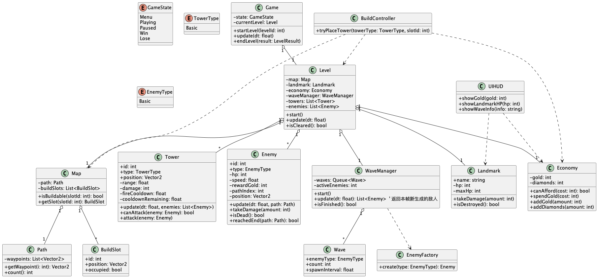

# 2026-group-14
2026 COMSM0166 group 14

# COMSM0166 Project Template
A project template for the Software Engineering Discipline and Practice module (COMSM0166).

## Info

This is the template for your group project repo/report. We'll be setting up your repo and assigning you to it after the group forming activity. You can delete this info section, but please keep the rest of the repo structure intact.

You will be developing your game using [P5.js](https://p5js.org) a javascript library that provides you will all the tools you need to make your game. However, we won't be teaching you javascript, this is a chance for you and your team to learn a (friendly) new language and framework quickly, something you will almost certainly have to do with your summer project and in future. There is a lot of documentation online, you can start with:

- [P5.js tutorials](https://p5js.org/tutorials/) 
- [Coding Train P5.js](https://thecodingtrain.com/tracks/code-programming-with-p5-js) course - go here for enthusiastic video tutorials from Dan Shiffman (recommended!)

## Defend London

STRAPLINE. Add an exciting one sentence description of your game here.

IMAGE. Add an image of your game here, keep this updated with a snapshot of your latest development.

VIDEO. Include a demo video of your game here (you don't have to wait until the end, you can insert a work in progress video)

Defend London is a London-themed tower defense game in which players must protect the city’s iconic landmarks from waves of invading enemies. By placing and upgrading defensive towers across a stylized map of London, players must manage resources carefully and adapt their strategy to survive increasingly difficult enemy attacks.

Play the game: [Start](https://uob-comsm0166.github.io/2026-group-14/game/)
Demo video: 

## Your Group

## Team Members

| Name          | Email | Role |
|---------------|-------|------|
| Jiaxi You     | <fl25387@bristol.ac.uk> | TBD |
| Shasha Tang   | <wj25162@bristol.ac.uk> | TBD |
| Junjie Wang   | <da25293@bristol.ac.uk> | TBD |
| Jingjing Liu  | <bd25907@bristol.ac.uk> | TBD |
| Zejun Zhang   | <tc25992@bristol.ac.uk> | TBD |
| Mingshu Zhang | <so25258@bristol.ac.uk> | TBD |

## Project Report

### Introduction

- 5% ~250 words 
- Describe your game, what is based on, what makes it novel? (what's the "twist"?) 

Defend London is a London-themed tower defense game that challenges players to protect some of the city’s most iconic landmarks from continuous waves of invading enemies. The game is based on the core mechanics of traditional tower defense games, where players must strategically place and upgrade defensive structures to stop enemies from reaching key objectives. However, rather than using a generic fantasy or medieval setting, Defend London reimagines the genre through a stylized version of London, turning familiar routes, rivers, and landmarks into the foundation of its gameplay and identity.

The game takes inspiration from well-known tower defense design principles such as wave-based progression, resource management, and tactical placement, but introduces a distinctive twist through its setting, visual style, and enemy variety. Each level is framed around recognizable London-inspired locations, such as outer city defenses, the River Thames, and the Tower of London, allowing the environment itself to become part of the player’s experience. This gives the game a stronger sense of place than many conventional tower defense titles.

What makes Defend London novel is its combination of local cultural identity with a mixed roster of unusual enemies, ranging from fantasy-inspired creatures to other hostile forces, all threatening a modern, recognizable city. This contrast between classic tower defense mechanics and a uniquely London-centered theme creates a memorable experience that feels both familiar and original. By combining strategic gameplay, illustrated visuals, and landmark-based level design, Defend London offers a creative reinterpretation of the tower defense genre.

### Requirements 

We use a GitHub Kanban board to track our progress; you can access it via the link here.
https://github.com/orgs/UoB-COMSM0166/projects/168

- 15% ~750 words
- Early stages design. Ideation process. How did you decide as a team what to develop? Use case diagrams, user stories.

#### Ideation

During our early design process, we explored two different prototype ideas before deciding on the final concept for the project. The first was Double Steal, which was designed as a more movement-based game focused on navigating a multi-level environment, managing health, and interacting with objectives across the map. This idea suggested a stronger emphasis on direct player control, exploration, and possibly stealth-based gameplay.

[prototype](./demo/paper-prototype2.mp4)

The second prototype developed into Defend London. This paper prototype already presented the main tower defense gameplay loop clearly: enemies follow a fixed path, players spend money to place different types of towers, defeated enemies provide further resources, and the overall objective is to prevent monsters from reaching and damaging the protected target. The prototype also showed early ideas for tower selection, resource display, and combat flow.

[prototype](./demo/paper-prototype.MOV)

After comparing the two concepts, we decided to continue with Defend London because it offered a more focused and coherent gameplay structure. It seemed more suitable for teamwork because the mechanics could be divided more naturally into separate systems such as map design, enemy behaviour, tower logic, and interface development.

#### Reflection

At this stage of the project, our team has been focusing on the preparation work for developing a tower defense game. Through this process, we have gained a basic understanding of Epics, User Stories, Acceptance Criteria, and their roles in the project.

At first, we regarded Epics as broad and abstract goals, and User Stories simply as a list of scattered features. Through group discussion and practice, we gradually realized that Epics represent the core value of the game, while User Stories serve as a critical bridge to translate these high-level values into user-centered and actionable tasks.

We practiced writing User Stories using the "As a user, I want to..., so that..." template, which encouraged us to focus on player experience rather than only technical implementation. Meanwhile, the "Given-When-Then" structure of Acceptance Criteria helped us define clear and testable completion conditions for each feature, ensuring that the team shares a consistent understanding of "done" before writing any code.

In this tower defense game project, these tools helped us transform the abstract idea of "developing a strategic tower defense game" into a concrete development roadmap. By breaking down core gameplay into Epics and detailed User Stories, we aligned our project vision and created a clear plan for the upcoming development phase.

This preparation work has not only improved team collaboration and consensus but also made us deeply realize that careful requirements management is the foundation of building a successful, user-centered product.

### Design

- 15% ~750 words 
- System architecture. Class diagrams, behavioural diagrams. 

#### Class Diagram

The class diagram shows the object-oriented structure of Defend London and the relationships between the main gameplay systems. The Game class controls the overall flow of the application, while the Level class acts as the central gameplay container. Other classes such as Map, Tower, Enemy, WaveManager, Landmark, Economy, and UIHUD each handle a specific part of the game, making the architecture more modular and easier to maintain.

#### Sequence Diagram

The sequence diagram shows the main gameplay update cycle in Defend London. The Game updates the current Level, which then updates the WaveManager to spawn enemies when needed. Enemies move along the path, towers attack enemies in range, defeated enemies reward the player with gold, and the game checks whether the landmark has been destroyed or all waves have been cleared.

### Implementation

- 15% ~750 words

- Describe implementation of your game, in particular highlighting the TWO areas of *technical challenge* in developing your game. 

### Evaluation

- 15% ~750 words

After developing a deliverable prototype of the game, it was important to evaluate its functionality and playability in order to identify potential flaws at an early stage. To assess the overall quality of the game and develop a comprehensive vision for future improvements, we used both quantitative and qualitative testing methods.

#### Quantitative evaluation
For the Quantitative evaluation, we first explored potential issues through a Think Aloud study conducted with two participants from another project group. The main objective of this method was to have the users’ first gameplay experience. Through this process, we aimed to gain a fundamental understanding of the game’s quality and identify early indicators for future improvements.

#### Think Aloud Evaluation 1: 15/03/2026
- **Positive**: The game interface is visually appealing and clean, allowing players to quickly understand how to operate the game. The rules are simple and clear, making the game easy to learn and play.
- **Negative**: Some monsters’ UI occasionally disappears, making them difficult to see.

#### Think Aloud Evaluation 2: 15/03/2026
- **Positive**: The game provides effective interactive feedback. The click sounds are clear, and there are appropriate sound effects for events such as monster deaths, tower placement, and losing HP. When a tower is placed in an invalid location, the game immediately provides a warning.
- **Negative**: The font size for monster and tower information is a bit small, which affects readability.The game lacks flexibility, as the music volume and brightness cannot be adjusted.

The feedback mainly focused on the UI design and scalability of the game. To further investigate these issues in a more systematic and detailed manner, we applied a heuristic evaluation method. This approach allows evaluators to assess the game based on established usability principles from different perspectives.

The heuristic evaluation was conducted by the team members, as this method requires a deeper understanding of the game’s design and underlying technical implementation in order to identify issues more precisely. After analysing the results from the Think Aloud evaluation and conducting additional testing, we developed the following Heuristic Evaluation Table.

#### Heuristic Evaluation
| Category | Issue | Heuristic | Frequency | Impact | Persistence | Severity |
| :--- | :--- | :--- | :--- | :--- | :--- | :--- |
| **Enemy** | diving enemies could still be targeted while they were underwater | Error prevention | 3 | 2 | 1 |
| **Enemy** | Missing information on monster waves | User Control & Flexibility | Help and documentation | 3 | 4 | 2 |
| **Tower** | lack of detailed stats and functional explanations for towers| Recognition rather than recall | 2 | 2 | 3 |
| **Game** | No options to adjust volume, brightness, or select different background music (BGM). | User control and freedom | 2 | 4 | 3 |
| **Settings** |The settings UI on the main menu does not scale properly to screen size  | Consistency and standards | 2 | 4 | 2 |
| **Settings** |The settings menu UI is inconsistent between the main menu and the in-game interface.| Consistency and standards| 2 | 2 | 1 |
| **Enemy** | Visual bug where certain monster images occasionally fail to render. | Consistency and standards | 2 | 2 | 3 |
| **Menu** | Font size is too small, making it difficult to read game information comfortably. | UAesthetic and minimalist design | 1 | 2 | 2 |

#### Development Focus
Based on the results, our next development focus will be concentrated on the following aspects:
- Fixing critical bugs to prevent game crashes and ensure stable gameplay
- Improving UI readability and ensuring consistent rendering across different devices
- Enhancing game flexibility by adding more background music options and a volume control system
- Providing clear and accessible information about game mechanics

- One qualitative evaluation (of your choice) 
- Description of how code was tested. 

### Process 

- 15% ~750 words

- Teamwork. How did you work together, what tools and methods did you use? Did you define team roles? Reflection on how you worked together. Be honest, we want to hear about what didn't work as well as what did work, and importantly how your team adapted throughout the project.

### Conclusion

- 10% ~500 words

- Reflect on the project as a whole. Lessons learnt. Reflect on challenges. Future work, describe both immediate next steps for your current game and also what you would potentially do if you had chance to develop a sequel.

### Contribution Statement

- Provide a table of everyone's contribution, which *may* be used to weight individual grades. We expect that the contribution will be split evenly across team-members in most cases. Please let us know as soon as possible if there are any issues with teamwork as soon as they are apparent and we will do our best to help your team work harmoniously together.

### Additional Marks

You can delete this section in your own repo, it's just here for information. in addition to the marks above, we will be marking you on the following two points:

- **Quality** of report writing, presentation, use of figures and visual material (5% of report grade) 
  - Please write in a clear concise manner suitable for an interested layperson. Write as if this repo was publicly available.
- **Documentation** of code (5% of report grade)
  - Organise your code so that it could easily be picked up by another team in the future and developed further.
  - Is your repo clearly organised? Is code well commented throughout?