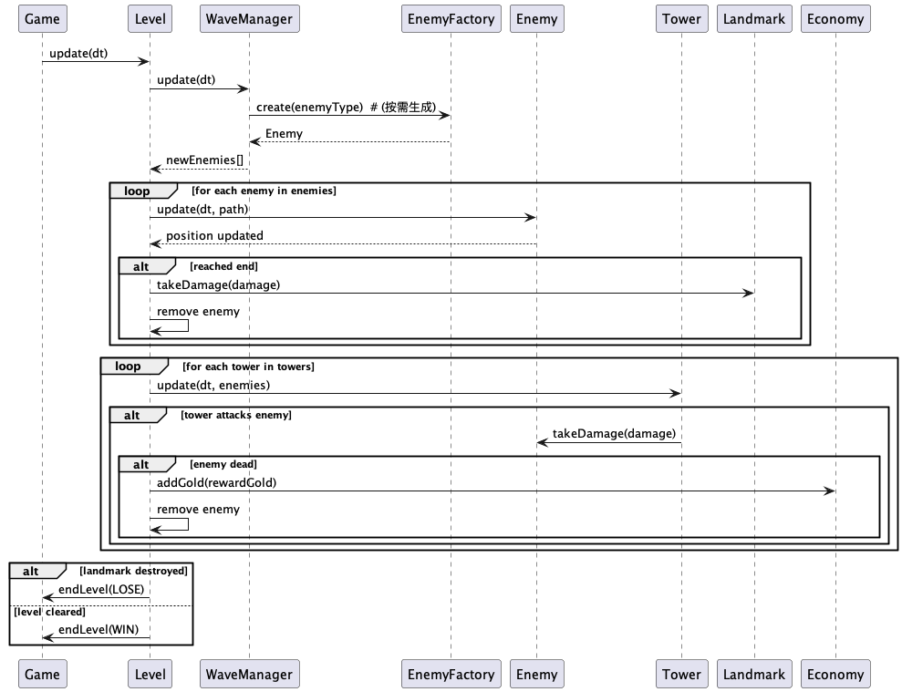

# 2026-group-14
2026 COMSM0166 group 14

# COMSM0166 Project Template
A project template for the Software Engineering Discipline and Practice module (COMSM0166).

## Info

This is the template for your group project repo/report. We'll be setting up your repo and assigning you to it after the group forming activity. You can delete this info section, but please keep the rest of the repo structure intact.

You will be developing your game using [P5.js](https://p5js.org) a javascript library that provides you will all the tools you need to make your game. However, we won't be teaching you javascript, this is a chance for you and your team to learn a (friendly) new language and framework quickly, something you will almost certainly have to do with your summer project and in future. There is a lot of documentation online, you can start with:

- [P5.js tutorials](https://p5js.org/tutorials/) 
- [Coding Train P5.js](https://thecodingtrain.com/tracks/code-programming-with-p5-js) course - go here for enthusiastic video tutorials from Dan Shiffman (recommended!)

## Defend London

STRAPLINE. Add an exciting one sentence description of your game here.

IMAGE. Add an image of your game here, keep this updated with a snapshot of your latest development.

VIDEO. Include a demo video of your game here (you don't have to wait until the end, you can insert a work in progress video)

Defend London is a London-themed tower defense game in which players must protect the city’s iconic landmarks from waves of invading enemies. By placing and upgrading defensive towers across a stylized map of London, players must manage resources carefully and adapt their strategy to survive increasingly difficult enemy attacks.

Play the game: [Start](https://uob-comsm0166.github.io/2026-group-14/game/)
Demo video: 

## Your Group

## Team Members

| Name          | Email | Role |
|---------------|-------|------|
| Jiaxi You     | <fl25387@bristol.ac.uk> | TBD |
| Shasha Tang   | <wj25162@bristol.ac.uk> | TBD |
| Junjie Wang   | <da25293@bristol.ac.uk> | TBD |
| Jingjing Liu  | <bd25907@bristol.ac.uk> | TBD |
| Zejun Zhang   | <tc25992@bristol.ac.uk> | TBD |
| Mingshu Zhang | <so25258@bristol.ac.uk> | TBD |

## Project Report

### Introduction

- 5% ~250 words 
- Describe your game, what is based on, what makes it novel? (what's the "twist"?) 

Defend London is a London-themed tower defense game that challenges players to protect some of the city’s most iconic landmarks from continuous waves of invading enemies. The game is based on the core mechanics of traditional tower defense games, where players must strategically place and upgrade defensive structures to stop enemies from reaching key objectives. However, rather than using a generic fantasy or medieval setting, Defend London reimagines the genre through a stylized version of London, turning familiar routes, rivers, and landmarks into the foundation of its gameplay and identity.

The game takes inspiration from well-known tower defense design principles such as wave-based progression, resource management, and tactical placement, but introduces a distinctive twist through its setting, visual style, and enemy variety. Each level is framed around recognizable London-inspired locations, such as outer city defenses, the River Thames, and the Tower of London, allowing the environment itself to become part of the player’s experience. This gives the game a stronger sense of place than many conventional tower defense titles.

What makes Defend London novel is its combination of local cultural identity with a mixed roster of unusual enemies, ranging from fantasy-inspired creatures to other hostile forces, all threatening a modern, recognizable city. This contrast between classic tower defense mechanics and a uniquely London-centered theme creates a memorable experience that feels both familiar and original. By combining strategic gameplay, illustrated visuals, and landmark-based level design, Defend London offers a creative reinterpretation of the tower defense genre.

### Requirements 

We use a GitHub Kanban board to track our progress; you can access it via the link here.
https://github.com/orgs/UoB-COMSM0166/projects/168

- 15% ~750 words
- Early stages design. Ideation process. How did you decide as a team what to develop? Use case diagrams, user stories.

#### Ideation

At the beginning of the design process, we discussed a range of possible gameplay ideas and considered several different types of games that could be developed for the project. This stage helped us explore different directions and think about what kind of experience we wanted to create. After comparing these ideas, we selected two prototypes to develop further and discuss in more detail.

The first prototype was Double Steal, which focused on direct character control in a multi-level environment. In this prototype, the player would move through different floors of the map, avoid danger, manage health, and complete objectives in different locations. The second prototype was Defend London, a tower defense game based on defending iconic London landmarks from waves of enemies through tower placement and upgrades.

[prototype](./demo/paper-prototype2.mp4)

[prototype](./demo/paper-prototype.MOV)

After comparing the two concepts, we decided to continue with Defend London because it offered a more focused and coherent gameplay structure. It seemed more suitable for teamwork because the mechanics could be divided more naturally into separate systems such as map design, enemy behaviour, tower logic, and interface development.

#### Reflection

At this stage of the project, our team has been focusing on the preparation work for developing a tower defense game. Through this process, we have gained a basic understanding of Epics, User Stories, Acceptance Criteria, and their roles in the project.

At first, we regarded Epics as broad and abstract goals, and User Stories simply as a list of scattered features. Through group discussion and practice, we gradually realized that Epics represent the core value of the game, while User Stories serve as a critical bridge to translate these high-level values into user-centered and actionable tasks.

We practiced writing User Stories using the "As a user, I want to..., so that..." template, which encouraged us to focus on player experience rather than only technical implementation. Meanwhile, the "Given-When-Then" structure of Acceptance Criteria helped us define clear and testable completion conditions for each feature, ensuring that the team shares a consistent understanding of "done" before writing any code.

In this tower defense game project, these tools helped us transform the abstract idea of "developing a strategic tower defense game" into a concrete development roadmap. By breaking down core gameplay into Epics and detailed User Stories, we aligned our project vision and created a clear plan for the upcoming development phase.

This preparation work has not only improved team collaboration and consensus but also made us deeply realize that careful requirements management is the foundation of building a successful, user-centered product.

### Design

- 15% ~750 words 
- System architecture. Class diagrams, behavioural diagrams. 

#### Class Diagram

##### Overall Structure

The class design of Defend London is organised into separate components so that each part of the game has a clear responsibility. This makes the system easier to understand, develop, and maintain. The overall gameplay flow is controlled by the Game class, while the Level class manages the main elements inside each stage.

###### Game Control

The Game class is responsible for the overall flow of the program, including starting a level, updating the game during play, and ending the level with a result. The GameState enumeration supports this by defining the main states of the game, such as menu, playing, paused, win, and lose. This helps the game switch clearly between different stages.

###### Level Management

The Level class acts as the centre of the gameplay system. It contains the Map, Landmark, Economy, WaveManager, and the lists of towers and enemies. Because of this, it is responsible for updating the state of the level and checking whether the level has been completed.

##### Map and Building

The Map class stores the enemy path and the available build slots. These build slots define where towers can be placed. The BuildController handles the tower placement process by checking whether a slot is valid and whether the player has enough resources to build a tower. This separates the map layout from the player’s building actions.

##### Combat System

Combat is mainly handled through the interaction between Tower and Enemy. Towers have attributes such as range, damage, and cooldown, which allow them to attack enemies within range. Enemies move along the predefined path, take damage from towers, and can damage the Landmark if they reach the end of the route.

##### Waves and Enemy Creation

The WaveManager controls the spawning and progression of enemy waves during the level. It works together with the Wave class, which stores the number and type of enemies in each wave. The EnemyFactory is used to create enemy objects, helping separate enemy creation from wave control logic.

##### Resources and Interface

The Economy class manages resources such as gold and diamonds, including checking whether the player can afford certain actions and rewarding resources when needed. The UIHUD displays important gameplay information, such as current gold, landmark health, and wave information, helping the player understand the current state of the game.

#### Sequence Diagram

##### Overall Process

This sequence diagram shows the main gameplay update process in Defend London during each frame of the game loop. It explains how the game updates the level, spawns enemies, processes movement and attacks, and checks whether the player has won or lost.

##### Game and Level Update

The process begins when the Game class calls update(dt) on the Level class. This starts the update cycle for the current frame and allows the level to process all active gameplay elements.

##### Enemy Spawning

The Level class first updates the WaveManager. If new enemies need to be spawned, the WaveManager calls the EnemyFactory to create enemies of the required type. These newly created enemies are then added to the list of active enemies in the level.

##### Enemy Movement

After spawning, the Level updates each enemy in the active enemy list. Each enemy moves along the path by running its update(dt, path) method. If an enemy reaches the end of the path, it damages the Landmark and is removed from the level.

##### Tower Attacks

Once enemy movement has been processed, the Level updates each tower. Each tower checks the current list of enemies and attacks when a target is within range. The attack causes damage to the enemy through the takeDamage(damage) method.

##### Enemy Removal and Rewards

If a tower attack kills an enemy, the Economy system rewards the player with gold using addGold(rewardGold). After this, the defeated enemy is removed from the active enemy list. This connects combat directly with the game’s resource system.

##### End Conditions

At the end of the update cycle, the level checks whether the game should finish. If the Landmark has been destroyed, the Game ends the level with a lose result. If the level has been cleared, meaning all waves are completed and all enemies have been removed, the Game ends the level with a win result.

### Implementation

- 15% ~750 words

- Describe implementation of your game, in particular highlighting the TWO areas of *technical challenge* in developing your game. 

### Evaluation

- 15% ~750 words

- One qualitative evaluation (of your choice) 

- One quantitative evaluation (of your choice) 

- Description of how code was tested. 

### Process 

- 15% ~750 words

- Teamwork. How did you work together, what tools and methods did you use? Did you define team roles? Reflection on how you worked together. Be honest, we want to hear about what didn't work as well as what did work, and importantly how your team adapted throughout the project.

### Conclusion

- 10% ~500 words

- Reflect on the project as a whole. Lessons learnt. Reflect on challenges. Future work, describe both immediate next steps for your current game and also what you would potentially do if you had chance to develop a sequel.

### Contribution Statement

- Provide a table of everyone's contribution, which *may* be used to weight individual grades. We expect that the contribution will be split evenly across team-members in most cases. Please let us know as soon as possible if there are any issues with teamwork as soon as they are apparent and we will do our best to help your team work harmoniously together.

### Additional Marks

You can delete this section in your own repo, it's just here for information. in addition to the marks above, we will be marking you on the following two points:

- **Quality** of report writing, presentation, use of figures and visual material (5% of report grade) 
  - Please write in a clear concise manner suitable for an interested layperson. Write as if this repo was publicly available.
- **Documentation** of code (5% of report grade)
  - Organise your code so that it could easily be picked up by another team in the future and developed further.
  - Is your repo clearly organised? Is code well commented throughout?
