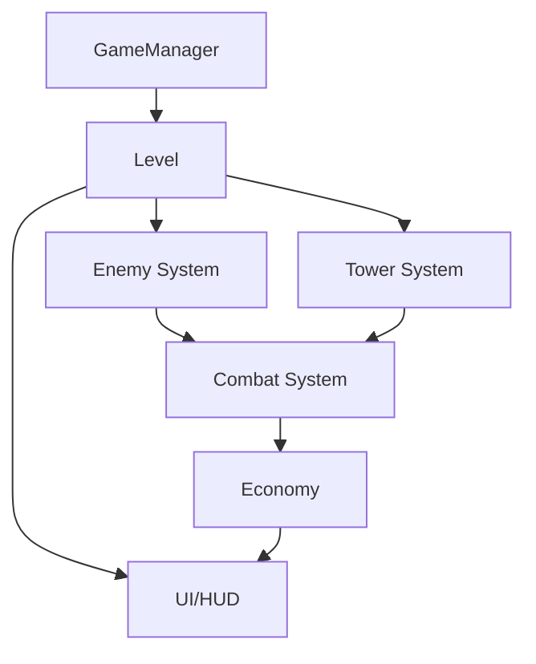

# 2026-group-14

Folder layout for this repo: [`STRUCTURE.md`](./STRUCTURE.md).

## Defend London
> Protect the landmarks. Outsmart the invaders. Defend your city.

<div align="center">

<p>
  <a href="https://uob-comsm0166.github.io/2026-group-14/game/index.html" target="_blank">
    
  </a>
</p>
<p>
  <a href="https://uob-comsm0166.github.io/2026-group-14/game/index.html" target="_blank">Play Now</a>
</p>

<br>

<p>
  <a href="./demo/demo.mp4" target="_blank">
    
  </a>
</p>
<p>
  <a href="./demo/demo.mp4" target="_blank">Watch Video</a>
</p>

</div>


## Your Group

<table width="100%">
  <tr valign="top">
    <td width="38%" align="left">
      
    </td>
    <td width="62%" align="left">
      <p><strong>Team Members</strong></p>
      <table>
        <thead>
          <tr>
            <th align="left">Name</th>
            <th align="left">Email</th>
            <th align="left">Role</th>
          </tr>
        </thead>
        <tbody>
          <tr>
            <td>Jiaxi You</td>
            <td>&lt;fl25387@bristol.ac.uk&gt;</td>
            <td>Project Manager / Tester</td>
          </tr>
          <tr>
            <td>Shasha Tang</td>
            <td>&lt;wj25162@bristol.ac.uk&gt;</td>
            <td>Gameplay Developer</td>
          </tr>
          <tr>
            <td>Junjie Wang</td>
            <td>&lt;da25293@bristol.ac.uk&gt;</td>
            <td>Combat Developer</td>
          </tr>
          <tr>
            <td>Jingjing Liu</td>
            <td>&lt;bd25907@bristol.ac.uk&gt;</td>
            <td>Level Designer</td>
          </tr>
          <tr>
            <td>Zejun Zhang</td>
            <td>&lt;tc25992@bristol.ac.uk&gt;</td>
            <td>UI Developer</td>
          </tr>
          <tr>
            <td>Mingshu Zhang</td>
            <td>&lt;so25258@bristol.ac.uk&gt;</td>
            <td>Systems Developer</td>
          </tr>
        </tbody>
      </table>
    </td>
  </tr>
</table>

## Project Report

### Introduction

Defend London is a tower defense game where players protect iconic London landmarks from waves of invading enemies by building towers, managing resources, and surviving increasingly challenging waves across three beautifully illustrated levels; what makes it stand out is its authentic London setting, diverse enemy roster with distinct behaviors, and a guided onboarding flow that helps new players learn core mechanics quickly.

---

### Ideation

#### Genre Exploration

At the start of the project, we evaluated multiple game genres against three criteria: uniqueness compared to past student projects, strategic depth for players, and clarity of implementation scope.

| Genre | Key Challenge | Decision |
|---|---|---|
| Action | Complex real-time enemy AI | ❌ |
| Puzzle | Time-consuming narrative design | ❌ |
| Shooting | Overdone by past teams | ❌ |
| **Tower Defense** | — | ✅ |

Tower defense was the best fit for this project. Enemy logic stayed manageable, team responsibilities could be split cleanly, and the genre still felt fresh in this module context.

#### Paper Prototypes

To validate our direction, we built two paper prototypes before writing any code:

<table>
<tr>
<td align="center" width="50%">

<br><b>Prototype A: Defend London</b>
<br>Tower defense · Place towers → Survive waves
</td>
<td align="center" width="50%">

<br><b>Prototype B: Double Steal</b>
<br>Action platformer · Navigate floors → Avoid hazards
</td>
</tr>
</table>

Prototype A demonstrated a tower defense loop where players place defenses and react to incoming waves. Prototype B explored action-platformer traversal with timing-sensitive hazards.

#### Why Defend London?

We selected Prototype A because it gave us clearer subsystem boundaries and lower integration risk. The action-platformer concept was interesting, but it would have required tighter cross-member coordination much earlier in the semester.

---

### Requirements

#### Stakeholders

We identified stakeholders using an onion model approach, organizing them by proximity to the project:


The onion model was mainly useful for prioritisation. Inner layers (team + instructor) shaped feasibility and assessment constraints, while outer layers (classmates + end players) influenced usability priorities through playtesting.

#### Use Case Diagram


The player starts a session, enemy waves begin, and towers are placed to defend the landmark. An alternative flow allows access to settings for volume and music adjustment.

#### User Stories

User stories capture requirements from the player perspective, using the standard form: "As a [role], I want [feature], so that [benefit]." We defined six stories: five functional (core systems and feedback) and one non-functional (performance), with role diversity across casual players, strategic players, new players, and all players. This avoids designing for a single "average" user. A longer backlog and alternative Given/When/Then criteria appear in [`docs/design/stakeholders_and_user_stories.md`](./design/stakeholders_and_user_stories.md).

| User Story | Analysis |
|------------|----------|
| “As a **casual player**, I want resources to be **auto-collected**, so that I can focus on tower placement and strategic decisions during each wave.” | **Functional requirement:** **Economy system** — gold is added automatically when enemies are defeated (no manual coin pickup). |
| “As a **strategic player**, I want to **see tower attack range before placing**, so that I can optimize my defense layout without memorizing every radius.” | **Functional requirement:** **Tower system** — range preview / placement feedback on the build grid. |
| “As a **strategic player**, I want a **next-wave preview** showing upcoming enemy types, so that I can prepare appropriate defenses.” | **Functional requirement:** **Wave system** — HUD or panel surfaces upcoming wave composition. |
| “As a **new player**, I want an **interactive tutorial** that guides me through game mechanics, so that I can learn without frustration.” | **Functional requirement:** **UI / game flow** — stepwise tutorial (`TUTORIAL_STEPS` in `constants.js`, driven by `GameManager` + `UIHUD`) introducing landmark, path, build area, and gold. |
| “As a **player**, I want the game to **respond smoothly without lag** during intense waves, so that my strategic decisions are not hindered by performance issues.” | **Non-functional requirement:** **Performance** — stable frame rate under load; supported by a modular per-frame `update()` chain and **wave-based spawning** (not all enemies active at once). |
| “As a **player**, I want **clear visual and audio feedback** when I win or lose, so that the game outcome feels satisfying and unambiguous.” | **Functional requirement:** **UI system** — dedicated win/lose (and level-complete) screens plus sound feedback. |

Most functional stories map directly to one subsystem (economy, placement, waves, tutorial UI, end-game UI). The non-functional performance story pushed us toward data-driven tuning (`TOWER_TYPES`, `ENEMY_STATS`) and a stable update order in the game loop.

Following course material on requirements, we classified every story as either a **functional requirement** (what the system must *do*) or a **non-functional requirement** (how well it must *behave*). **Functional** stories mainly drove **class boundaries and UI flows**; the **performance** story reinforced **data-driven balance** and an efficient, predictable update path.

#### Development Epics

| Epic | Description | Key Acceptance Criteria |
|---|---|---|
| Enemy Wave System | Spawning, pathfinding, scaling | 3+ enemy types; path from start to landmark |
| Tower System | Building, upgrading, modular types | Valid placement; auto-targeting |
| Game Interface | Real-time HUD | Live health, coins, wave display |
| Audio System | BGM and sound effects | Distinct placement/damage/death sounds |
| Map & Environment | Grid logic and visual theme | Clear path vs buildable separation |

---

### Design

#### Architecture Overview

Defend London uses a modular architecture where each subsystem handles one responsibility. `GameManager` coordinates frame updates and state transitions between menu, gameplay, and end screens.


```mermaid
%%{init: {"flowchart": {"nodeSpacing": 20, "rankSpacing": 22}, "themeVariables": {"fontSize": "12px"}} }%%
flowchart TD
    GM[GameManager]
    LV[Level]
    EN[Enemy System]
    TW[Tower System]
    CB[Combat System]
    UI[UI/HUD]
    EC[Economy]
    GM --> LV
    LV --> EN
    LV --> TW
    EN --> CB
    TW --> CB
    CB --> EC
    LV --> UI
    EC --> UI
```

#### Level Design: The Maps of London

Each level is themed around an iconic London location, with increasing complexity in path design and buildable space.

<table>
<tr>
<td align="center" width="33%">

<br><b>Level 1: Big Ben</b>
<br>🟢 Introductory
</td>
<td align="center" width="33%">

<br><b>Level 2: Tower Bridge</b>
<br>🟡 Intermediate
</td>
<td align="center" width="33%">

<br><b>Level 3: Buckingham Palace</b>
<br>🔴 Advanced
</td>
</tr>
</table>

The progression follows a deliberate learning curve: Level 1 teaches fundamentals, Level 2 introduces resource trade-offs, and Level 3 demands strategic mastery against the Gentleman Bug boss.

#### Tower System

The tower roster is a role-based system: basic towers provide stable single-target damage, slow and area towers control enemy tempo and spacing, support-oriented towers amplify surrounding output, and high-cost towers provide burst or situational effects; we keep these parameters in `TOWER_TYPES` so balance changes can be made consistently without rewriting core combat logic, and this setup encourages mixed compositions.

| | Tower | Cost | Damage | Special ability |
|:--:|---|--:|--:|---|
|  | Basic Tower | 60 | 15 | Balanced baseline |
|  | Slow Tower | 85 | 12 | 45% slow effect |
|  | Area Tower | 130 | 13 | Pulsing AoE damage |
|  | Crystal Tower | 120 | 15 | +25% damage to nearby towers |
|  | Steam Cannon | 180 | 55 | Piercing (up to 3 targets) |
|  | Alchemist Tower | 150 | 20 | Random potion effects |

#### Enemy System

Enemy design follows escalating counter-play across levels: early enemies teach movement-speed and durability basics, mid-tier enemies introduce pressure abilities such as charging and dodging, and late-game enemies force adaptation through disruption, temporary untargetability, healing, and boss-phase mechanics; with behaviours configured through `ENEMY_STATS`, each wave tests player decisions on placement, targeting, and resource timing.

**Level 1: Fundamentals**

| | Enemy | HP | Speed | Ability |
|:--:|---|--:|--:|---|
|  | Guard | 100 | 2.0 | None |
|  | Pigeon | 60 | 3.0 | High speed |
|  | Hedgehog | 300 | 1.0 | High HP tank |

**Level 2: Ability pressure**

| | Enemy | HP | Speed | Ability |
|:--:|---|--:|--:|---|
|  | Knight | 180 | 1.6 | Charges when wounded |
|  | Archer | 90 | 2.2 | 25% dodge chance |
|  | Giant | 500 | 0.9 | Leaps forward |

**Level 3: Counter-strategy**

| | Enemy | HP | Speed | Ability |
|:--:|---|--:|--:|---|
|  | Goblin Bomber | 120 | 2.2 | Explodes; disables towers |
|  | Diving Lizard | 150 | 3.3 | Untargetable dive phase |
|  | Treant Mage | 200 | 1.2 | Area healing |
|  | Gentleman Bug | 2500 | 0.8 | 3-phase boss |

#### UML diagrams

##### Class diagram


`Game` / `GameManager` orchestrates `Level`, which manages tower and enemy collections. Wave logic handles spawning; factories and presets instantiate specific types. `Tower` and `Enemy` share common update interfaces.

##### Sequence diagram


Each frame: the game calls `update()` → wave manager spawns enemies → enemies move → towers attack → combat resolves damage → UI refreshes → win/lose check.

### Process

#### Development workflow

We agreed team responsibilities and a **Git workflow** (branch strategy, integration rules) at the outset, wrote them into a living document, and revised and followed that guide for the rest of the module so practice and documentation stayed aligned.

[**Git workflow guide (full text)**](./process/workflow.md)


In day-to-day work we used a feature-branch model: scoped work on `feature/*` and personal lines such as `*_dev`, fixes on `gamefix*`, and integration through pull requests (e.g. #23, #24) with review and CI before merge.


| Branch type | Examples | Purpose |
|-------------|----------|--------|
| `feature/*` | `feature/tower-system`, `feature/enemy-wave-system` | New functionality |
| `*_dev` | `zejun_dev`, `sound_dev` | Subsystem / personal line |
| `gamefix*`, `develop`, `design` | `gamefix`, `gamefix2`, `develop`, `design` | Fixes, integration, design experiments |

#### Task management

We tracked work on a **GitHub Project** board; [open the project](https://github.com/orgs/UoB-COMSM0166/projects/168) for the live board.


#### Communication

We wrote meeting outcomes and ad-hoc plans into a shared log so the group had a record of decisions. [Meeting notes →](./meeting_notes/)


### Implementation

#### Development timeline

Our development followed a **12-week** iterative process in **four** phases.

---

##### Phase 1: Core Architecture (Weeks 1–3)

<table>
<tr>
<td width="40%">


</td>
<td width="60%">

**Focus:** A minimal but runnable gameplay loop

**Deliverables**
- **Game loop** and **state management** (`GameManager` + `GameState`)
- **Grid-based map data structure** with per-cell types (`MapData.js`)
- **Basic tower placement logic** and collision checks
- **Enemy pathfinding prototype** along **waypoint** lists in `Path.js`

</td>
</tr>
</table>

---

##### Phase 2: Foundational Systems (Weeks 4–6)

<table>
<tr>
<td width="40%">


</td>
<td width="60%">

**Focus:** A playable single-level prototype plus developer tooling

**Deliverables**
- **Tower system baseline**: placement, attack, and range checks
- **Enemy system baseline**: spawn, movement, hit/damage, and death handling
- **Economy system**: gold gain/spend and wave rewards
- **Debug tooling** for map-path validation: `D` key grid overlay, `N` key path edit mode, and waypoint export

</td>
</tr>
</table>

---

##### Phase 3: Feature Expansion (Weeks 7–9)

<table>
<tr>
<td width="40%">


</td>
<td width="60%">

**Focus:** Gameplay depth and combat variety

**Deliverables**
- **Six tower types** with distinct abilities (Basic / Slow / Area / Crystal / Steam / Alchemist)
- **Multi-phase boss** (Gentleman Bug) with staged mechanics
- **Enemy ability expansion**: charge, dodge, dive, heal, explode
- **Initial balancing pass** using spreadsheet-style reasoning plus playtest feedback

</td>
</tr>
</table>

---

##### Phase 4: Content and Polish (Weeks 10–12)

<table>
<tr>
<td width="40%">


</td>
<td width="60%">

**Focus:** Level delivery, difficulty pacing, and player-facing polish

**Deliverables**
- **Three London-themed levels**: Big Ben -> Tower Bridge -> Buckingham Palace
- **Difficulty curve tuning** through wave composition, starting gold, and enemy combinations
- **Audio system polish**: BGM selection plus placement/attack/death and win/lose feedback sounds
- **Settings menu**, **Win/Lose** screens, and final bug fixing

</td>
</tr>
</table>

---

#### Technical highlight: state management

Switching between menu, level select, playing, paused, win, lose, and other modes risks orphaned UI or input handlers if every screen is bolted on ad hoc.

We centralised transitions in `GameManager.setState`, backed by a single `GameState` string enum in `constants.js`. There is no separate `GameStateManager` class in this codebase.

```javascript
const GameState = {
  MENU: 'menu',
  PLAYING: 'playing',
  PAUSED: 'paused',
  WIN: 'win',
  LOSE: 'lose',
};
```

The full enum also includes `LOGIN`, `LEVEL_SELECT`, `SETTINGS`, `IN_GAME_SETTINGS`, `MONSTER_INFO`, and `INSTRUCTIONS`. Routing transitions through one dispatch point kept draw and keyboard logic aligned with the active state.

In playtests and heuristic sessions, rapid menu/play/pause/end-screen switching did not produce crashes, and state transitions remained predictable.

---

#### Technical challenges

##### Challenge 1: Debug grid system

**Problem.** Hand-drawn backgrounds did not always match the logical grid: towers could look “off” the art, or pathing could disagree with the painted road unless offsets and cell size were tuned.

**Solution.** We added developer overlays: `D` toggles `drawDebugGrid()` in `GameManager.js` (green tint = tower-buildable in the current view, red tint = not buildable; cell indices drawn for alignment). `LEVEL_GRID_CONFIG` holds `offsetX`, `offsetY`, and `gridSize` per level. `N` toggles path edit mode with waypoint placement and console export for `Path.js` (see `./images/dev/grid-debug.png`).

```javascript
const LEVEL_GRID_CONFIG = {
  1: { offsetX: 0, offsetY: -15, gridSize: 30 },
  2: { offsetX: 0, offsetY: 0, gridSize: 30 },
  3: { offsetX: 0, offsetY: 0, gridSize: 30 }
};
```

| Debug overlay (D key) | Colour (approx.) | Role |
|-----------------------|------------------|------|
| **Buildable** | Green (transparent) | Cells where **towers** may be placed |
| **Non-buildable** | Red tint | **Path**, **obstacle**, HUD band, or other blocked cells |

This change made map alignment and path export much quicker to iterate on, and most remaining issues were found before final release builds.

##### Challenge 2: Balance formula

**Problem.** In early playtests, balance was unstable. Sometimes players earned so much gold that waves felt too easy; in other runs, enemies were too strong and difficulty spiked suddenly. Tuning only by intuition took a long time and was difficult to explain clearly in team review.

**Solution.** We used two layers together:
- **Code truth (what the game actually uses):** `TOWER_TYPES`, `ENEMY_STATS`, `LEVEL_*_WAVE_CONFIGS`, per-kill `reward`, and `WAVE_CLEAR_BONUS_GOLD` in `constants.js` / `GameManager.js`.
- **Design checks (for planning):** simple formulas to estimate how costs, HP, and rewards should scale before final values are locked.

The formulas below are planning guides used alongside playtesting. Final tower costs are still defined in `TOWER_TYPES`; the cost formula is mainly used to keep tier spacing reasonable during balancing.

```text
Cost ≈ BaseCost × (1 + 0.15 × TowerTier)          // design-time only
HP ≈ BaseHP × (1 + 0.2 × WaveNumber) × L_mult     // design-time only
Reward ≈ EnemyHP × 0.1 + BaseReward                 // design-time only
```

**Team rule of thumb.** After clearing a wave, gold from kills plus wave bonus should usually be enough for a few new mid-tier tower placements (if the player defends well). The goal is meaningful choices, not unlimited spending.

| Parameter | Level 1 | Level 2 | Level 3 | Source in code |
|-----------|--------:|--------:|--------:|----------------|
| **Starting gold** | **300** | **550** | **600** | `INITIAL_GOLD` (300) + per-level offsets in `GameManager` **level configs** (+0 / +250 / +300) |
| **Wave count** | **3** | **6** | **6** | Length of `LEVEL_1_WAVE_CONFIGS` … `LEVEL_3_WAVE_CONFIGS` in `constants.js` |

**Design impact.** Difficulty is controlled through wave composition, enemy HP/count in each level config, and per-level starting gold (table above). This made pacing easier to tune map by map, and made design discussions more concrete because we could point to a specific wave or enemy group to adjust.

`L_mult` in the HP formula is a planning variable for spreadsheets and early estimates. The final shipped values are still the config-table values in code.

After this pass, playtest feedback became more actionable: testers could identify the exact wave or enemy group that felt off.

### Evaluation

#### Evaluation design

We used a mixed-methods evaluation: qualitative discovery first (think-aloud and heuristic review), then a quantitative comparison of perceived workload and usability under two in-game conditions.

Quantitative user study (within-subject, *n* = 10). Each participant played two sessions in randomised order:

| Condition | Map | Role in analysis |
|-----------|-----|------------------|
| Simple mode | Level 1 (Big Ben) | Low difficulty baseline |
| Hard mode | Level 3 (Buckingham Palace) | High difficulty stress test |

After each session, participants completed:

- NASA-TLX (weighted): Mental, Physical, Temporal demand, Performance, Effort, and Frustration, then pairwise weighting per participant to compute one workload score.
- SUS (10 items): perceived usability on a 0-100 scale; industry benchmark = 68.

---

#### User testing: NASA-TLX


From Simple to Hard, perceived workload more than doubled (about +128% on the aggregate score). That matches our goal for Level 3: higher strategic pressure. A Wilcoxon signed-rank test on paired scores gave W = 0, p < 0.05 (every participant ranked Hard heavier than Simple), as reported in [`TLX_evaluations.md`](./weekly_progress/week8_quantitative_evaluations/TLX_evaluations.md).

---

#### User testing: SUS


Both conditions stayed above 68, so players still considered the interface usable even when the game was hard. The ~13.7 point drop from Simple to Hard reflects the additional challenge, consistent with [`SUS_evaluations.md`](./weekly_progress/week8_quantitative_evaluations/SUS_evaluations.md).


NASA-TLX and SUS point to the same conclusion: challenge rises with difficulty, while interface usability stays in a good range. Our qualitative and heuristic findings then translate this into concrete fixes for HUD, settings, and wave information.

---

#### Software testing

We combined black-box case runs from our test document with white-box checks on critical paths. We verified key logic through code inspection and manual execution tracing.

##### Black-box testing

We verified behaviour without reading implementation line-by-line; examples:

| Test case | Input | Expected | Outcome |
|-----------|-------|----------|---------|
| Valid tower placement | Click grass build cell with enough gold | Tower appears; gold deducted | Pass |
| Invalid placement | Click path / obstacle | Blocked + feedback | Pass |
| Wave flow | Clear wave | Countdown / next wave or victory | Pass |
| Insufficient gold | Pick expensive tower | Cannot place; no charge | Pass |
| Defeat | Landmark HP → 0 | Lose screen / retry path | Pass |

Full IDs (FT-001 … CP-002) are tabulated in [`week9_evaluation_quality_and_testing.md`](./weekly_progress/week9_evaluation_quality_and_testing/week9_evaluation_quality_and_testing.md).

##### White-box testing

We inspected and manually executed sensitive logic paths: stepping through `WaveManager` state (`waiting` -> `spawning` -> `active`), `Economy` refunds and sell flows, `Tower` range and slow/splash branches, and `GameManager` win/lose gates. We also used the debug grid to check that logical tiles matched map art. These checks caught integration bugs that black-box runs alone often miss.

## Sustainability, Ethics and Accessibility

### Overall Approach

Sustainability in Defend London is about keeping the tower-defence loop fair and maintainable as levels and systems grow. In practice that covers how London is represented, how players learn the rules and adjust audio and display, how browser load scales with sprites and sound, whether the `p5.js` build needs paid infrastructure, and how `GameManager`, wave logic, map data, and combat code stay separable. We used SusAF to organise those angles.

### SusAD Diagram


*Figure: SusAD diagram — positive opportunities (green) and negative risks (red) across sustainability dimensions.*

The figure summarises trade-offs for this build: local `localStorage` and nickname-only progress cut server and account surface, while large sprite and audio sets still stress load and memory. Splitting `GameManager`, map data, and wave logic eases change, but a mouse-first HUD and tuning values spread across files still matter for accessibility and maintenance.

### Social Sustainability

Landmark-based levels (Big Ben, Tower Bridge, Buckingham Palace) give Defend London a clear identity; a real-city theme still needs careful representation. Player trust depends on readable paths, tower effects, and win/lose feedback—clearer copy for abilities and waves would strengthen that.

### Individual Sustainability

The tutorial, pause, level select, continue/try again, and win/lose flow aim to flatten the learning curve; volume, music, and brightness support comfort. Placement and combat still lean on mouse and colour; keyboard controls, a high-contrast mode, and non-colour cues for key states would widen who can play fairly.

### Ethics

Progress uses a nickname only (no accounts) and `localStorage` in the browser for this build, with no analytics layer in the shipped game. Next steps would be a short in-game explanation of local saving and a “delete save data” action so users control what stays on the device.

### Environmental Sustainability

Running in the browser supports a single-player loop without a dedicated save server. Waves spawn enemies incrementally, which limits peak object count during heavy fights. Image and audio for towers, enemies, and maps remain the main footprint—compressing files, pruning unused assets, and measuring load and frame time under max waves are the main levers left.

### Economic Sustainability

Defend London runs as static `p5.js` and JavaScript files, so the current version does not require paid hosting or a backend. Splitting enemies, towers, economy, waves, and map data across files keeps maintenance scoped, provided balance numbers are gradually centralised so tuning does not sprawl.

### Technical Sustainability

`GameManager.js` coordinates level flow and state; `MapData.js` and `Path.js` separate build tiles from enemy routes; `Tower`, `Enemy`, and `WaveManager` isolate combat and wave timing. That layout matches how we debugged placement, pathing, and wave edges. Further work is tighter shared config, short entry-point docs, and more automated checks for placement and wave handover (see Software testing under Evaluation).

### Future Actions Summary

If we extended the current build, the highest-value work would track the risks above: clearer tower and enemy-ability copy and wave intent; keyboard and display options for players who cannot rely on mouse or default contrast; plain-language privacy text and a delete-save control; leaner media and measured performance under heavy waves; and centralised tuning values with a few automated checks on placement and wave progression.

Defend London already has a sound base on these fronts; the largest gaps are accessibility, transparent handling of local saves, and asset/runtime efficiency.

## Conclusion

### Limitations and honest reflection

We did not fully deliver one item from early design notes: in-place tower upgrades (stat tiers on the same placement). We focused on six distinct tower types, the gold economy, and sell/refund interactions. This scope kept strategy depth and controlled late-stage regression risk. Cloud accounts and leaderboards were out of scope from the beginning, so we kept local-only progress by design (see Sustainability, Ethics and Accessibility).

Some work took longer than expected. Aligning hand-drawn maps with the logical grid and enemy paths needed repeated tuning, and small offset/waypoint issues often appeared only during full-level playtests. Late integration (economy, waves, menus, and combat in one loop) also concentrated bugs that were invisible in isolated subsystem tests.

We should also be clear about technical debt. We relied on manual and black-box runs plus code inspection of sensitive paths, not a broad automated test suite; the `tests/` tree is intentionally small for this module (see Software testing under Evaluation). Tuning values are still spread across several config locations. Before handover, we would centralise balance parameters, add short maintainer notes, and add a few automated checks on placement and wave handover (also reflected under Future directions).

### Course concepts in practice

Course concepts mattered most when they shaped day-to-day decisions. Requirements work (stakeholders, user stories, epics) helped us hold scope boundaries early ([stakeholders & user stories](./design/stakeholders_and_user_stories.md)). Class and sequence diagrams reduced interface ambiguity before integration. Iterative delivery over twelve weeks, together with GitHub Project tracking and [`workflow.md`](./process/workflow.md), helped us break larger risks into reviewable steps. Evaluation methods (think-aloud, heuristics, NASA-TLX, SUS) also changed priorities: we started treating gameplay difficulty and interface usability as different problems that need different fixes. SusAF then widened our quality lens to include accessibility, privacy clarity, maintainability, and runtime cost.

### Learning gains and mindset shifts

Several useful lessons came from friction points. We began by prioritising feature completeness, then realised integration quality and feedback clarity had a bigger effect on player experience. We also expected balancing to be mostly intuition-driven; in practice, lightweight formulas plus structured playtest evidence gave faster decisions and clearer team agreement. Finally, once ownership, branch discipline, and review expectations were explicit, merge conflicts dropped and debugging became more local.

Our biggest mindset shift took longer than we expected. When early testers said wave information was confusing, we spent time explaining why our design was "reasonable." By Week 8, we stopped doing that: if players could not understand something, we treated it as a design problem and changed the HUD, tutorial, and settings cues.

### Future directions

Looking ahead, we would improve player experience with more keyboard and display options, and with clearer in-game explanations of local saves and privacy. On performance and resources, we would compress and trim media assets and measure system load more systematically during heavy waves. If the core loop were extended, we would add more London-themed scenarios, alongside greater enemy and level variety. For maintainability, we would centralise balance and configuration further, provide short maintainer-facing notes, and add more regression checks for placement logic and wave handover (see Software testing in Evaluation).

## Contribution Statement

| Contributor | Contribution |
|---|---|
| Jiaxi You | Led project management and coordination of evaluation activities; set up the testing framework and initialised the game engine for the team baseline. |
| Shasha Tang | Produced requirements documentation; designed core gameplay mechanics and developed user stories to guide implementation. |
| Junjie Wang | Implemented the tower-defence systems and combat mechanics (towers, waves, and related in-battle behaviour). |
| Jingjing Liu | Designed levels and integrated subsystems into a coherent game loop. |
| Zejun Zhang | Built the user interface and menu systems (screens, navigation, and in-game UI flow). |
| Mingshu Zhang | Implemented the grid system. |

### AI Usage Statement

Some visual assets used in this game project were generated with Gemini. AI tools were also used for grammar checking.

## Additional Marks

You can delete this section in your own repo, it's just here for information. in addition to the marks above, we will be marking you on the following two points:

- **Quality** of report writing, presentation, use of figures and visual material (5% of report grade) 
  - Please write in a clear concise manner suitable for an interested layperson. Write as if this repo was publicly available.
- **Documentation** of code (5% of report grade)
  - Organise your code so that it could easily be picked up by another team in the future and developed further.
  - Is your repo clearly organised? Is code well commented throughout?
