# 2026-group-14

## Defend London
> Protect the landmarks. Outsmart the invaders. Defend your city.

<table>
  <tr>
    <td align="center" width="50%">
      <a href="./index.html">
        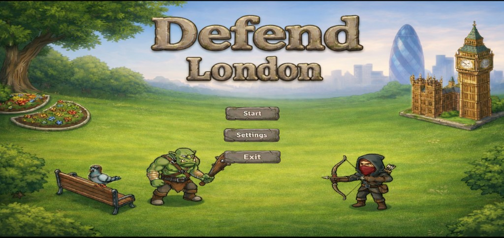
      </a>
      <br>
      🎮 <a href="./index.html">Play Now</a>
    </td>
    <td align="center" width="50%">
      <a href="./demo/demo.mp4">
        <video controls width="420" src="./demo/demo.mp4">
          Your browser does not support the video tag.
        </video>
      </a>
      <br>
      📺 <a href="./demo/demo.mp4">Watch Demo</a>
    </td>
  </tr>
</table>


## Your Group

<table width="100%">
  <tr valign="top">
    <td width="38%" align="left">
      
    </td>
    <td width="62%" align="left">
      <p><strong>Team Members</strong></p>
      <table>
        <thead>
          <tr>
            <th align="left">Name</th>
            <th align="left">Email</th>
            <th align="left">Role</th>
          </tr>
        </thead>
        <tbody>
          <tr>
            <td>Jiaxi You</td>
            <td>&lt;fl25387@bristol.ac.uk&gt;</td>
            <td>Project Manager / Tester</td>
          </tr>
          <tr>
            <td>Shasha Tang</td>
            <td>&lt;wj25162@bristol.ac.uk&gt;</td>
            <td>Gameplay Developer</td>
          </tr>
          <tr>
            <td>Junjie Wang</td>
            <td>&lt;da25293@bristol.ac.uk&gt;</td>
            <td>Combat Developer</td>
          </tr>
          <tr>
            <td>Jingjing Liu</td>
            <td>&lt;bd25907@bristol.ac.uk&gt;</td>
            <td>Level Designer</td>
          </tr>
          <tr>
            <td>Zejun Zhang</td>
            <td>&lt;tc25992@bristol.ac.uk&gt;</td>
            <td>UI Developer</td>
          </tr>
          <tr>
            <td>Mingshu Zhang</td>
            <td>&lt;so25258@bristol.ac.uk&gt;</td>
            <td>Systems Developer</td>
          </tr>
        </tbody>
      </table>
    </td>
  </tr>
</table>

## Project Report

### Introduction

#### What is Defend London?

A tower defense game where players protect iconic London landmarks from waves of invading enemies.  
Build towers, manage resources, and survive increasingly challenging waves across three beautifully illustrated levels.

---

#### What Makes It Special ✨

| 🏛️ London Identity | 👾 Diverse Enemies | 🎓 Guided Experience |
|---|---|---|
| Levels based on real landmarks: **Big Ben**, **Tower Bridge**, and **Buckingham Palace**. | 10 unique enemy types with abilities like charging, dodging, diving, and healing. | An interactive tutorial helps new players learn core mechanics step by step. |

The sections below follow our decision flow: **ideation** (genre and prototypes), **requirements** (stakeholders through epics), then **design** (architecture, systems, and UML).

---

### Ideation

#### Genre Exploration

At the start of the project, we evaluated multiple game genres against three criteria: uniqueness compared to past student projects, strategic depth for players, and clarity of implementation scope.

| Genre | Key Challenge | Decision |
|---|---|---|
| Action | Complex real-time enemy AI | ❌ |
| Puzzle | Time-consuming narrative design | ❌ |
| Shooting | Overdone by past teams | ❌ |
| **Tower Defense** | — | ✅ |

Tower defense stood out because enemy behavior is predictable and rule-based, the modular structure maps naturally to team responsibilities, and few past teams had explored this genre.

#### Paper Prototypes

To validate our direction, we built two paper prototypes before writing any code:

<table>
<tr>
<td align="center" width="50%">
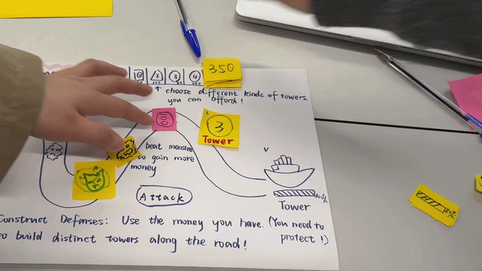
<br><b>Prototype A: Defend London</b>
<br>Tower defense · Place towers → Survive waves
</td>
<td align="center" width="50%">
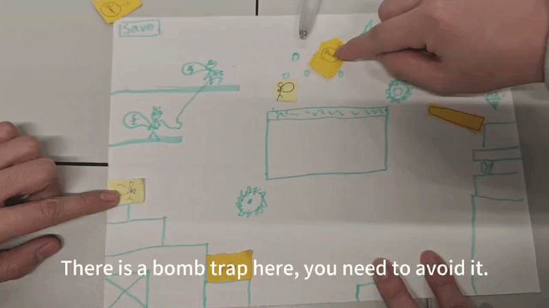
<br><b>Prototype B: Double Steal</b>
<br>Action platformer · Navigate floors → Avoid hazards
</td>
</tr>
</table>

Prototype A demonstrated a tower defense loop where players place defenses and react to incoming waves. Prototype B explored action-platformer traversal with timing-sensitive hazards.

#### Why Defend London?

We selected Prototype A for three reasons:

1. **System boundaries were clear** — tower, enemy, wave, and UI components mapped naturally to individual team members.
2. **Parallel development was feasible** — each subsystem could be built and tested independently.
3. **Integration risk was lower** — the action platformer’s tightly coupled mechanics would have required more coordination.

---

### Requirements

We used a GitHub Kanban board to track requirement progress and development tasks:  
https://github.com/orgs/UoB-COMSM0166/projects/168

#### Stakeholders

We identified stakeholders using an onion model approach, organizing them by proximity to the project:


| Layer | Stakeholder | Role |
|:---:|:---|:---|
| Core | Development Team | Design, code, test, deploy |
| 2nd | Course Instructor | Evaluate outcomes, provide guidance |
| 3rd | Classmates | Playtest and offer usability feedback |
| Outer | End Players | Target audience influencing design decisions |

The development team sits at the core as direct builders. Course instructors evaluate whether the project meets learning objectives—programming skills, collaboration, and structured process. Classmates serve as early playtesters, while end players represent the ultimate audience whose needs drive feature prioritization.

#### Use Case Diagram


The player starts a session, enemy waves begin, and towers are placed to defend the landmark. An alternative flow allows access to settings for volume and music adjustment.

#### User Stories

User stories capture requirements from the player’s perspective, using the standard form: **“As a [role], I want [feature], so that [benefit].”** We defined **six** stories: **five functional** (core systems and feedback) and **one non-functional** (performance), with **role diversity**—**casual player**, **strategic player**, **new player**, and **all players**—so analysis reflects different needs, not a single “average” user. A longer backlog and alternative **Given / When / Then** criteria appear in [`docs/design/stakeholders_and_user_stories.md`](./design/stakeholders_and_user_stories.md).

| User Story | Analysis |
|------------|----------|
| “As a **casual player**, I want resources to be **auto-collected**, so that I can focus on tower placement rather than clicking every dropped coin.” | **Functional requirement:** **Economy system** — gold is added automatically when enemies are defeated (no manual coin pickup). |
| “As a **strategic player**, I want to **see tower attack range before placing**, so that I can optimize my defense layout without memorizing every radius.” | **Functional requirement:** **Tower system** — range preview / placement feedback on the build grid. |
| “As a **strategic player**, I want a **next-wave preview** showing upcoming enemy types, so that I can prepare appropriate defenses.” | **Functional requirement:** **Wave system** — HUD or panel surfaces upcoming wave composition. |
| “As a **new player**, I want an **interactive tutorial** that guides me through game mechanics, so that I can learn without frustration.” | **Functional requirement:** **UI / game flow** — stepwise tutorial (`TUTORIAL_STEPS` in `constants.js`, driven by `GameManager` + `UIHUD`) introducing landmark, path, build area, and gold. |
| “As a **player**, I want the game to **respond smoothly without lag** during intense waves, so that my strategic decisions are not hindered by performance issues.” | **Non-functional requirement:** **Performance** — stable frame rate under load; supported by a modular per-frame `update()` chain and **wave-based spawning** (not all enemies active at once). |
| “As a **player**, I want **clear visual and audio feedback** when I win or lose, so that the game outcome feels satisfying and unambiguous.” | **Functional requirement:** **UI system** — dedicated win/lose (and level-complete) screens plus sound feedback. |

Each **functional** story maps to a **subsystem** in the architecture (economy, tower placement, waves, tutorial UI, end-game UI). The **non-functional** story supported choices such as **centralized config tables** (`TOWER_TYPES`, `ENEMY_STATS`) for fast tuning without extra runtime work, and a **clear update order** in the game loop so work stays localized per frame.

Following course material on requirements, we classified every story as either a **functional requirement** (what the system must *do*) or a **non-functional requirement** (how well it must *behave*). **Functional** stories mainly drove **class boundaries and UI flows**; the **performance** story reinforced **data-driven balance** and an efficient update path instead of ad hoc calculations every frame.

#### Development Epics

| Epic | Description | Key Acceptance Criteria |
|---|---|---|
| Enemy Wave System | Spawning, pathfinding, scaling | 3+ enemy types; path from start to landmark |
| Tower System | Building, upgrading, modular types | Valid placement; auto-targeting |
| Game Interface | Real-time HUD | Live health, coins, wave display |
| Audio System | BGM and sound effects | Distinct placement/damage/death sounds |
| Map & Environment | Grid logic and visual theme | Clear path vs buildable separation |

#### Reflection

This phase clarified that **epics** are product-level outcomes, while **user stories** break those outcomes into testable, player-facing statements. The table above makes the link explicit: each story has a **requirement type** (functional vs non-functional) and a **target component**, which is how we checked coverage before implementation. **Instructor user stories** from the stakeholder model (workflow, testing, code quality) are revisited in the **Conclusion**; **acceptance criteria** on the Kanban board and in the design doc kept “done” unambiguous for both features and process.

---

### Design

#### Architecture Overview

Defend London uses a modular architecture where each subsystem handles one responsibility. `GameManager` coordinates frame updates and state transitions between menu, gameplay, and end screens.

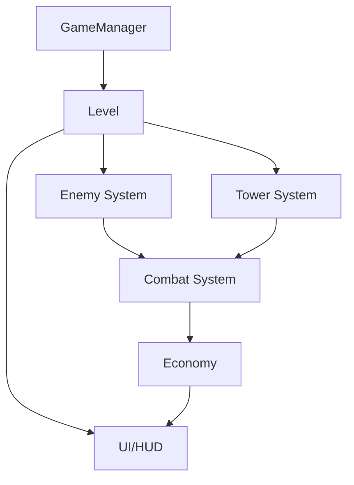
```mermaid
flowchart TD
    GM[GameManager]
    LV[Level]
    EN[Enemy System]
    TW[Tower System]
    CB[Combat System]
    UI[UI/HUD]
    EC[Economy]
    GM --> LV
    LV --> EN
    LV --> TW
    EN --> CB
    TW --> CB
    CB --> EC
    LV --> UI
    EC --> UI
```

This separation enables parallel development and localized debugging—issues can be traced to specific modules without full-game investigation.

#### Level Design: The Maps of London

Each level is themed around an iconic London location, with increasing complexity in path design and buildable space.

<table>
<tr>
<td align="center" width="33%">

<br><b>Level 1: Big Ben</b>
<br>Single path · Generous space
<br>🟢 Introductory
</td>
<td align="center" width="33%">
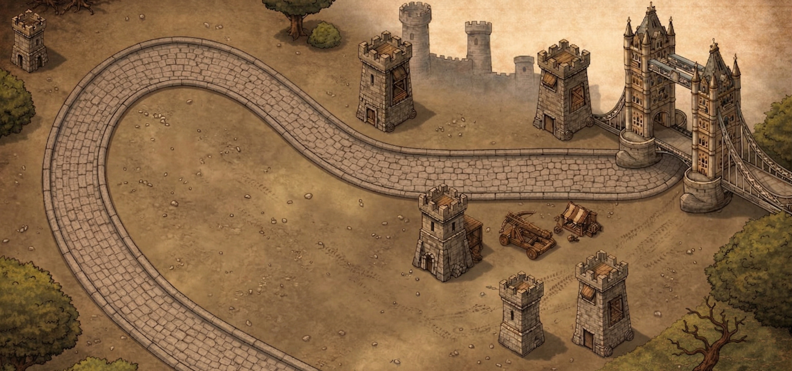
<br><b>Level 2: Tower Bridge</b>
<br>Split path · Bridge chokepoints
<br>🟡 Intermediate
</td>
<td align="center" width="33%">
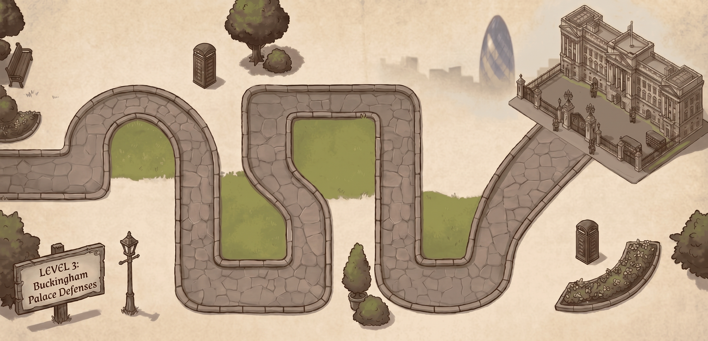
<br><b>Level 3: Buckingham Palace</b>
<br>Multi-lane · Tight placement
<br>🔴 Advanced
</td>
</tr>
</table>

The progression follows a deliberate learning curve: Level 1 teaches fundamentals, Level 2 introduces resource trade-offs, and Level 3 demands strategic mastery against the Gentleman Bug boss.

#### Tower System

Tower parameters are defined in centralized config tables (`TOWER_TYPES`), enabling balance adjustments without modifying core logic.

| | Tower | Cost | Damage | Special ability |
|:--:|---|--:|--:|---|
| 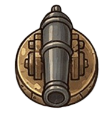 | Basic Tower | 60 | 15 | Balanced baseline |
| 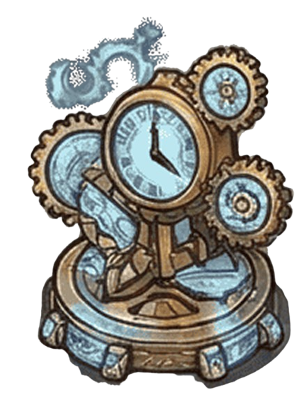 | Slow Tower | 85 | 12 | 45% slow effect |
|  | Area Tower | 130 | 13 | Pulsing AoE damage |
| 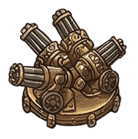 | Crystal Tower | 120 | 15 | +25% damage to nearby towers |
| 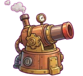 | Steam Cannon | 180 | 55 | Piercing (up to 3 targets) |
|  | Alchemist Tower | 150 | 20 | Random potion effects |

The Crystal Tower exemplifies our trade-off philosophy: its attack is slow, but it **boosts** nearby towers (+25% damage in range), so players choose between stacking direct firepower and long-term synergy.

#### Enemy System

Enemy behavior is data-driven through `ENEMY_STATS`. Each level introduces abilities that counter common player strategies.

**Level 1: Fundamentals**

| | Enemy | HP | Speed | Ability |
|:--:|---|--:|--:|---|
|  | Guard | 100 | 2.0 | None |
| 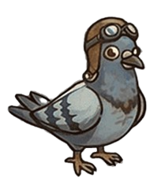 | Pigeon | 60 | 3.0 | High speed |
|  | Hedgehog | 300 | 1.0 | High HP tank |

**Level 2: Ability pressure**

| | Enemy | HP | Speed | Ability |
|:--:|---|--:|--:|---|
|  | Knight | 180 | 1.6 | Charges when wounded |
|  | Archer | 90 | 2.2 | 25% dodge chance |
|  | Giant | 500 | 0.9 | Leaps forward |

**Level 3: Counter-strategy**

| | Enemy | HP | Speed | Ability |
|:--:|---|--:|--:|---|
| 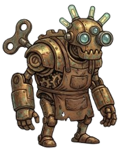 | Goblin Bomber | 120 | 2.2 | Explodes; disables towers |
| 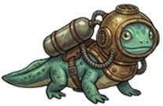 | Diving Lizard | 150 | 3.3 | Untargetable dive phase |
| 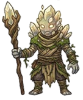 | Treant Mage | 200 | 1.2 | Area healing |
|  | Gentleman Bug | 2500 | 0.8 | 3-phase boss |

The Treant Mage forces target prioritization; the Goblin Bomber punishes tower clustering. These abilities turn enemies into tactical puzzles rather than stat increases alone.

#### UML diagrams

##### Class diagram


`Game` / `GameManager` orchestrates `Level`, which manages tower and enemy collections. Wave logic handles spawning; factories and presets instantiate specific types. `Tower` and `Enemy` share common update interfaces.

##### Sequence diagram


Each frame: the game calls `update()` → wave manager spawns enemies → enemies move → towers attack → combat resolves damage → UI refreshes → win/lose check.

#### Key design decisions

- **Centralized configuration.** Tower and enemy parameters live in config objects, enabling rapid balance iteration without touching core game logic.
- **Modular boundaries.** Clear interfaces between subsystems support parallel development and isolated debugging.
- **Progressive complexity.** Enemy abilities are introduced gradually across levels, building player skill before demanding mastery.

### Implementation

#### Development timeline

Our development followed a **12-week** iterative process in **four** phases.

---

##### Phase 1: Foundation (Weeks 1–3)

<table>
<tr>
<td width="40%">


</td>
<td width="60%">

**Focus:** Core architecture and basic systems

**Deliverables**
- **Game loop** and **state management** (`GameManager` + `GameState`)
- **Grid-based map** with per-cell types (`MapData.js`); **configurable** cell size via `LEVEL_GRID_CONFIG` (default **30×30 px** in `constants.js`)
- **Basic tower placement** and projectiles
- **Enemy pathfinding** along **waypoint** lists in `Path.js`

</td>
</tr>
</table>

---

##### Phase 2: Expansion (Weeks 4–6)

<table>
<tr>
<td width="40%">

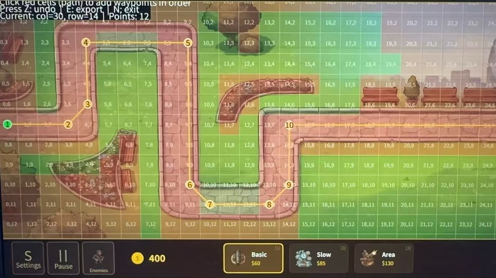

</td>
<td width="60%">

**Focus:** Feature development and variety

**Deliverables**
- **Six tower types** with distinct abilities (`TOWER_TYPES` in `constants.js`)
- **Ten enemy types** with varied stats and behaviours (`ENEMY_STATS`)
- **Wave management** (`WaveManager` + `LEVEL_*_WAVE_CONFIGS`)
- **Economy**: gold, **wave clear bonus** (`WAVE_CLEAR_BONUS_GOLD`), selling and refunds

</td>
</tr>
</table>

---

##### Phase 3: Challenge (Weeks 7–9)

<table>
<tr>
<td width="40%">

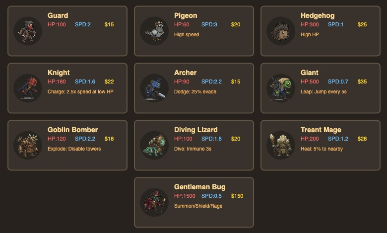

</td>
<td width="60%">

**Focus:** Content expansion and balancing

**Deliverables**
- **Three London-themed levels** with hand-drawn backgrounds
- **Multi-phase boss** (Gentleman Bug) and abilities such as **charge**, **dodge**, **dive**, **heal**, **explode**
- **Balance tuning** using **spreadsheet-style reasoning** and **in-game configs** (not a single runtime formula)
- **Heuristic models** (e.g. **player firepower** vs **enemy pressure**) to compare waves before playtesting

</td>
</tr>
</table>

---

##### Phase 4: Polish (Weeks 10–12)

<table>
<tr>
<td width="40%">

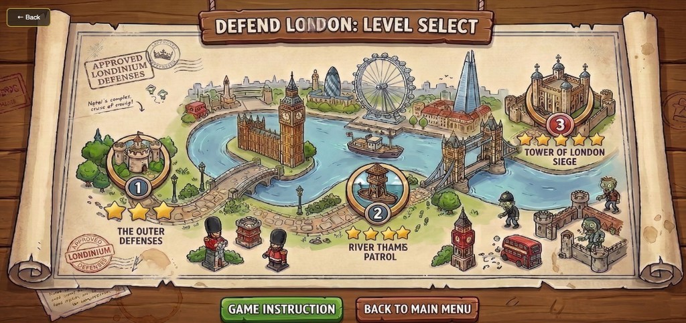

</td>
<td width="60%">

**Focus:** Testing and refinement

**Deliverables**
- **Debug tools** for **grid / path alignment** (overlay, path editor, console export — see Technical challenges)
- **Settings** (volume, brightness, BGM selection) and consistent **menu vs in-game** flows where possible
- **Win / loss** screens with clear feedback
- **Bug fixes** from playtesting and heuristic review

</td>
</tr>
</table>

---

#### Technical highlight: state management

Switching between **menu**, **level select**, **playing**, **paused**, **win**, **lose**, and other modes risks **orphaned UI** or **input handlers** if every screen is bolted on ad hoc.

We centralised transitions in **`GameManager.setState`**, backed by a single **`GameState`** string enum in `constants.js` (the code does **not** use a separate class named `GameStateManager`; the **manager** role lives in **`GameManager`**).

```javascript
const GameState = {
  MENU: 'menu',
  PLAYING: 'playing',
  PAUSED: 'paused',
  WIN: 'win',
  LOSE: 'lose',
};
```

The full enum also includes **`LOGIN`**, **`LEVEL_SELECT`**, **`SETTINGS`**, **`IN_GAME_SETTINGS`**, **`MONSTER_INFO`**, and **`INSTRUCTIONS`**. Each transition runs through the same **dispatch** so **draw** and **keyboard** logic stay aligned with the **current** state.

| State (core loop) | On entry (concept) | On exit (concept) |
|-------------------|--------------------|-------------------|
| **MENU** | Show main menu; accept navigation to settings / level flow | Hand off before loading a level |
| **PLAYING** | Spawn **economy**, **waves**, **map**; run per-frame **update** | Pause or tear down level objects when leaving |
| **PAUSED** | Freeze gameplay **update**; show pause UI | Resume **PLAYING** branch |
| **WIN** / **LOSE** | Show outcome UI; record stats if needed | Return to **menu** or **retry** without leaking level state |

**Result.** Playtests and heuristic sessions did **not** surface crashes from **rapid menu ↔ play ↔ pause ↔ end-screen** navigation; state stayed **predictable** for testers.

---

#### Technical challenges

##### Challenge 1: Debug grid system

**Problem.** **Hand-drawn** backgrounds did not always match the **logical grid**: towers could look “off” the art, or **pathing** could disagree with the painted road unless **offsets** and **cell size** were tuned.

**Solution.** We added **developer overlays**: **`D`** toggles **`drawDebugGrid()`** in `GameManager.js` (green tint = **tower-buildable** in the current view, red tint = **not buildable**; cell indices drawn for alignment). **`LEVEL_GRID_CONFIG`** holds **`offsetX`**, **`offsetY`**, and **`gridSize`** per level. **`N`** toggles **path edit mode** with **waypoint** placement and **console export** for `Path.js` (see `./images/dev/grid-debug.png`).

```javascript
const LEVEL_GRID_CONFIG = {
  1: { offsetX: 0, offsetY: -15, gridSize: 30 },
  2: { offsetX: 0, offsetY: 0, gridSize: 30 },
  3: { offsetX: 0, offsetY: 0, gridSize: 30 }
};
```

| Debug overlay (D key) | Colour (approx.) | Role |
|-----------------------|------------------|------|
| **Buildable** | Green (transparent) | Cells where **towers** may be placed |
| **Non-buildable** | Red tint | **Path**, **obstacle**, HUD band, or other blocked cells |

**Result.** **Alignment** and **path export** became **fast iteration** loops instead of pixel-guessing; remaining issues were caught **before** final release builds.

##### Challenge 2: Balance formula

**Problem.** Early playtests swung between **too much gold** (trivial waves) and **over-tuned enemies** (unfair spikes). **Pure gut-feel** tuning was slow and **hard to justify** in team review.

**Solution.** We combined **(A)** **authoritative tables in code** — `TOWER_TYPES`, `ENEMY_STATS`, `LEVEL_*_WAVE_CONFIGS`, per-kill **`reward`**, and **`WAVE_CLEAR_BONUS_GOLD`** (`constants.js` / `GameManager.js`) — with **(B)** simple **design-time formulas** to reason about scaling. The expressions below are **design-time** checks used **with** playtesting. **Shipped** tower costs are **authored** in `TOWER_TYPES`; the cost line below shapes tier spacing before those values are locked in.

```text
Cost ≈ BaseCost × (1 + 0.15 × TowerTier)          // design-time only
HP ≈ BaseHP × (1 + 0.2 × WaveNumber) × L_mult     // design-time only
Reward ≈ EnemyHP × 0.1 + BaseReward                 // design-time only
```

**Principle (team rule of thumb):** after clearing a wave, income from **kills + wave bonus** should usually allow **roughly a few** new **mid-tier** placements if the player defends well — tight enough to force choices, not a gold flood.

| Parameter | Level 1 | Level 2 | Level 3 | Source in code |
|-----------|--------:|--------:|--------:|----------------|
| **Starting gold** | **300** | **550** | **600** | `INITIAL_GOLD` (300) + per-level offsets in `GameManager` **level configs** (+0 / +250 / +300) |
| **Wave count** | **3** | **6** | **6** | Length of `LEVEL_1_WAVE_CONFIGS` … `LEVEL_3_WAVE_CONFIGS` in `constants.js` |

**Design.** Difficulty scales through **wave composition**, **enemy HP and count** in the per-level configs, and **per-level starting gold** (table above). That approach gave **finer control over pacing** on each map and made **which wave or group to adjust** easy to see in design review. The **L_mult** term in the HP line is a **planning** hook for spreadsheets and early estimates; the **authoritative** numbers live in the same config tables as the shipped waves.

**Result.** Feedback shifted from vague “**too easy / hard**” to **which wave** and **which enemy group** to change — a sign that **economy and pressure** were understandable and **tunable**.

### Evaluation

#### Evaluation design

We ran a **mixed-methods** evaluation: **qualitative** discovery (think-aloud and heuristic review), then **quantitative** comparison of perceived **workload** and **usability** under two in-game conditions.

**Quantitative user study (within-subject, *n* = 10).** Each participant played **two sessions** in **randomised order**:

| Condition | Map | Role in analysis |
|-----------|-----|------------------|
| **Simple mode** | **Level 1** (Big Ben) | Low difficulty baseline |
| **Hard mode** | **Level 3** (Buckingham Palace) | High difficulty stress test |

After **each** session, participants completed:

- **NASA-TLX** (weighted): Mental, Physical, and Temporal demand, Performance, Effort, Frustration — then **pairwise weights** per participant before computing an **overall workload** score.
- **SUS** (10 items): perceived usability on a **0–100** scale; industry **benchmark = 68**.

**Environment:** Chrome, Edge, Firefox (current versions); **p5.js** game; desktop **Windows / macOS**. We also logged **task completion**, obvious **interaction errors**, and **frame behaviour** during heavy waves (see Software testing).

**Qualitative (supporting).** Two **think-aloud** sessions (external participants) plus a **team heuristic** pass informed issue lists and UI priorities; details align with the severity table we used during iteration (see earlier report drafts in [`docs/weekly_progress/week9_evaluation_quality_and_testing/week9_evaluation_quality_and_testing.md`](./weekly_progress/week9_evaluation_quality_and_testing/week9_evaluation_quality_and_testing.md)).

**Figure set (recommended for the report).** Use **three** charts under `./images/eval/`: **(1)** NASA-TLX aggregate, **(2)** SUS aggregate (benchmark line), **(3)** SUS **per-user** (shows every participant vs **68** and makes the **paired** pattern obvious). Weight heatmaps for TLX live in [`docs/weekly_progress/week8_quantitative_evaluations/TLX_evaluations.md`](./weekly_progress/week8_quantitative_evaluations/TLX_evaluations.md) if you need supplementary material.

---

#### User testing: NASA-TLX

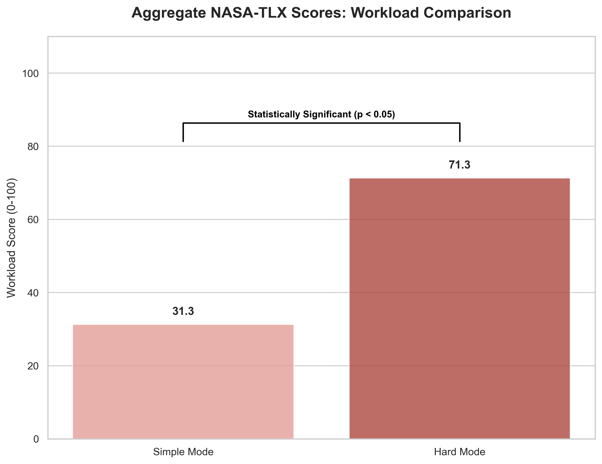
*Aggregate NASA-TLX (weighted) workload. Source charts: [`NASA_TLX_Final_Comparison.png`](./weekly_progress/week8_quantitative_evaluations/NASA_TLX_Final_Comparison.png).*

| Condition | Mean workload | Interpretation |
|-----------|---------------|----------------|
| **Simple (Level 1)** | **31.3** | Low–moderate cognitive load |
| **Hard (Level 3)** | **71.3** | High load — strategy and time pressure dominate |

Moving from **Simple** to **Hard** roughly **more than doubles** perceived workload (about **+128%** on the aggregate score), matching the design goal that **Level 3** should feel **taxing** rather than “more of the same UI friction.” A **Wilcoxon signed-rank** test on paired scores gave **W = 0**, **p < 0.05** (every participant ranked **Hard** heavier than **Simple**), reported in [`TLX_evaluations.md`](./weekly_progress/week8_quantitative_evaluations/TLX_evaluations.md).

---

#### User testing: SUS


*Aggregate SUS. Source: [`SUS_Final_Comparison.png`](./weekly_progress/week8_quantitative_evaluations/SUS_Final_Comparison.png).*

| Condition | Mean SUS | Adjective rating (Bangor) |
|-----------|----------|-----------------------------|
| **Simple (Level 1)** | **88.0** | Excellent (“A”) |
| **Hard (Level 3)** | **74.3** | Good (“B”) |
| **Industry benchmark** | **68** | Acceptable threshold |

Both conditions sit **above 68**, so players judged the **interface** usable even when the **game** was hard. The **~13.7** point drop from **Simple** to **Hard** reflects **challenge**, not broken menus — consistent with the narrative in [`SUS_evaluations.md`](./weekly_progress/week8_quantitative_evaluations/SUS_evaluations.md).

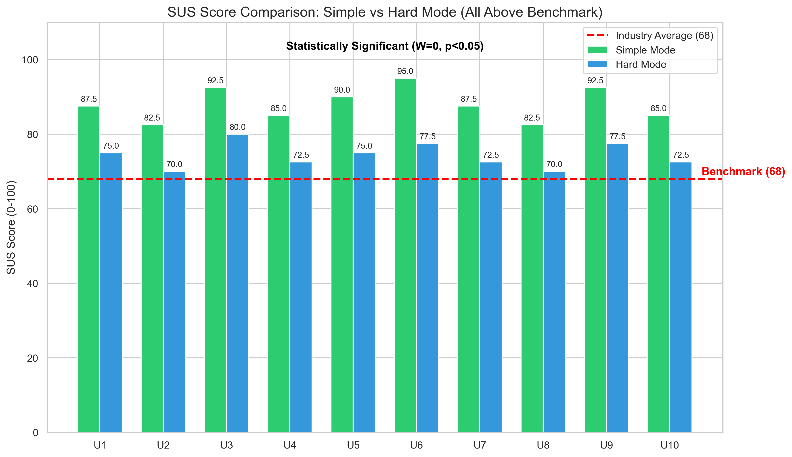
*Per-participant SUS: **every** user stayed **above 68** in **both** conditions, and **every** user rated **Simple** higher than **Hard** — strong evidence of **consistent** measurement rather than one outlier driving the mean.*

Taken together, the NASA-TLX and SUS subsections above support the product story: **difficulty scales through gameplay**, while **UI learnability** stays in a **good-to-excellent** band. Qualitative and heuristic work then turns those signals into **concrete** HUD, settings, and wave-info fixes.

---

#### Software testing

We did **not** rely on a large automated **unit-test** suite in this module (see `tests/`); instead we combined **black-box** case runs from our test document with **white-box–style** checks on critical paths.

##### Black-box testing

Behaviour verified **without** reading implementation line-by-line; examples:

| Test case | Input | Expected | Outcome |
|-----------|-------|----------|---------|
| Valid tower placement | Click **grass** build cell with enough gold | Tower appears; gold deducted | Pass |
| Invalid placement | Click **path** / **obstacle** | Blocked + feedback | Pass |
| Wave flow | Clear wave | Countdown / next wave or **victory** | Pass |
| Insufficient gold | Pick expensive tower | Cannot place; no charge | Pass |
| Defeat | Landmark **HP → 0** | **Lose** screen / retry path | Pass |

Full IDs (FT-001 … CP-002) are tabulated in [`week9_evaluation_quality_and_testing.md`](./weekly_progress/week9_evaluation_quality_and_testing/week9_evaluation_quality_and_testing.md).

##### White-box testing

Targeted **inspection** and **manual** execution of sensitive logic (no claimed **code-coverage %**): stepping through **`WaveManager`** state (`waiting` → `spawning` → `active`), **`Economy`** refunds and sell paths, **`Tower`** range and slow/splash branches, and **`GameManager`** win/lose gates — plus **debug-grid** verification that **logical tiles** matched **art**. This caught integration bugs that black-box runs alone often miss.

### Process

#### Development workflow

We agreed **team responsibilities** and a **Git workflow** (branch strategy, integration rules) **at the outset**, wrote them into a living document, and **revised and followed that guide** for the rest of the module so practice and documentation stayed aligned.

[**Git workflow guide (full text)**](./workflow.md)

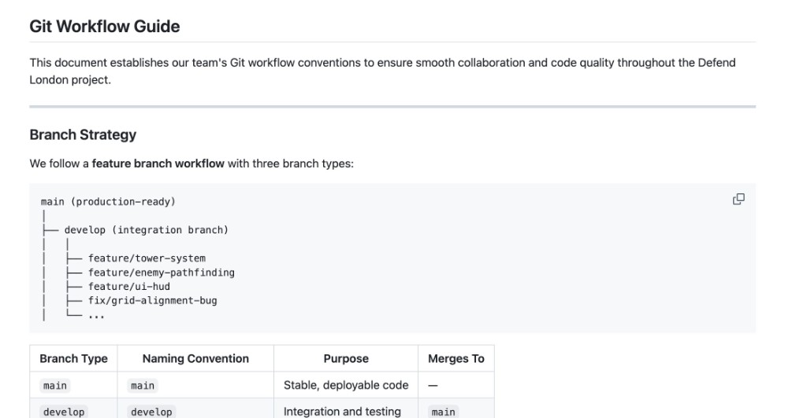

In day-to-day work we used a **feature-branch** model: scoped work on `feature/*` and personal lines such as `*_dev`, fixes on `gamefix*`, and integration through **Pull Requests** (e.g. **#23**, **#24**) with review and CI before merge.

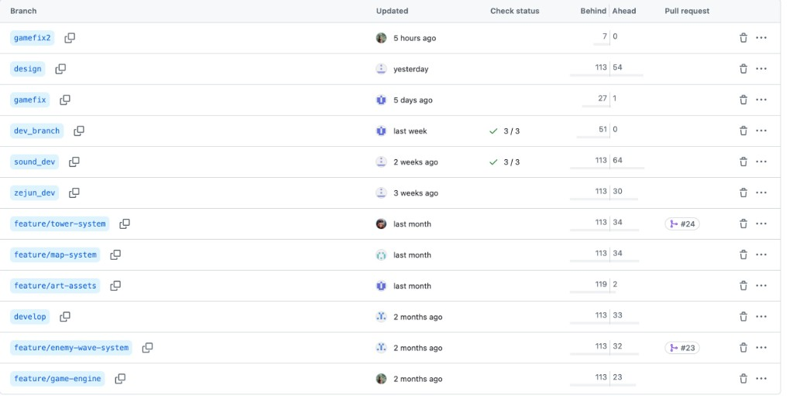

| Branch type | Examples | Purpose |
|-------------|----------|--------|
| `feature/*` | `feature/tower-system`, `feature/enemy-wave-system` | New functionality |
| `*_dev` | `zejun_dev`, `sound_dev` | Subsystem / personal line |
| `gamefix*`, `develop`, `design` | `gamefix`, `gamefix2`, `develop`, `design` | Fixes, integration, design experiments |

#### Task management

Work was tracked on a **GitHub Project** board; [open the project](https://github.com/orgs/UoB-COMSM0166/projects/168) for the live board.

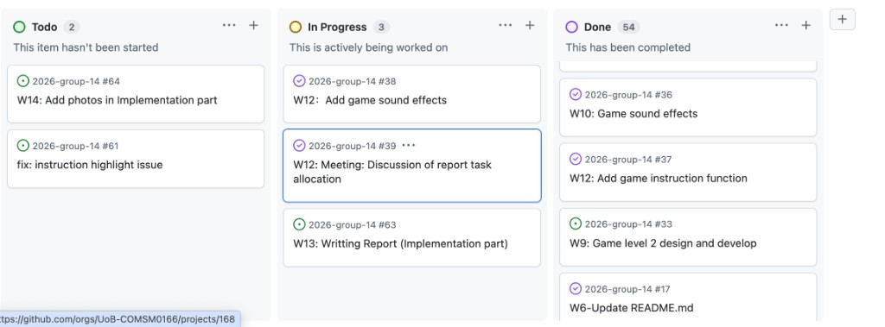

#### Communication

Meeting outcomes and ad-hoc plans were written up in a shared log so the group had a record of decisions. [Meeting notes →](./meeting_notes/)

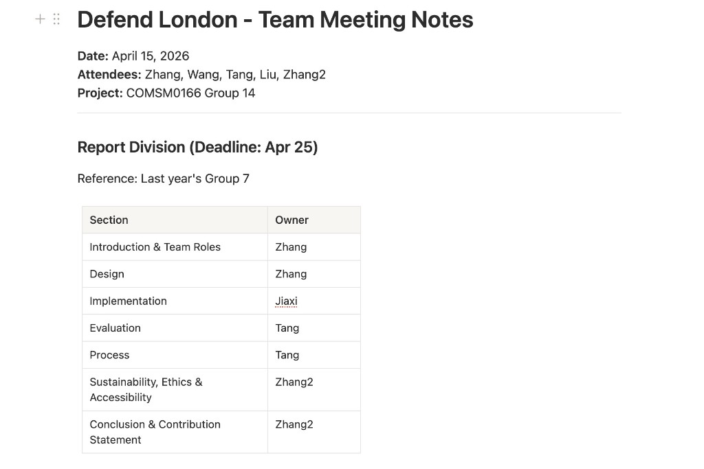

#### Contribution summary

**GitHub Insights → Contributors** reflects activity across the **six** team members over the module. **Roles and responsibilities** are in **Team Members** / the **Introduction**; we do not repeat per-person breakdowns here.

## Sustainability, Ethics and Accessibility

### Overall Approach

Sustainability in Defend London is about keeping the tower-defence loop fair and maintainable as levels and systems grow. In practice that covers how London is represented, how players learn the rules and adjust audio and display, how browser load scales with sprites and sound, whether the p5.js build needs paid infrastructure, and how `GameManager`, wave logic, map data, and combat code stay separable. We used SusAF to organise those angles.

### SusAD Diagram


*Figure: SusAD diagram — positive opportunities (green) and negative risks (red) across sustainability dimensions.*

The figure summarises trade-offs for this build: local `localStorage` and nickname-only progress cut server and account surface, while large sprite and audio sets still stress load and memory. Splitting `GameManager`, map data, and wave logic eases change, but a mouse-first HUD and tuning values spread across files still matter for accessibility and maintenance.

### Social Sustainability

Landmark-based levels (Big Ben, Tower Bridge, Buckingham Palace) give Defend London a clear identity; a real-city theme still needs careful representation. Player trust depends on readable paths, tower effects, and win/lose feedback—clearer copy for abilities and waves would strengthen that.

### Individual Sustainability

The tutorial, pause, level select, continue/try again, and win/lose flow aim to flatten the learning curve; volume, music, and brightness support comfort. Placement and combat still lean on mouse and colour; keyboard controls, a high-contrast mode, and non-colour cues for key states would widen who can play fairly.

### Ethics

Progress uses a nickname only (no accounts) and `localStorage` in the browser for this build, with no analytics layer in the shipped game. Next steps would be a short in-game explanation of local saving and a “delete save data” action so users control what stays on the device.

### Environmental Sustainability

Running in the browser avoids a dedicated save server for the single-player loop. Waves spawn enemies incrementally rather than instantiating whole rosters at once, which limits peak object count during heavy fights. Image and audio for towers, enemies, and maps remain the main footprint—compressing files, pruning unused assets, and measuring load and frame time under max waves are the main levers left.

### Economic Sustainability

Defend London ships as static p5.js and JavaScript, so there is no paid hosting or custom API requirement for the current design—appropriate for a module budget. Splitting enemies, towers, economy, waves, and map data across files keeps maintenance scoped, provided balance numbers are gradually centralised so tuning does not sprawl.

### Technical Sustainability

`GameManager.js` coordinates level flow and state; `MapData.js` and `Path.js` separate build tiles from enemy routes; `Tower`, `Enemy`, and `WaveManager` isolate combat and wave timing. That layout matches how we debugged placement, pathing, and wave edges. Further work is tighter shared config, short entry-point docs, and more automated checks for placement and wave handover (see Software testing under Evaluation).

### Future Actions Summary

If we extended the current build, the highest-value work would track the risks above: clearer tower and enemy-ability copy and wave intent; keyboard and display options for players who cannot rely on mouse or default contrast; plain-language privacy text and a delete-save control; leaner media and measured performance under heavy waves; and centralised tuning values with a few automated checks on placement and wave progression.

Defend London already has a sound base on these fronts; the largest gaps are accessibility, transparent handling of local saves, and asset/runtime efficiency.

## Conclusion

### Project Summary

Defend London grew from a London-themed concept into a playable browser tower-defence with three levels, multiple enemy and tower types, wave-based progression, economy and UI, sound, and local progress. The hardest work was not adding features in isolation, but integrating combat, paths, waves, and feedback into one coherent experience.

### Limitations and honest reflection

**Scope we chose not to deliver in full.** Design documents once described **in-place tower upgrades** (stat tiers on the same placement). We **prioritised** six distinct tower types, **gold economy**, and **sell/refund** instead: that preserved strategic choice while avoiding an extra upgrade UI, balance matrix, and regression surface in the closing weeks. **Cloud accounts or leaderboards** were never planned for this module build—**local-only progress** was a deliberate boundary (see Sustainability, Ethics and Accessibility).

**Where effort exceeded early estimates.** **Aligning** hand-drawn maps with the **logical grid** and **enemy paths** took more iteration than anticipated; small **offset** or **waypoint** errors were easy to miss until full-level playtests. **Late integration** (economy, waves, menus, and combat in one loop) also concentrated bugs that did not appear when subsystems were tested alone.

**Technical debt we are open about.** Shipping quality relied on **manual and black-box runs** plus **code inspection** on sensitive paths, not a broad **automated test** suite—the `tests/` tree is minimal by design for this project (see Software testing under Evaluation). **Tuning values** remain spread across several config locations; **centralising balance**, short maintainer notes, and a few **automated checks** on placement and wave handover are the main improvements we would make before handing the repo to another team (also reflected under Future directions).

### Course concepts in practice

Taken together, the course ideas showed up in how we actually worked, not only in the syllabus labels. **Requirements** were grounded in user stories, epics, and stakeholder stories ([stakeholders & user stories](./design/stakeholders_and_user_stories.md)), which steered scope before implementation churn. **Design** was supported by UML (class and sequence diagrams) so towers, waves, economy, and UI were discussed with a **shared vocabulary**. **Iterative delivery** over twelve weeks—tracked on the GitHub board and described under Process—meant grid alignment, pathing, and balance were refined in increments rather than fixed up front. **Version control** relied on feature branches, pull requests, and a written [`workflow.md`](./workflow.md), which mattered with six people merging in parallel. **Evaluation** (think-aloud, heuristics, NASA-TLX, and SUS; see Evaluation) made a distinction we could not ignore: behaviour that is fine in code can still feel wrong to players, and structured testing exposed that. **Sustainability (SusAF)** is treated in Sustainability, Ethics and Accessibility; we do not repeat the SusAD detail here, but that section records how we argued about privacy, accessibility, and technical footprint. In short, the module’s process vocabulary matched our day-to-day trade-offs: specify, design, build in loops, branch safely, test with users, and reflect on longer-term impact.

### Team reflection

Working as a six-person team, we found that communication and clear ownership mattered as much as code. Hand-offs that were left implicit led to duplicated work and merge friction; adopting a shared Git guide (see Process), a visible GitHub board, and regular syncs reduced that. Playtesting was a collaboration skill in its own right: when feedback showed that a feature we liked confused new players, treating that as data—not defending the first design—led to better HUD, tutorial, and wave presentation.

### Future directions

- **Player experience:** keyboard and display options, clearer in-game explanation of local saves and privacy
- **Performance and assets:** compress and prune media; measure load under heavy waves
- **Content:** more London-themed set-pieces, enemy and level variety, if the core loop were extended
- **Maintainability:** centralise balance and config, short maintainer notes, more regression checks on placement and wave handover (see Software testing in Evaluation)

## Contribution Statement

| Contributor | Contribution |
|---|---|
| Jiaxi You | Led project management and coordination of evaluation activities; set up the testing framework and initialised the game engine for the team baseline. |
| Shasha Tang | Produced requirements documentation; designed core gameplay mechanics and developed user stories to guide implementation. |
| Junjie Wang | Implemented the tower-defence systems and combat mechanics (towers, waves, and related in-battle behaviour). |
| Jingjing Liu | Designed levels and produced visual assets used in the game. |
| Zejun Zhang | Built the user interface and menu systems (screens, navigation, and in-game UI flow). |
| Mingshu Zhang | Implemented the grid system and integrated subsystems into a coherent game loop. |

## Additional Marks

You can delete this section in your own repo, it's just here for information. in addition to the marks above, we will be marking you on the following two points:

- **Quality** of report writing, presentation, use of figures and visual material (5% of report grade) 
  - Please write in a clear concise manner suitable for an interested layperson. Write as if this repo was publicly available.
- **Documentation** of code (5% of report grade)
  - Organise your code so that it could easily be picked up by another team in the future and developed further.
  - Is your repo clearly organised? Is code well commented throughout?
