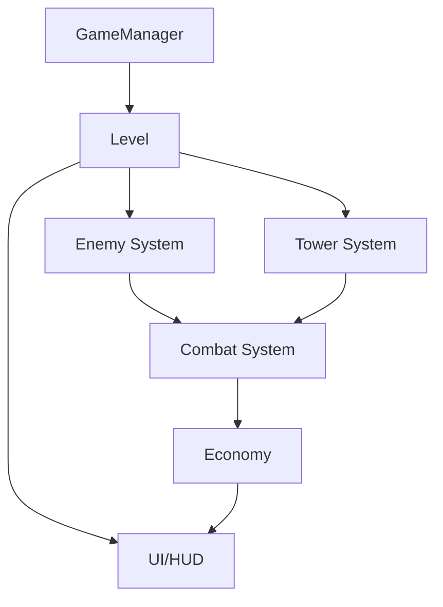
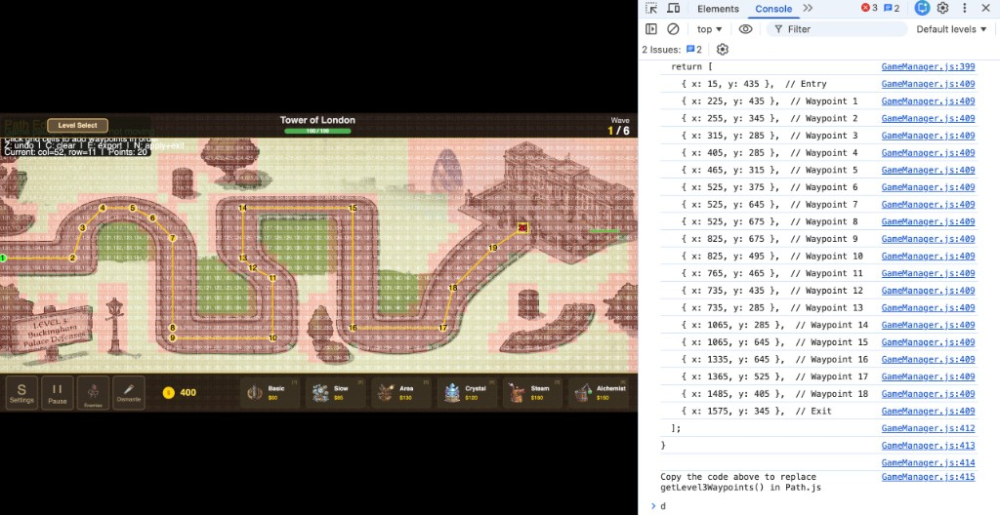
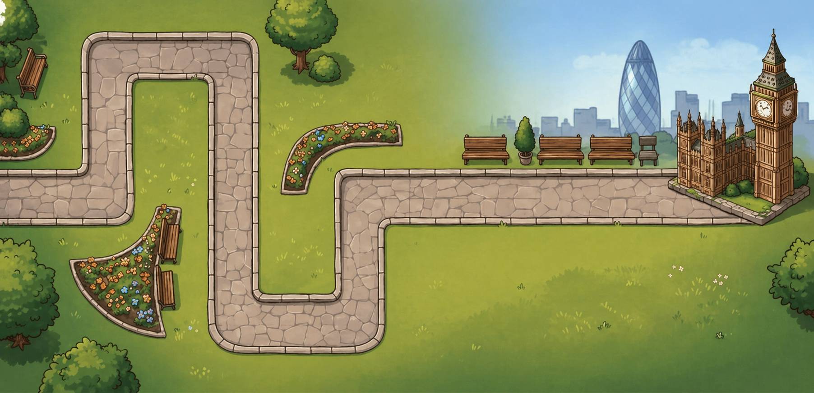

# 2026-group-14

## Defend London

> Protect the landmarks. Outsmart the invaders. Defend your city.

<table>
  <tr>
    <td align="center" width="50%">
      <a href="./index.html">
        
      </a>
      <br>
      🎮 <a href="./index.html">Play Now</a>
    </td>
    <td align="center" width="50%">
      <a href="./demo/demo.mp4">
        <video controls width="420" src="./demo/demo.mp4">
          Your browser does not support the video tag.
        </video>
      </a>
      <br>
      📺 <a href="./demo/demo.mp4">Watch Demo</a>
    </td>
  </tr>
</table>


## Your Group


## Team Members

| Name          | Email | Role | Completed Work |
|---------------|-------|------|----------------|
| Jiaxi You     | <fl25387@bristol.ac.uk> | Project Manager / Tester | Project management / Testing / Game engine setup |
| Shasha Tang   | <wj25162@bristol.ac.uk> | Gameplay Developer | Requirements / Gameplay design |
| Junjie Wang   | <da25293@bristol.ac.uk> | Combat Developer | Tower system / Combat mechanics |
| Jingjing Liu  | <bd25907@bristol.ac.uk> | Level Designer | Level design / Visual assets |
| Zejun Zhang   | <tc25992@bristol.ac.uk> | UI Developer | UI / Menu interface |
| Mingshu Zhang | <so25258@bristol.ac.uk> | Systems Developer | Grid system / Gameplay systems / Integration |


## Project Report

### Introduction

#### What is Defend London?

A tower defense game where players protect iconic London landmarks from waves of invading enemies.  
Build towers, manage resources, and survive increasingly challenging waves across three beautifully illustrated levels.

---

#### What Makes It Special ✨

| 🏛️ London Identity | 👾 Diverse Enemies | 🎓 Guided Experience |
|---|---|---|
| Levels based on real landmarks: **Big Ben**, **Tower Bridge**, and **Buckingham Palace**. | 10 unique enemy types with abilities like charging, dodging, diving, and healing. | An interactive tutorial helps new players learn core mechanics step by step. |

The sections below follow our decision flow: **ideation** (genre and prototypes), **requirements** (stakeholders through epics), then **design** (architecture, systems, and UML).

---

### Ideation

#### Genre Exploration

At the start of the project, we evaluated multiple game genres against three criteria: uniqueness compared to past student projects, strategic depth for players, and clarity of implementation scope.

| Genre | Key Challenge | Decision |
|---|---|---|
| Action | Complex real-time enemy AI | ❌ |
| Puzzle | Time-consuming narrative design | ❌ |
| Shooting | Overdone by past teams | ❌ |
| **Tower Defense** | — | ✅ |

Tower defense stood out because enemy behavior is predictable and rule-based, the modular structure maps naturally to team responsibilities, and few past teams had explored this genre.

#### Paper Prototypes

To validate our direction, we built two paper prototypes before writing any code:

<table>
<tr>
<td align="center" width="50%">

<br><b>Prototype A: Defend London</b>
<br>Tower defense · Place towers → Survive waves
</td>
<td align="center" width="50%">

<br><b>Prototype B: Double Steal</b>
<br>Action platformer · Navigate floors → Avoid hazards
</td>
</tr>
</table>

Prototype A demonstrated a tower defense loop where players place defenses and react to incoming waves. Prototype B explored action-platformer traversal with timing-sensitive hazards.

#### Why Defend London?

We selected Prototype A for three reasons:

1. **System boundaries were clear** — tower, enemy, wave, and UI components mapped naturally to individual team members.
2. **Parallel development was feasible** — each subsystem could be built and tested independently.
3. **Integration risk was lower** — the action platformer’s tightly coupled mechanics would have required more coordination.

---

### Requirements

We used a GitHub Kanban board to track requirement progress and development tasks:  
https://github.com/orgs/UoB-COMSM0166/projects/168

#### Stakeholders

We identified stakeholders using an onion model approach, organizing them by proximity to the project:


| Layer | Stakeholder | Role |
|:---:|:---|:---|
| Core | Development Team | Design, code, test, deploy |
| 2nd | Course Instructor | Evaluate outcomes, provide guidance |
| 3rd | Classmates | Playtest and offer usability feedback |
| Outer | End Players | Target audience influencing design decisions |

The development team sits at the core as direct builders. Course instructors evaluate whether the project meets learning objectives—programming skills, collaboration, and structured process. Classmates serve as early playtesters, while end players represent the ultimate audience whose needs drive feature prioritization.

#### Use Case Diagram


The player starts a session, enemy waves begin, and towers are placed to defend the landmark. An alternative flow allows access to settings for volume and music adjustment.

#### User Stories

User stories capture requirements from the player’s perspective, using the standard form: **“As a [role], I want [feature], so that [benefit].”** We defined **six** stories: **five functional** (core systems and feedback) and **one non-functional** (performance), with **role diversity**—**casual player**, **strategic player**, **new player**, and **all players**—so analysis reflects different needs, not a single “average” user. A longer backlog and alternative **Given / When / Then** criteria appear in [`docs/design/stakeholders_and_user_stories.md`](./design/stakeholders_and_user_stories.md).

| User Story | Analysis |
|------------|----------|
| “As a **casual player**, I want resources to be **auto-collected**, so that I can focus on tower placement rather than clicking every dropped coin.” | **Functional requirement:** **Economy system** — gold is added automatically when enemies are defeated (no manual coin pickup). |
| “As a **strategic player**, I want to **see tower attack range before placing**, so that I can optimize my defense layout without memorizing every radius.” | **Functional requirement:** **Tower system** — range preview / placement feedback on the build grid. |
| “As a **strategic player**, I want a **next-wave preview** showing upcoming enemy types, so that I can prepare appropriate defenses.” | **Functional requirement:** **Wave system** — HUD or panel surfaces upcoming wave composition. |
| “As a **new player**, I want an **interactive tutorial** that guides me through game mechanics, so that I can learn without frustration.” | **Functional requirement:** **UI / game flow** — stepwise tutorial (`TUTORIAL_STEPS` in `constants.js`, driven by `GameManager` + `UIHUD`) introducing landmark, path, build area, and gold. |
| “As a **player**, I want the game to **respond smoothly without lag** during intense waves, so that my strategic decisions are not hindered by performance issues.” | **Non-functional requirement:** **Performance** — stable frame rate under load; supported by a modular per-frame `update()` chain and **wave-based spawning** (not all enemies active at once). |
| “As a **player**, I want **clear visual and audio feedback** when I win or lose, so that the game outcome feels satisfying and unambiguous.” | **Functional requirement:** **UI system** — dedicated win/lose (and level-complete) screens plus sound feedback. |

Each **functional** story maps to a **subsystem** in the architecture (economy, tower placement, waves, tutorial UI, end-game UI). The **non-functional** story supported choices such as **centralized config tables** (`TOWER_TYPES`, `ENEMY_STATS`) for fast tuning without extra runtime work, and a **clear update order** in the game loop so work stays localized per frame.

Following course material on requirements, we classified every story as either a **functional requirement** (what the system must *do*) or a **non-functional requirement** (how well it must *behave*). **Functional** stories mainly drove **class boundaries and UI flows**; the **performance** story reinforced **data-driven balance** and an efficient update path instead of ad hoc calculations every frame.

#### Development Epics

| Epic | Description | Key Acceptance Criteria |
|---|---|---|
| Enemy Wave System | Spawning, pathfinding, scaling | 3+ enemy types; path from start to landmark |
| Tower System | Building, upgrading, modular types | Valid placement; auto-targeting |
| Game Interface | Real-time HUD | Live health, coins, wave display |
| Audio System | BGM and sound effects | Distinct placement/damage/death sounds |
| Map & Environment | Grid logic and visual theme | Clear path vs buildable separation |

#### Reflection

This phase clarified that **epics** are product-level outcomes, while **user stories** break those outcomes into testable, player-facing statements. The table above makes the link explicit: each story has a **requirement type** (functional vs non-functional) and a **target component**, which is how we checked coverage before implementation. **Instructor user stories** from the stakeholder model (workflow, testing, code quality) are revisited in the **Conclusion**; **acceptance criteria** on the Kanban board and in the design doc kept “done” unambiguous for both features and process.

---

### Design

#### Architecture Overview

Defend London uses a modular architecture where each subsystem handles one responsibility. `GameManager` coordinates frame updates and state transitions between menu, gameplay, and end screens.


```mermaid
flowchart TD
    GM[GameManager]
    LV[Level]
    EN[Enemy System]
    TW[Tower System]
    CB[Combat System]
    UI[UI/HUD]
    EC[Economy]
    GM --> LV
    LV --> EN
    LV --> TW
    EN --> CB
    TW --> CB
    CB --> EC
    LV --> UI
    EC --> UI
```

This separation enables parallel development and localized debugging—issues can be traced to specific modules without full-game investigation.

#### Level Design: The Maps of London

Each level is themed around an iconic London location, with increasing complexity in path design and buildable space.

<table>
<tr>
<td align="center" width="33%">

<br><b>Level 1: Big Ben</b>
<br>Single path · Generous space
<br>🟢 Introductory
</td>
<td align="center" width="33%">

<br><b>Level 2: Tower Bridge</b>
<br>Split path · Bridge chokepoints
<br>🟡 Intermediate
</td>
<td align="center" width="33%">

<br><b>Level 3: Buckingham Palace</b>
<br>Multi-lane · Tight placement
<br>🔴 Advanced
</td>
</tr>
</table>

The progression follows a deliberate learning curve: Level 1 teaches fundamentals, Level 2 introduces resource trade-offs, and Level 3 demands strategic mastery against the Gentleman Bug boss.

#### Tower System

Tower parameters are defined in centralized config tables (`TOWER_TYPES`), enabling balance adjustments without modifying core logic.

| | Tower | Cost | Damage | Special ability |
|:--:|---|--:|--:|---|
|  | Basic Tower | 60 | 15 | Balanced baseline |
|  | Slow Tower | 85 | 12 | 45% slow effect |
|  | Area Tower | 130 | 13 | Pulsing AoE damage |
|  | Crystal Tower | 120 | 15 | +25% damage to nearby towers |
|  | Steam Cannon | 180 | 55 | Piercing (up to 3 targets) |
|  | Alchemist Tower | 150 | 20 | Random potion effects |

The Crystal Tower exemplifies our trade-off philosophy: its attack is slow, but it **boosts** nearby towers (+25% damage in range), so players choose between stacking direct firepower and long-term synergy.

#### Enemy System

Enemy behavior is data-driven through `ENEMY_STATS`. Each level introduces abilities that counter common player strategies.

**Level 1: Fundamentals**

| | Enemy | HP | Speed | Ability |
|:--:|---|--:|--:|---|
|  | Guard | 100 | 2.0 | None |
|  | Pigeon | 60 | 3.0 | High speed |
|  | Hedgehog | 300 | 1.0 | High HP tank |

**Level 2: Ability pressure**

| | Enemy | HP | Speed | Ability |
|:--:|---|--:|--:|---|
|  | Knight | 180 | 1.6 | Charges when wounded |
|  | Archer | 90 | 2.2 | 25% dodge chance |
|  | Giant | 500 | 0.9 | Leaps forward |

**Level 3: Counter-strategy**

| | Enemy | HP | Speed | Ability |
|:--:|---|--:|--:|---|
|  | Goblin Bomber | 120 | 2.2 | Explodes; disables towers |
|  | Diving Lizard | 150 | 3.3 | Untargetable dive phase |
|  | Treant Mage | 200 | 1.2 | Area healing |
|  | Gentleman Bug | 2500 | 0.8 | 3-phase boss |

The Treant Mage forces target prioritization; the Goblin Bomber punishes tower clustering. These abilities turn enemies into tactical puzzles rather than stat increases alone.

#### UML diagrams

##### Class diagram


`Game` / `GameManager` orchestrates `Level`, which manages tower and enemy collections. Wave logic handles spawning; factories and presets instantiate specific types. `Tower` and `Enemy` share common update interfaces.

##### Sequence diagram


Each frame: the game calls `update()` → wave manager spawns enemies → enemies move → towers attack → combat resolves damage → UI refreshes → win/lose check.

#### Key design decisions

- **Centralized configuration.** Tower and enemy parameters live in config objects, enabling rapid balance iteration without touching core game logic.
- **Modular boundaries.** Clear interfaces between subsystems support parallel development and isolated debugging.
- **Progressive complexity.** Enemy abilities are introduced gradually across levels, building player skill before demanding mastery.

### Implementation

#### Development timeline

Our development followed a **12-week** iterative process in **four** phases. Each stage below is **outcome-oriented**: what we set out to do, and what we delivered.

---

##### Phase 1: Foundation (Weeks 1–3)

<table>
<tr>
<td width="40%">


</td>
<td width="60%">

**Focus:** Core architecture and basic systems

**Deliverables**
- **Game loop** and **state hand-offs** through `GameManager`
- **Grid-based map** with per-cell types (`TILE_TYPES` in `MapData.js`); default **30×30 px** logical cells (`constants.js`)
- **Basic tower placement** and projectiles; enemies follow a **waypoint path**
- **Placeholder HUD** to prove the loop end-to-end

</td>
</tr>
</table>

---

##### Phase 2: Expansion (Weeks 4–6)

<table>
<tr>
<td width="40%">


</td>
<td width="60%">

**Focus:** Feature development and system variety

**Deliverables**
- **Six tower types** with distinct roles (support, AoE, piercing, potions, etc.), driven by `TOWER_TYPES`
- **Wave pipeline** and **economy** (gold, sell, upgrade hooks)
- **Path / map debug tooling** (e.g. path export to `Path.js`, map paint mode) to speed level integration
- **Audio** wired through a central sound path for BGM and SFX

</td>
</tr>
</table>

---

##### Phase 3: Challenge (Weeks 7–9)

<table>
<tr>
<td width="40%">


</td>
<td width="60%">

**Focus:** Content depth and balance

**Deliverables**
- **Three London-themed levels** with hand-drawn maps and tuned paths
- **Ten enemy types** and a **multi-phase boss** (Gentleman Bug) using shared behaviour building blocks
- **Enemy abilities** (e.g. charge, dodge, dive, heal, explode) tuned via **`ENEMY_STATS`**
- **Monster info** panel and repeated **playtest → config** iteration

</td>
</tr>
</table>

---

##### Phase 4: Polish (Weeks 10–12)

<table>
<tr>
<td width="40%">


</td>
<td width="60%">

**Focus:** Testing, onboarding, and UX

**Deliverables**
- **Eight-step interactive tutorial** (`TUTORIAL_STEPS` in `constants.js`, driven by `GameManager` + `UIHUD`)
- **Settings** (e.g. volume, brightness) and **win/loss** flow with clear feedback
- **Bug fixes** from heuristic review and playtests; **performance** pass on the per-frame `update()` chain

</td>
</tr>
</table>

---

#### Technical highlights

##### Grid system and tile mapping

The world is divided into a **logical grid**: each cell has a **type** (grass / path / obstacle) that governs **building** and **enemy movement**. `LEVEL_GRID_CONFIG` stores **per-level offsets and cell size** so the grid lines up with painted backgrounds.

| Tile / role | Function | Typical look |
|-------------|----------|--------------|
| **Grass** | **Build** towers (where rules allow) | Park / open ground |
| **Path** | Enemy **route** | Road |
| **Obstacle** | **Blocks** build and walk | Trees, walls, off-map |

A **debug overlay** (**D** in-game) shows **tile colours and coordinates**; **path edit mode** (**N**) lets us **place waypoints** and **export** arrays for `getLevel…Waypoints()` in `Path.js`—the screenshot below is **Level 3 (Buckingham Palace)** with grid, path, and **console export**.

```javascript
// Per-level grid alignment (excerpt from constants.js)
const LEVEL_GRID_CONFIG = {
  1: { offsetX: 0, offsetY: -15, gridSize: 30 },
  2: { offsetX: 0, offsetY: 0, gridSize: 30 },
  3: { offsetX: 0, offsetY: 0, gridSize: 30 }
};
```


*Path edit on Level 3: numbered route, build grid, and copied waypoint list for `Path.js`.*

##### Interactive tutorial system

New players are **paused** in-game while an **8-step** walkthrough **spotlights** one UI area at a time (darkened backdrop + `highlightArea` windows).

| Step | Highlight / area | Lesson |
|------|------------------|--------|
| 1 | Welcome dialog | **Tower defense** — how the session is structured |
| 2 | **Landmark** | **Objective** — keep the landmark alive |
| 3 | **Path** | **Enemy route** — they follow the road to the landmark |
| 4 | **Tower panel** | **Selection** — choose a tower type and cost |
| 5 | **Buildable grass** | **Placement** — click **green** cells to build |
| 6 | **Gold** | **Economy** — spend and earn from kills |
| 7 | **Lives (HUD)** | **Failure** — **lives** reach **0** → **game over** |
| 8 | Ready / dismiss | **Play** — apply what you learned |

A dark **overlay** keeps **attention** on the **current** step. In-game, the tutorial uses **Level 1**; the figure below shows that **play space** in context.


*Level 1 (Big Ben): the tutorial runs on this map.*

---

#### Technical challenges

##### Challenge 1: Game state management

**Problem.** Many **screens** (menu, login, level select, **playing**, paused, settings, win, lose, monster info) need **clean transitions** without **leaving listeners** or **half-initialised** subsystems.

**Solution.** A single **`GameState` enum** and a **`setState` path** in `GameManager` so each transition runs the right **draw** / **input** branch. States are **strings** for easy logging and `switch` dispatch.

```javascript
const GameState = {
  MENU: 'menu',
  LOGIN: 'login',
  LEVEL_SELECT: 'level_select',
  PLAYING: 'playing',
  PAUSED: 'paused',
  WIN: 'win',
  LOSE: 'lose',
  // … settings, in-game settings, monster info, instructions
};
```

**Result.** In **heuristic and playtest** runs we saw **no crashes** from **menu ↔ play ↔ end-screen** navigation; **pause** and **resume** stay **safe** for fast toggling.

##### Challenge 2: Enemy ability system

**Problem.** **Ten** enemy **archetypes** and **active abilities** risked **giant if-chains** and **copy-paste** stat edits.

**Solution.** **Data-first** design: **stats and behaviour** live in **`ENEMY_STATS`**, with **shared** logic for movement, skills, and boss **phases**. Tuning is mostly **table edits** plus **localised** code paths.

| Ability (examples) | Trigger (concept) | Player-facing effect |
|--------------------|-------------------|----------------------|
| **Charge** | Low health | **Speed** surge |
| **Dodge** | On hit | **Chance** to ignore a hit |
| **Dive** | Timed | Short **untargetable** window |
| **Heal** (aura) | While alive | Allies **regen** in range |
| **Explode** | On death | **Tower** disable or **AoE** damage |

**Result.** New or adjusted enemies mostly require **config** and **asset** hooks; the **Gentleman Bug** **boss** **phases** re-use the same **pattern** instead of a **one-off** spaghetti file.

### Evaluation

- 15% ~750 words

After developing a deliverable prototype of the game, it was important to evaluate its functionality and playability in order to identify potential flaws at an early stage. To assess the overall quality of the game and develop a comprehensive vision for future improvements, we used both quantitative and qualitative testing methods.

#### Qualitative evaluation
For the Qualitative evaluation, we first explored potential issues through a Think Aloud study conducted with two participants from another project group. The main objective of this method was to have the users’ first gameplay experience. Through this process, we aimed to gain a fundamental understanding of the game’s quality and identify early indicators for future improvements.

#### Think Aloud Evaluation 1: 15/03/2026
- **Positive**: The game interface is visually appealing and clean, allowing players to quickly understand how to operate the game. The rules are simple and clear, making the game easy to learn and play.
- **Negative**: Some monsters’ UI occasionally disappears, making them difficult to see.

#### Think Aloud Evaluation 2: 15/03/2026
- **Positive**: The game provides effective interactive feedback. The click sounds are clear, and there are appropriate sound effects for events such as monster deaths, tower placement, and losing HP. When a tower is placed in an invalid location, the game immediately provides a warning.
- **Negative**: The font size for monster and tower information is a bit small, which affects readability.The game lacks flexibility, as the music volume and brightness cannot be adjusted.

The feedback mainly focused on the UI design and scalability of the game. To further investigate these issues in a more systematic and detailed manner, we applied a heuristic evaluation method. This approach allows evaluators to assess the game based on established usability principles from different perspectives.

The heuristic evaluation was conducted by the team members, as this method requires a deeper understanding of the game’s design and underlying technical implementation in order to identify issues more precisely. After analysing the results from the Think Aloud evaluation and conducting additional testing, we developed the following Heuristic Evaluation Table.

#### Heuristic Evaluation
| Category | Issue | Heuristic | Frequency | Impact | Persistence | Severity |
| :--- | :--- | :--- | :--- | :--- | :--- | :--- |
| **Enemy** | diving enemies could still be targeted while they were underwater | Error prevention | 3 | 2 | 2 | 2.33 |
| **Enemy** | Missing information on monster waves | Help and documentation | 2 | 2 | 3 | 2.33 |
| **Tower** | lack of detailed stats and functional explanations for towers| Recognition rather than recall | 2 | 2 | 1 | 1.67 |
| **Game** | No options to adjust volume, brightness, or select different background music (BGM). | User control and freedom | 3 | 4 | 3 | 3.33 |
| **Settings** |The settings UI on the main menu does not scale properly to screen size  | Consistency and standards | 3 | 2 | 2 | 2.33 |
| **Settings** |The settings menu UI is inconsistent between the main menu and the in-game interface.| Consistency and standards| 1 | 2 | 3 | 2 |
| **Enemy** | Visual bug where certain monster images occasionally fail to render. | Consistency and standards | 3 | 2 | 1 | 2 |
| **Menu** | Font size is too small, making it difficult to read game information comfortably. | UAesthetic and minimalist design | 2 | 3 | 2 | 2.33 |

#### Development Focus
Based on the results, our next development focus will be concentrated on the following aspects:
- Fixing critical bugs to prevent game crashes and ensure stable gameplay
- Improving UI readability and ensuring consistent rendering across different devices
- Enhancing game flexibility by adding more background music options and a volume control system
- Providing clear and accessible information about game mechanics

#### Quantitative evaluation

For quantitative evaluation, we used the NASA-TLX method together with a structured test plan documented in a dedicated Tower Defense Game Test Document. The test document provided a systematic basis for evaluating the game’s functional behaviour and the players’ perceived workload.

The Tower Defense Game Test Document began with an overview of purpose and scope, stating that it is used to systematically test the tower defense game developed with p5.js and verify whether functions, combat logic, UI interaction, boundary performance, and compatibility meet expected design requirements.

The quantitative evaluation was executed in a controlled environment:

- Browsers: Chrome, Edge, Firefox (latest versions)
- Framework: p5.js
- Devices: PC (Windows/macOS, standard screen resolution)
- Tools: browser developer tools for checking localStorage, frame rate, and error logs

The test process included 24 specific cases across five core modules: Functional Testing, Combat & Balancing Testing, UI & UX Testing, Boundary & Robustness Testing, and Compatibility & Performance Testing.

The test module summary is shown below:

| Test Module | Number of Cases | Focus Area |
| --- | --- | --- |
| Functional Testing | 6 | Core gameplay interactions and build mechanics |
| Combat & Balancing Testing | 6 | Tower-enemy interaction, targeting logic, and balance |
| UI & UX Testing | 6 | Menu flow, settings controls, save/load, and interface feedback |
| Boundary & Robustness Testing | 4 | Stability under edge cases, click handling, and game over logic |
| Compatibility & Performance Testing | 2 | Browser compatibility and high-load frame rate behaviour |

Key quantitative methods were:

- **NASA-TLX**: players completed the NASA Task Load Index questionnaire after each play session to quantify cognitive workload, effort, frustration, and overall task difficulty.
- **Task Completion Rate**: recording whether key tasks such as tower placement, wave progression, and level completion were successful.
- **Error Rate**: logging incorrect behaviours such as invalid placement, blocked actions, save/load failures, and unintended game responses.
- **Performance Testing**: observing frame rate stability and browser compatibility during late high-pressure waves.

The NASA-TLX evaluation involved 10 players, including 5 with prior tower defense experience and 5 without. The average scores for each dimension are shown below:

| Evaluation Dimension | Overall Average Score | Load Level |
| --- | --- | --- |
| Mental Demand | 40.4 | Medium |
| Physical Demand | 22.0 | Low |
| Temporal Demand | 37.7 | Medium |
| Performance | 29.7 | Low |
| Effort | 35.5 | Medium |
| Frustration | 24.0 | Low |
| Overall Task Load | 31.6 | Low-Medium |

Key quantitative observations from the test document:

- the core interactions such as tower placement and wave progression behaved as expected in most cases
- the save system preserved progress across browser refreshes when the same nickname was used
- compatibility tests confirmed normal behaviour in Chrome, Edge, and Firefox
- performance tests showed stable frame rate and no obvious lag during later waves with many enemies and towers

These quantitative measures gave us concrete evidence that the game’s systems were functioning correctly, and NASA-TLX provided a structured way to compare player workload before and after the usability improvements.

#### Description of how code was tested

We tested the code at three levels:

- **Manual functional testing**: played the game directly to verify core interactions such as tower placement, enemy movement, wave progression, and level completion.
- **Heuristic review**: the team inspected interface flows and interaction design using usability principles, checking for consistency, error prevention, and clear feedback.
- **Technical validation**: used the in-game debug overlay and map tools to confirm that enemy pathing matched the visible map, that buildable tiles aligned correctly, and that tower targeting logic responded appropriately after tuning range and cooldown values.

Our testing approach was deliberately hands-on. By replaying the game after each fix and checking the reported issues, we confirmed that each change improved usability without introducing new regressions.

#### Summary of outcomes

##### Positive observations

- The core tower defense loop is clear: players can choose towers, place them on a grid, and see enemies move along defined London-themed paths.
- The audio and feedback system works well for basic events: tower placement, enemy death, and landmark damage are all clearly communicated.
- The balance model created for gold income and enemy pressure produced a sense of tension while still allowing players to recover through good strategy.

##### Key issues identified

1. **UI readability and information clarity**
   - Some tower and enemy statistics were too small or hard to read during active gameplay.
   - Monster icons and status labels were not always visible, especially when many enemies appeared at once.

2. **Settings and control flexibility**
   - Players could not adjust volume or brightness in-game, which reduced accessibility and personalization.
   - The settings panel appeared inconsistent between the main menu and the in-game interface.

3. **Usability gaps**
   - A lack of explicit wave-preview detail made some waves feel unexpectedly hard.
   - The menu and tutorial flow could better explain the difference between support towers and direct-damage towers.

4. **Rendering and consistency bugs**
   - Some enemy images occasionally failed to render or disappeared during fast movement.
   - Buildable grid cells and the background visuals were sometimes misaligned on edge cases, making it unclear where towers could be placed.

#### Improvements to implement

Based on evaluation, the next development cycle should focus on:

- improving HUD readability with larger text and clearer iconography
- adding music/volume controls and a consistent settings experience
- giving players better wave preview and tower information before placement
- fixing rendering glitches for enemies and ensuring grid alignment stays consistent across all levels

#### Testing notes

- The Think Aloud study highlighted user-facing problems quickly, especially around the tutorial and information density.
- Heuristic review by the team was effective for catching issues that testers did not explicitly mention, such as consistency in menu layout and error prevention during tower placement.
- The debug overlay and map grid tooling proved valuable for ensuring pathing and tower placement logic matched the player-visible environment.

### Process

#### Team collaboration

Our game development process was organised around regular team coordination, shared documentation, and a common project board.

- We used the GitHub project board as our primary task tracker. The board captured feature progress, bug fixes, and design tasks, which helped the team keep a shared sense of priority.
- Design work and decisions were documented in the `/docs` folder, including the use case model, class diagrams, and sequence diagrams.
- We held frequent group discussions to decide the game direction, with an early focus on choosing a genre that was both playable and technically achievable.

#### Role distribution and workflow

The team divided the work into major subsystems:

- **Game mechanics and balance**: wave manager, enemy statistics, tower effects, and the balance formula that guided difficulty tuning.
- **UI and interaction**: menu flow, HUD, settings, and feedback for tower placement.
- **Level design and assets**: map layouts, enemy paths, and London-themed environment details.
- **Quality and debugging**: buildable-grid alignment, rendering stability, and playable prototype testing.

Although individual roles were flexible, this structure helped each member focus on a specific area while still collaborating across the whole game.

#### Process timeline

We followed a four-phase development path:

1. **Prototype**: built the core loop with a single enemy type, one basic tower, and a playable grid map.
2. **Foundation**: added level progression, the economy system, and basic win/lose conditions.
3. **Content and balance**: introduced multiple enemy types, additional towers, and enemy abilities, while tuning difficulty across levels.
4. **Polish**: improved menus, added sound and music, implemented tutorial guidance, and refined HUD feedback.

#### Challenges and adaptation

- At first, the team needed a stronger shared language for balancing the game. We solved this by defining a simple firepower-versus-pressure formula that made tuning discussions more objective.
- Communication and task handoff were not perfect early on; some features overlapped and required repeated integration checks. Using the project board and more frequent mini-demos helped the team stay aligned.
- The map grid alignment issue was a technical bottleneck. We adapted by building a debug overlay tool, which reduced uncertainty and made level adjustments much faster.

#### Reflection

Overall, our process combined creative design with practical engineering. We learned that good collaboration requires both a clear roadmap and flexible iteration. The team improved most when we turned vague problems into concrete tasks: a UI bug became a settings refinement task, and an unfair level became a balance formula adjustment.

The process also taught us that documentation matters. Writing user stories, epics, and diagrams helped the team agree on what to build, while evaluation notes gave us a better basis for prioritising improvements.

## Sustainability, Ethics and Accessibility

### Overall Approach

In this project, we understood sustainability as the ability of the game system to retain its value, stability and adaptability throughout long-term use, maintenance and future extension. Because Defend London is a browser-based tower defense game, the most relevant sustainability issues include resource loading, local data storage, player experience, code structure and future extensibility. Based on the Sustainability Awareness Framework (SusAF), our group considered sustainability across five dimensions: social, individual, environmental, economic and technical sustainability.

| Sustainability Dimension | Relevant Topics for Defend London |
|---|---|
| Social | London-themed representation, player trust, fair gameplay |
| Individual | Player comfort, learning support, privacy, accessibility |
| Environmental | Resource loading, browser performance, energy use |
| Economic | Low-cost development, no server cost, future maintenance |
| Technical | Modular code, maintainability, extensibility |

### SusAD Diagram

We used a SusAD diagram to show both positive opportunities and negative risks across the five sustainability dimensions. The diagram helps show how small design decisions can create wider effects. For example, local browser saving can reduce server infrastructure, nickname-only saving can reduce privacy risk, and modular code can lower future maintenance cost. It also highlights possible risks, such as large image/audio assets increasing resource use, mouse or colour-based interaction reducing accessibility, and repeated configuration values increasing maintenance cost.

**Figure: SusAD diagram showing positive opportunities and negative risks across the five sustainability dimensions for Defend London.**

---

## Social

Our group designed Defend London with a clear London-themed identity, including recognisable landmarks and city-inspired levels. This gives the game a stronger identity than a generic fantasy tower defense game and adds some cultural value. However, because we use a real city as the theme, we also need to avoid careless or stereotypical representations of London, its people or its culture.

We also think social sustainability is connected to player trust. Players should be able to understand the game rules clearly, including enemy paths, tower functions and why they win or lose. In future development, we could improve tower descriptions, enemy ability explanations and level guidance so that players can understand the game more fairly.

---

## Individual

From an individual perspective, our group supports players through the tutorial, pause screen, level selection, continue option, try again button and win/lose screens. These features reduce confusion and make the game easier for first-time players to learn.

We also included music volume, music selection and brightness settings, allowing players to adjust the experience according to their comfort. However, our current accessibility is still limited because the game mainly relies on mouse input and visual judgement. This may make the game harder to use for players who have difficulty with mouse control or colour-based information. In future development, we could add keyboard controls, clearer text labels, high-contrast UI options, colour-blind friendly visual indicators and text feedback for important sound events.

Ethically, our group tried to avoid unnecessary personal data collection. Players only need to enter a nickname, with no email address, password, real name or external account required. This supports data minimisation. However, we should explain more clearly that progress is stored locally in the browser and add a “delete save data” option, so players have more control over their information.

---

## Environmental

We designed Defend London as a browser-based game that can run locally. Player progress is saved using `localStorage`, so the basic progression system does not need a remote account server or database. This reduces unnecessary infrastructure and network communication.

The game also uses wave-based enemy spawning instead of creating all enemies at once. This reduces the number of active objects the browser needs to update at the same time, which helps reduce browser workload. However, the game uses many image and audio assets, so large files may increase loading time, memory use and CPU usage. Future work should include compressing assets, removing unused files, and measuring loading time, memory use and CPU usage.

---

## Economic

Our group used accessible web technologies to develop Defend London. The project does not require paid infrastructure, a custom backend or platform-specific deployment. This makes it suitable for a student group project and avoids unnecessary cost.

The modular code structure also helps reduce future maintenance cost. Since enemies, towers, economy, waves, map data and paths are handled separately, future developers can update one part of the game without rewriting the whole system. However, repeated configuration values could make future updates harder, so they should be reduced or centralised.

---

## Technical

We divided the game into multiple modules instead of writing it as one large file. `GameManager.js` coordinates the overall game state and level flow, while other files manage enemies, towers, economy, waves, map data and paths. This makes the project easier to understand, debug and extend.

The separation between `MapData.js` and `Path.js` also improves maintainability because buildable areas and enemy movement paths can be changed independently. In future development, we could further centralise repeated configuration values, document important functions and add tests for tower placement, enemy movement and wave progression.

---

## Future Actions

| Area | Future Improvement |
|---|---|
| Privacy | Explain local saving and add a “delete save data” option |
| Accessibility | Add keyboard controls, high-contrast mode and clearer text labels |
| Environmental | Compress image/audio assets and measure performance |
| Technical | Improve documentation and reduce repeated configuration |
| Social | Make tower rules, enemy abilities and level guidance clearer |

Overall, we think Defend London already has a reasonable foundation for sustainability, ethics and accessibility, but it is not fully complete yet. The main future improvements are clearer privacy communication, better accessibility support, asset optimisation, stronger documentation and more measurable performance testing.

### Conclusion

Overall, Defend London started as a simple London-themed tower defense idea and developed into a playable browser game with multiple levels, enemy waves, towers, economy, UI, sound feedback, local saving, and a clear visual style. This project showed us that game development is not just about adding features; the harder part is making different systems work together so that the player experience feels clear, fair, and enjoyable, while creating a useful, usable, maintainable, and responsible system for real users.

One important lesson we learned was the value of iterative and agile development. Our plan changed as the game developed. Some ideas seemed straightforward at the beginning, but became more complicated during implementation, especially grid alignment, enemy pathing, wave balance, and UI readability. Instead of following one fixed plan, we improved the game through repeated testing, discussion, feedback, and small adjustments. The GitHub project board and regular team communication helped us keep track of progress and decide what needed to be improved next.

Epics and user stories were also useful because they helped us turn a broad idea into clearer development tasks. The **end-player stories** in the Requirements section (six **As a… I want…** statements covering economy, range preview, wave preview, tutorial, performance, and win/loss feedback) framed the visible game experience and **functional vs non-functional** trade-offs, while a parallel set of **instructor (course) user stories**—for example *Follow a Defined Development Workflow* (Git, Kanban, incremental delivery) and *Conduct Testing and Iteration* (playtests, heuristic review, NASA-TLX)—gave us a checklist against software-engineering and module learning goals. The full wording of the instructor stories appears in [`docs/design/stakeholders_and_user_stories.md`](./design/stakeholders_and_user_stories.md) under *Epics for Course Instructors*. Tying the **Process** and **Evaluation** sections of this report to those stories is how we show alignment with the course, not only with what players would want in a commercial product.

The class diagram and sequence diagram helped us understand the structure and behaviour of the game before and during implementation. They made the relationships between enemies, towers, waves, the economy system, paths, map data, UI, and game state easier to discuss. In practice, this supported our modular structure and made the project easier to debug and extend.

Testing changed how we looked at the game because it showed us the difference between a game that works from a developer’s perspective and a game that feels clear and comfortable from a player’s perspective. Think Aloud testing and heuristic evaluation showed problems that we had started to ignore as developers, such as small text, unclear feedback, limited settings, and missing wave information. NASA-TLX also gave us another way to check whether the game felt too demanding or frustrating for players. These evaluations made us realise that a game can be technically working, but still need improvement in usability, accessibility, feedback, and player comfort.

We also used SusAF to reflect on sustainability, ethics, and accessibility. This helped us think beyond immediate gameplay and consider wider effects such as privacy, resource use, maintainability, and inclusiveness. Our current design has some good foundations, including local browser saving, nickname-only progress storage, modular code, and lightweight web deployment. However, there are still risks, such as large image and audio assets, mouse or colour-based interaction, and repeated configuration values.

If we continued developing the current game, we would focus on improving accessibility, polishing the interface, compressing assets, adding clearer wave previews, and explaining local saving more clearly. We would also improve documentation so that future developers could understand the code structure, configuration files, and debugging tools more easily. If we had the chance to make a sequel, we would expand the London theme with more landmarks, more enemy routes, richer enemy abilities, and a deeper progression system.

Overall, this project taught us that game development depends on much more than coding. Iteration, teamwork, requirements, design, testing, sustainability, and privacy all affected whether our final game became playable, understandable, and maintainable.

### Contribution Statement

| Contributor | Contribution |
|---|---|
| Jiaxi You | 1 |
| Shasha Tang | 1 |
| Junjie Wang | 1 |
| Jingjing Liu | 1 |
| Zejun Zhang | 1 |
| Mingshu Zhang | 1 |

### Additional Marks

You can delete this section in your own repo, it's just here for information. in addition to the marks above, we will be marking you on the following two points:

- **Quality** of report writing, presentation, use of figures and visual material (5% of report grade) 
  - Please write in a clear concise manner suitable for an interested layperson. Write as if this repo was publicly available.
- **Documentation** of code (5% of report grade)
  - Organise your code so that it could easily be picked up by another team in the future and developed further.
  - Is your repo clearly organised? Is code well commented throughout?
