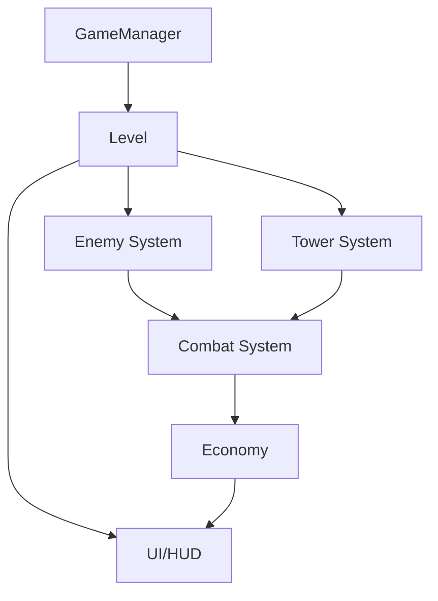

# 2026-group-14

## Defend London

> Protect the landmarks. Outsmart the invaders. Defend your city.

<table>
  <tr>
    <td align="center" width="50%">
      
       
      🎮 <a href="./index.html">Play Now</a>
    </td>
    <td align="center" width="50%">
      <a href="./demo/demo.mp4">
        <video controls width="420" src="./demo/demo.mp4">
          Your browser does not support the video tag.
        </video>
      </a>
       
      📺 <a href="./demo/demo.mp4">Watch Demo</a>
    </td>
  </tr>
</table>

## Your Group

## Team Members

| Name          | Email | Role | Completed Work |
|---------------|-------|------|----------------|
| Jiaxi You     | <fl25387@bristol.ac.uk> | Project Manager / Tester | Project management / Testing / Game engine setup |
| Shasha Tang   | <wj25162@bristol.ac.uk> | Gameplay Developer | Requirements / Gameplay design |
| Junjie Wang   | <da25293@bristol.ac.uk> | Combat Developer | Tower system / Combat mechanics |
| Jingjing Liu  | <bd25907@bristol.ac.uk> | Level Designer | Level design / Visual assets |
| Zejun Zhang   | <tc25992@bristol.ac.uk> | UI Developer | UI / Menu interface |
| Mingshu Zhang | <so25258@bristol.ac.uk> | Systems Developer | Grid system / Gameplay systems / Integration |

## Project Report

### Introduction

#### What is Defend London?

A tower defense game where players protect iconic London landmarks from waves of invading enemies.  
Build towers, manage resources, and survive increasingly challenging waves across three beautifully illustrated levels.

---

#### What Makes It Special ✨

| 🏛️ London Identity | 👾 Diverse Enemies | 🎓 Guided Experience |
|---|---|---|
| Levels based on real landmarks: outer defenses, River Thames, and the Tower of London. | 10 unique enemy types with abilities like charging, dodging, diving, and healing. | An interactive tutorial helps new players learn core mechanics step by step. |

---

### Requirements

We used a GitHub Kanban board to track requirement progress and development tasks:  
https://github.com/orgs/UoB-COMSM0166/projects/168

### Ideation: Why Tower Defense?

At the early stage, our team evaluated multiple game genres based on three criteria: uniqueness compared to past projects, strategic depth for players, and clarity of implementation scope.

| Genre | Key Challenge | Decision |
|---|---|---|
| Action | Complex real-time enemy AI | ❌ |
| Puzzle | Time-consuming narrative design | ❌ |
| Shooting | Overdone by past teams | ❌ |
| **Tower Defense** | — | ✅ Selected |

We chose tower defense because few past teams had explored this genre, enemy behavior is predictable and rule-based, and the modular structure supports both strategic player choice and clear team task division.

---

### Stakeholders

We identified stakeholders using an onion model approach. The primary stakeholders are players, including casual players seeking relaxed play and strategic players looking for optimization depth. Secondary stakeholders include developers maintaining the codebase and designers balancing gameplay systems.

---

### Use Case Diagram

The Use Case Diagram captures system requirements from the player's perspective, with the player acting as the primary actor across the core game loop.

In the main flow, the player starts a session, enemy waves begin, and towers are selected and placed to defend the landmark. An alternative flow allows the player to open settings and adjust volume or background music.

---

### User Stories

To keep development user-centered, we prioritized three core player stories:

- **Casual Player:** "I want auto-collected resources so I can focus on strategy rather than clicking every dropped coin."
- **Strategic Player:** "I want to see tower attack range before placing, so I can optimize my layout without memorizing every radius."
- **Strategic Player:** "I want a next-wave preview showing upcoming enemy types, so I can prepare rather than be surprised."

These stories guided feature prioritization and kept design decisions anchored to player experience.

---

### Development Epics

We defined five core epics that map to the essential systems of Defend London:

| Epic | Description | Key Acceptance Criteria |
|---|---|---|
| Enemy Wave System | Spawning, pathfinding, and difficulty scaling | 3+ enemy types; navigation from start to landmark |
| Tower System | Building, upgrades, and modular tower types | Placement validation; automatic targeting in range |
| Game Interface | Real-time HUD and in-game navigation | Live updates for health, coins, and wave number |
| Audio System | Background music and gameplay sound effects | Distinct sounds for placement, damage, and enemy death |
| Map & Environment | Grid logic and visual theming | Clear path/buildable separation across levels |

---

### Reflection

This requirements phase taught us that epics represent product-level value, while user stories translate that value into actionable and testable tasks. The "As a... I want... so that..." format kept us focused on player outcomes, and clear acceptance criteria aligned the team on what counted as done before implementation.

### Design

### Architecture Overview

Defend London follows a modular architecture where each subsystem handles one responsibility: towers handle targeting and attacks, enemies handle movement and abilities, and UI renders game state. `GameManager` coordinates these systems through frame updates and state transitions between menu, gameplay, and end states.

```mermaid
flowchart TD
    GM[GameManager]
    LV[Level]
    EN[Enemy System]
    TW[Tower System]
    CB[Combat System]
    UI[UI/HUD]
    EC[Economy]
    GM --> LV
    LV --> EN
    LV --> TW
    EN --> CB
    TW --> CB
    CB --> EC
    LV --> UI
    EC --> UI
```

This separation lets team members work in parallel and makes debugging more efficient because issues can be isolated to a specific subsystem.

---

### Paper Prototypes

Before coding, we explored two concepts through paper prototyping to compare gameplay loops and team-fit complexity.

<table>
<tr>
<td align="center" width="50%">

 <b>Prototype A: Defend London</b>
</td>
<td align="center" width="50%">

 <b>Prototype B: Double Steal</b>
</td>
</tr>
</table>

Prototype A focused on a tower defense loop where players place defenses and react to incoming waves. Prototype B focused on action-platform traversal across floors with timing-sensitive hazards.

We selected Defend London because tower, enemy, wave, and UI boundaries mapped naturally to team responsibilities, reducing integration risk during development.

---

### Core Systems Design

### 🗼 Tower System

Tower behavior is defined in centralized config tables (`TOWER_TYPES`), allowing balance changes without modifying core loop logic.

| Tower | Cost | Damage | Special Ability |
|---|---:|---:|---|
| Basic Tower | 60 | 15 | Balanced baseline |
| Frost Tower | 85 | 12 | 45% slow effect |
| Area Tower | 130 | 13 | Pulsing AoE damage |
| Crystal Tower | 120 | 15 | +25% damage boost to nearby towers |
| Steam Cannon | 180 | 55 | Piercing shots (up to 3 targets) |
| Alchemist Tower | 150 | 20 | Random potion effects |

The Crystal Tower highlights our trade-off philosophy: support value grows in coordinated layouts, so players must choose between direct damage and long-term synergy.

### 👾 Enemy System

Enemy behavior is data-driven through `ENEMY_STATS`, with level progression introducing new counters to common player strategies.

| Level | Enemies | Key Abilities |
|---|---|---|
| Level 1 | Guard, Pigeon, Hedgehog | Basic speed/HP variation |
| Level 2 | Knight, Archer, Giant | Charge, dodge, leap |
| Level 3 | Bomber, Lizard, Mage, Boss | Explosion, dive, heal, multi-phase |

Treant Mage forces target prioritization by healing nearby enemies, while Goblin Bomber punishes tower clustering by disabling nearby defenses on death. These patterns turn enemies into tactical puzzles rather than pure stat checks.

---

### UML Diagrams

### Class Diagram

The class model shows how `Game`/`GameManager` orchestrates `Level`, while `Level` manages tower lists, enemy lists, and wave progression services. Combat behavior emerges from `Tower` and `Enemy` interactions, with configuration-driven variation for unit types.

### Sequence Diagram

Each frame follows the same sequence: update level state, process wave spawning, update enemy movement, run tower targeting/attacks, resolve effects, then refresh UI and evaluate win/lose conditions. This keeps combat behavior deterministic and easier to test.

---

### Key Design Decisions

**Centralized Configuration Tables.** Tower and enemy parameters are stored in dedicated config objects, which enables fast balancing without changing core update logic. This reduces regression risk during playtest-driven iteration.

**Modular Subsystem Boundaries.** Towers, enemies, waves, economy, and UI are separated into focused modules with clear interfaces. This supports parallel development and keeps debugging localized.

**Progressive Ability Introduction.** Enemy complexity increases across levels rather than being front-loaded. This pacing improves onboarding while preserving challenge in later stages.

### Implementation

#### Implementation Journey

Development moved through four natural phases:

---

<table>
<tr>

<td align="center" width="25%" valign="top">

##### Phase 1 · Prototype

**Core game loop**

- Tile-based grid map
- Single enemy type following a fixed waypoint path
- One basic tower with projectile shooting
- Enemies spawn → move → take damage → die or reach landmark

 

*Early engine: green grid, placeholder towers, no art*

</td>

<td align="center" valign="middle" width="2%">➜</td>

<td align="center" width="25%" valign="top">

##### Phase 2 · Foundation

**Levels, economy & systems**

- Three distinct map layouts with per-level grid configs
- `WaveManager` wave-state machine (waiting → spawning → active)
- `Economy` gold system and `Landmark` HP tracking
- Win / lose conditions wired into `GameManager`
- Path edit and map paint debug tooling built

 

*Path edit mode: numbered waypoints, green/red tile overlay, live console export*

</td>

<td align="center" valign="middle" width="2%">➜</td>

<td align="center" width="25%" valign="top">

##### Phase 3 · Content & Balance

**Enemies, towers & tuning**

- 10 enemy types with distinct abilities (charge, leap, heal, taunt…)
- 6 tower types including support (Crystal) and AoE (Steam, Area)
- 3-phase final boss — Gentleman Bug
- Balance formula applied across all three levels
- Repeated playtesting cycles; stats adjusted via `TOWER_TYPES` / `ENEMY_STATS`

 

*In-game encyclopaedia: all 10 enemy types with HP, speed, reward and ability summary*

</td>

<td align="center" valign="middle" width="2%">➜</td>

<td align="center" width="25%" valign="top">

##### Phase 4 · Polish

**Feel & accessibility**

- Main menu, level-select screen, pause and settings panels
- In-game tutorial with step-by-step highlights
- Background music and per-event sound effects (`SoundManager`)
- Monster encyclopaedia with flavour text
- HUD refinements: wave bonus display, placement error feedback

 

*Level select: illustrated London map with three landmarks and star ratings*

</td>

</tr>
</table>

---

#### Technical Challenge 1: Balancing Difficulty for Engaging Combat

**Challenge.** The experience we wanted was specific: players should feel they *nearly* lost but just barely won. Early playtests revealed wild swings — some waves trivially easy, others immediately unwinnable. Worse, the team had no shared language for diagnosing why a wave felt unfair.

**Technical Difficulty.** Without a principled framework, tuning becomes guesswork. A value that feels fair in wave 1 can cascade into an unwinnable state by wave 3. We needed a diagnostic tool that could express difficulty as a comparable quantity.

**Solution.** We derived a working balance formula:

> **Player Firepower** = towers × damage × attack duration  
> **Enemy Pressure** = enemies per wave × individual HP

The target was rough parity, tilting slightly toward enemies to maintain tension. This formula gave us a common language — when someone proposed buffing an enemy, we could immediately estimate how much additional firepower players would need.

Concretely, Level 1 opens with 400 gold, enough for five or six basic towers before the first wave. The 60-gold wave bonus was calibrated so players always feel one tower short of comfortable. By wave 3, slow but durable Hedgehogs arrive, forcing players to have already scaled their defences. Each leaked enemy deals significant landmark damage — five uncontested breaches end a run — making every placement decision feel consequential.

Verification required real playtesting. When Level 2's boss wave proved consistently overwhelming, we reduced the boss count and extended the preparation window. These cycles — always returning to the formula as a diagnostic anchor — produced a difficulty curve that testers described as challenging but fair.

**Design Value.** The formula transformed subjective debates ("this feels too hard") into tractable discussions ("enemy pressure exceeds firepower by 40% — where should we adjust?").

#### Technical Challenge 2: Diverse Abilities That Reward Adaptive Strategy

**Challenge.** Tower defence risks monotony if each level simply sends more enemies. We wanted every level to introduce mechanics requiring genuinely new strategies, not just more towers.

**Technical Difficulty.** With six tower types and ten enemy types, interactions multiply rapidly. An ability balanced in isolation might break the game in combination. We needed a system where any stat could be adjusted in one place without touching unrelated logic.

**Solution.** We centralised all statistics in configuration tables, making iterative tuning fast and safe. More importantly, we designed abilities around strategic trade-offs rather than raw difficulty increases.

Level 1 introduces only basic enemies and towers, letting players master fundamentals. Level 2 unlocks the Crystal Tower — a support unit that boosts nearby towers rather than attacking directly. This forces a genuine decision: does boosting existing towers outperform simply adding more firepower? The level also introduces enemies with active abilities: Knights that charge when wounded, Archers that evade projectiles, Giants that leap past defensive lines.

Level 3 escalates further with abilities designed to counter established strategies. The Treant Mage heals nearby enemies, threatening to undo damage already dealt — forcing players to prioritise targets. The Goblin Bomber explodes on death, disabling nearby towers and punishing overly clustered defences. The final boss, Gentleman Bug, progresses through three phases: summoning minions, taunting towers to reduce their damage, and gaining resistance as it weakens.

When playtesting revealed the Treant Mage's healing outpaced realistic player damage, a single configuration change resolved the issue instantly — demonstrating how centralised tuning enabled rapid iteration.

**Design Value.** Each ability was designed as a puzzle rewarding adaptive thinking, not an arbitrary difficulty spike.

#### Technical Challenge 3: Grid Alignment and Debug Tooling

**Challenge.** Each level's invisible tile grid must align precisely with its visual background. A boundary offset by even a few pixels could block a visually open area from building, or allow towers to clip into enemy paths — both confusing to players and nearly impossible to diagnose by eye.

**Solution.** We built a debug mode that overlays the tile grid directly on screen, colour-coding buildable versus blocked cells, and printing coordinates to the console. Arrow keys adjust grid offsets in real time; a path visualisation confirms that enemy waypoints trace the intended route exactly.

This tooling transformed hours of guesswork into minutes of precise adjustment. If we were to start over, we would build it in the first week rather than the third.

#### Conclusion

Implementing *Defend Britain* taught us that building mechanics is only part of the work — making them *feel right* demands equal attention. The balance formula gave us a shared diagnostic language; centralised configuration made iteration safe; visual debug tooling made precise alignment tractable. More broadly, this project showed that "feel" is not a vague quality but something that can be diagnosed systematically. These practices — principled frameworks, single-source configuration, purpose-built tooling — will transfer directly to future projects.

### Evaluation

- 15% ~750 words

After developing a deliverable prototype of the game, it was important to evaluate its functionality and playability in order to identify potential flaws at an early stage. To assess the overall quality of the game and develop a comprehensive vision for future improvements, we used both quantitative and qualitative testing methods.

#### Qualitative evaluation
For the Qualitative evaluation, we first explored potential issues through a Think Aloud study conducted with two participants from another project group. The main objective of this method was to have the users’ first gameplay experience. Through this process, we aimed to gain a fundamental understanding of the game’s quality and identify early indicators for future improvements.

#### Think Aloud Evaluation 1: 15/03/2026
- **Positive**: The game interface is visually appealing and clean, allowing players to quickly understand how to operate the game. The rules are simple and clear, making the game easy to learn and play.
- **Negative**: Some monsters’ UI occasionally disappears, making them difficult to see.

#### Think Aloud Evaluation 2: 15/03/2026
- **Positive**: The game provides effective interactive feedback. The click sounds are clear, and there are appropriate sound effects for events such as monster deaths, tower placement, and losing HP. When a tower is placed in an invalid location, the game immediately provides a warning.
- **Negative**: The font size for monster and tower information is a bit small, which affects readability.The game lacks flexibility, as the music volume and brightness cannot be adjusted.

The feedback mainly focused on the UI design and scalability of the game. To further investigate these issues in a more systematic and detailed manner, we applied a heuristic evaluation method. This approach allows evaluators to assess the game based on established usability principles from different perspectives.

The heuristic evaluation was conducted by the team members, as this method requires a deeper understanding of the game’s design and underlying technical implementation in order to identify issues more precisely. After analysing the results from the Think Aloud evaluation and conducting additional testing, we developed the following Heuristic Evaluation Table.

#### Heuristic Evaluation
| Category | Issue | Heuristic | Frequency | Impact | Persistence | Severity |
| :--- | :--- | :--- | :--- | :--- | :--- | :--- |
| **Enemy** | diving enemies could still be targeted while they were underwater | Error prevention | 3 | 2 | 2 | 2.33 |
| **Enemy** | Missing information on monster waves | Help and documentation | 2 | 2 | 3 | 2.33 |
| **Tower** | lack of detailed stats and functional explanations for towers| Recognition rather than recall | 2 | 2 | 1 | 1.67 |
| **Game** | No options to adjust volume, brightness, or select different background music (BGM). | User control and freedom | 3 | 4 | 3 | 3.33 |
| **Settings** |The settings UI on the main menu does not scale properly to screen size  | Consistency and standards | 3 | 2 | 2 | 2.33 |
| **Settings** |The settings menu UI is inconsistent between the main menu and the in-game interface.| Consistency and standards| 1 | 2 | 3 | 2 |
| **Enemy** | Visual bug where certain monster images occasionally fail to render. | Consistency and standards | 3 | 2 | 1 | 2 |
| **Menu** | Font size is too small, making it difficult to read game information comfortably. | UAesthetic and minimalist design | 2 | 3 | 2 | 2.33 |

#### Development Focus
Based on the results, our next development focus will be concentrated on the following aspects:
- Fixing critical bugs to prevent game crashes and ensure stable gameplay
- Improving UI readability and ensuring consistent rendering across different devices
- Enhancing game flexibility by adding more background music options and a volume control system
- Providing clear and accessible information about game mechanics

#### Quantitative evaluation

For quantitative evaluation, we used the NASA-TLX method together with a structured test plan documented in a dedicated Tower Defense Game Test Document. The test document provided a systematic basis for evaluating the game’s functional behaviour and the players’ perceived workload.

The Tower Defense Game Test Document began with an overview of purpose and scope, stating that it is used to systematically test the tower defense game developed with p5.js and verify whether functions, combat logic, UI interaction, boundary performance, and compatibility meet expected design requirements.

The quantitative evaluation was executed in a controlled environment:

- Browsers: Chrome, Edge, Firefox (latest versions)
- Framework: p5.js
- Devices: PC (Windows/macOS, standard screen resolution)
- Tools: browser developer tools for checking localStorage, frame rate, and error logs

The test process included 24 specific cases across five core modules: Functional Testing, Combat & Balancing Testing, UI & UX Testing, Boundary & Robustness Testing, and Compatibility & Performance Testing.

The test module summary is shown below:

| Test Module | Number of Cases | Focus Area |
| --- | --- | --- |
| Functional Testing | 6 | Core gameplay interactions and build mechanics |
| Combat & Balancing Testing | 6 | Tower-enemy interaction, targeting logic, and balance |
| UI & UX Testing | 6 | Menu flow, settings controls, save/load, and interface feedback |
| Boundary & Robustness Testing | 4 | Stability under edge cases, click handling, and game over logic |
| Compatibility & Performance Testing | 2 | Browser compatibility and high-load frame rate behaviour |

Key quantitative methods were:

- **NASA-TLX**: players completed the NASA Task Load Index questionnaire after each play session to quantify cognitive workload, effort, frustration, and overall task difficulty.
- **Task Completion Rate**: recording whether key tasks such as tower placement, wave progression, and level completion were successful.
- **Error Rate**: logging incorrect behaviours such as invalid placement, blocked actions, save/load failures, and unintended game responses.
- **Performance Testing**: observing frame rate stability and browser compatibility during late high-pressure waves.

The NASA-TLX evaluation involved 10 players, including 5 with prior tower defense experience and 5 without. The average scores for each dimension are shown below:

| Evaluation Dimension | Overall Average Score | Load Level |
| --- | --- | --- |
| Mental Demand | 40.4 | Medium |
| Physical Demand | 22.0 | Low |
| Temporal Demand | 37.7 | Medium |
| Performance | 29.7 | Low |
| Effort | 35.5 | Medium |
| Frustration | 24.0 | Low |
| Overall Task Load | 31.6 | Low-Medium |

Key quantitative observations from the test document:

- the core interactions such as tower placement and wave progression behaved as expected in most cases
- the save system preserved progress across browser refreshes when the same nickname was used
- compatibility tests confirmed normal behaviour in Chrome, Edge, and Firefox
- performance tests showed stable frame rate and no obvious lag during later waves with many enemies and towers

These quantitative measures gave us concrete evidence that the game’s systems were functioning correctly, and NASA-TLX provided a structured way to compare player workload before and after the usability improvements.

#### Description of how code was tested

We tested the code at three levels:

- **Manual functional testing**: played the game directly to verify core interactions such as tower placement, enemy movement, wave progression, and level completion.
- **Heuristic review**: the team inspected interface flows and interaction design using usability principles, checking for consistency, error prevention, and clear feedback.
- **Technical validation**: used the in-game debug overlay and map tools to confirm that enemy pathing matched the visible map, that buildable tiles aligned correctly, and that tower targeting logic responded appropriately after tuning range and cooldown values.

Our testing approach was deliberately hands-on. By replaying the game after each fix and checking the reported issues, we confirmed that each change improved usability without introducing new regressions.

#### Summary of outcomes

##### Positive observations

- The core tower defense loop is clear: players can choose towers, place them on a grid, and see enemies move along defined London-themed paths.
- The audio and feedback system works well for basic events: tower placement, enemy death, and landmark damage are all clearly communicated.
- The balance model created for gold income and enemy pressure produced a sense of tension while still allowing players to recover through good strategy.

##### Key issues identified

1. **UI readability and information clarity**
   - Some tower and enemy statistics were too small or hard to read during active gameplay.
   - Monster icons and status labels were not always visible, especially when many enemies appeared at once.

2. **Settings and control flexibility**
   - Players could not adjust volume or brightness in-game, which reduced accessibility and personalization.
   - The settings panel appeared inconsistent between the main menu and the in-game interface.

3. **Usability gaps**
   - A lack of explicit wave-preview detail made some waves feel unexpectedly hard.
   - The menu and tutorial flow could better explain the difference between support towers and direct-damage towers.

4. **Rendering and consistency bugs**
   - Some enemy images occasionally failed to render or disappeared during fast movement.
   - Buildable grid cells and the background visuals were sometimes misaligned on edge cases, making it unclear where towers could be placed.

#### Improvements to implement

Based on evaluation, the next development cycle should focus on:

- improving HUD readability with larger text and clearer iconography
- adding music/volume controls and a consistent settings experience
- giving players better wave preview and tower information before placement
- fixing rendering glitches for enemies and ensuring grid alignment stays consistent across all levels

#### Testing notes

- The Think Aloud study highlighted user-facing problems quickly, especially around the tutorial and information density.
- Heuristic review by the team was effective for catching issues that testers did not explicitly mention, such as consistency in menu layout and error prevention during tower placement.
- The debug overlay and map grid tooling proved valuable for ensuring pathing and tower placement logic matched the player-visible environment.

### Process

#### Team collaboration

Our game development process was organised around regular team coordination, shared documentation, and a common project board.

- We used the GitHub project board as our primary task tracker. The board captured feature progress, bug fixes, and design tasks, which helped the team keep a shared sense of priority.
- Design work and decisions were documented in the `/docs` folder, including the use case model, class diagrams, and sequence diagrams.
- We held frequent group discussions to decide the game direction, with an early focus on choosing a genre that was both playable and technically achievable.

#### Role distribution and workflow

The team divided the work into major subsystems:

- **Game mechanics and balance**: wave manager, enemy statistics, tower effects, and the balance formula that guided difficulty tuning.
- **UI and interaction**: menu flow, HUD, settings, and feedback for tower placement.
- **Level design and assets**: map layouts, enemy paths, and London-themed environment details.
- **Quality and debugging**: buildable-grid alignment, rendering stability, and playable prototype testing.

Although individual roles were flexible, this structure helped each member focus on a specific area while still collaborating across the whole game.

#### Process timeline

We followed a four-phase development path:

1. **Prototype**: built the core loop with a single enemy type, one basic tower, and a playable grid map.
2. **Foundation**: added level progression, the economy system, and basic win/lose conditions.
3. **Content and balance**: introduced multiple enemy types, additional towers, and enemy abilities, while tuning difficulty across levels.
4. **Polish**: improved menus, added sound and music, implemented tutorial guidance, and refined HUD feedback.

#### Challenges and adaptation

- At first, the team needed a stronger shared language for balancing the game. We solved this by defining a simple firepower-versus-pressure formula that made tuning discussions more objective.
- Communication and task handoff were not perfect early on; some features overlapped and required repeated integration checks. Using the project board and more frequent mini-demos helped the team stay aligned.
- The map grid alignment issue was a technical bottleneck. We adapted by building a debug overlay tool, which reduced uncertainty and made level adjustments much faster.

#### Reflection

Overall, our process combined creative design with practical engineering. We learned that good collaboration requires both a clear roadmap and flexible iteration. The team improved most when we turned vague problems into concrete tasks: a UI bug became a settings refinement task, and an unfair level became a balance formula adjustment.

The process also taught us that documentation matters. Writing user stories, epics, and diagrams helped the team agree on what to build, while evaluation notes gave us a better basis for prioritising improvements.

## Sustainability, Ethics and Accessibility

### Overall Approach

In this project, we understood sustainability as the ability of the game system to retain its value, stability and adaptability throughout long-term use, maintenance and future extension. Because Defend London is a browser-based tower defense game, the most relevant sustainability issues include resource loading, local data storage, player experience, code structure and future extensibility. Based on the Sustainability Awareness Framework (SusAF), our group considered sustainability across five dimensions: social, individual, environmental, economic and technical sustainability.

| Sustainability Dimension | Relevant Topics for Defend London |
|---|---|
| Social | London-themed representation, player trust, fair gameplay |
| Individual | Player comfort, learning support, privacy, accessibility |
| Environmental | Resource loading, browser performance, energy use |
| Economic | Low-cost development, no server cost, future maintenance |
| Technical | Modular code, maintainability, extensibility |

### SusAD Diagram

We used a SusAD diagram to show both positive opportunities and negative risks across the five sustainability dimensions. The diagram helps show how small design decisions can create wider effects. For example, local browser saving can reduce server infrastructure, nickname-only saving can reduce privacy risk, and modular code can lower future maintenance cost. It also highlights possible risks, such as large image/audio assets increasing resource use, mouse or colour-based interaction reducing accessibility, and repeated configuration values increasing maintenance cost.

**Figure: SusAD diagram showing positive opportunities and negative risks across the five sustainability dimensions for Defend London.**

---

## Social

Our group designed Defend London with a clear London-themed identity, including recognisable landmarks and city-inspired levels. This gives the game a stronger identity than a generic fantasy tower defense game and adds some cultural value. However, because we use a real city as the theme, we also need to avoid careless or stereotypical representations of London, its people or its culture.

We also think social sustainability is connected to player trust. Players should be able to understand the game rules clearly, including enemy paths, tower functions and why they win or lose. In future development, we could improve tower descriptions, enemy ability explanations and level guidance so that players can understand the game more fairly.

---

## Individual

From an individual perspective, our group supports players through the tutorial, pause screen, level selection, continue option, try again button and win/lose screens. These features reduce confusion and make the game easier for first-time players to learn.

We also included music volume, music selection and brightness settings, allowing players to adjust the experience according to their comfort. However, our current accessibility is still limited because the game mainly relies on mouse input and visual judgement. This may make the game harder to use for players who have difficulty with mouse control or colour-based information. In future development, we could add keyboard controls, clearer text labels, high-contrast UI options, colour-blind friendly visual indicators and text feedback for important sound events.

Ethically, our group tried to avoid unnecessary personal data collection. Players only need to enter a nickname, with no email address, password, real name or external account required. This supports data minimisation. However, we should explain more clearly that progress is stored locally in the browser and add a “delete save data” option, so players have more control over their information.

---

## Environmental

We designed Defend London as a browser-based game that can run locally. Player progress is saved using `localStorage`, so the basic progression system does not need a remote account server or database. This reduces unnecessary infrastructure and network communication.

The game also uses wave-based enemy spawning instead of creating all enemies at once. This reduces the number of active objects the browser needs to update at the same time, which helps reduce browser workload. However, the game uses many image and audio assets, so large files may increase loading time, memory use and CPU usage. Future work should include compressing assets, removing unused files, and measuring loading time, memory use and CPU usage.

---

## Economic

Our group used accessible web technologies to develop Defend London. The project does not require paid infrastructure, a custom backend or platform-specific deployment. This makes it suitable for a student group project and avoids unnecessary cost.

The modular code structure also helps reduce future maintenance cost. Since enemies, towers, economy, waves, map data and paths are handled separately, future developers can update one part of the game without rewriting the whole system. However, repeated configuration values could make future updates harder, so they should be reduced or centralised.

---

## Technical

We divided the game into multiple modules instead of writing it as one large file. `GameManager.js` coordinates the overall game state and level flow, while other files manage enemies, towers, economy, waves, map data and paths. This makes the project easier to understand, debug and extend.

The separation between `MapData.js` and `Path.js` also improves maintainability because buildable areas and enemy movement paths can be changed independently. In future development, we could further centralise repeated configuration values, document important functions and add tests for tower placement, enemy movement and wave progression.

---

## Future Actions

| Area | Future Improvement |
|---|---|
| Privacy | Explain local saving and add a “delete save data” option |
| Accessibility | Add keyboard controls, high-contrast mode and clearer text labels |
| Environmental | Compress image/audio assets and measure performance |
| Technical | Improve documentation and reduce repeated configuration |
| Social | Make tower rules, enemy abilities and level guidance clearer |

Overall, we think Defend London already has a reasonable foundation for sustainability, ethics and accessibility, but it is not fully complete yet. The main future improvements are clearer privacy communication, better accessibility support, asset optimisation, stronger documentation and more measurable performance testing.

### Conclusion

Overall, Defend London started as a simple London-themed tower defense idea and developed into a playable browser game with multiple levels, enemy waves, towers, economy, UI, sound feedback, local saving, and a clear visual style. This project showed us that game development is not just about adding features; the harder part is making different systems work together so that the player experience feels clear, fair, and enjoyable, while creating a useful, usable, maintainable, and responsible system for real users.

One important lesson we learned was the value of iterative and agile development. Our plan changed as the game developed. Some ideas seemed straightforward at the beginning, but became more complicated during implementation, especially grid alignment, enemy pathing, wave balance, and UI readability. Instead of following one fixed plan, we improved the game through repeated testing, discussion, feedback, and small adjustments. The GitHub project board and regular team communication helped us keep track of progress and decide what needed to be improved next.

Epics and user stories were also useful because they helped us turn a broad idea into clearer development tasks. They made us think from the player’s perspective, such as whether tower placement was clear, whether waves felt fair, and whether the interface gave enough feedback. This helped the team divide the work more clearly and focus on the gameplay experience rather than only technical implementation.

The class diagram and sequence diagram helped us understand the structure and behaviour of the game before and during implementation. They made the relationships between enemies, towers, waves, the economy system, paths, map data, UI, and game state easier to discuss. In practice, this supported our modular structure and made the project easier to debug and extend.

Testing changed how we looked at the game because it showed us the difference between a game that works from a developer’s perspective and a game that feels clear and comfortable from a player’s perspective. Think Aloud testing and heuristic evaluation showed problems that we had started to ignore as developers, such as small text, unclear feedback, limited settings, and missing wave information. NASA-TLX also gave us another way to check whether the game felt too demanding or frustrating for players. These evaluations made us realise that a game can be technically working, but still need improvement in usability, accessibility, feedback, and player comfort.

We also used SusAF to reflect on sustainability, ethics, and accessibility. This helped us think beyond immediate gameplay and consider wider effects such as privacy, resource use, maintainability, and inclusiveness. Our current design has some good foundations, including local browser saving, nickname-only progress storage, modular code, and lightweight web deployment. However, there are still risks, such as large image and audio assets, mouse or colour-based interaction, and repeated configuration values.

If we continued developing the current game, we would focus on improving accessibility, polishing the interface, compressing assets, adding clearer wave previews, and explaining local saving more clearly. We would also improve documentation so that future developers could understand the code structure, configuration files, and debugging tools more easily. If we had the chance to make a sequel, we would expand the London theme with more landmarks, more enemy routes, richer enemy abilities, and a deeper progression system.

Overall, this project taught us that game development depends on much more than coding. Iteration, teamwork, requirements, design, testing, sustainability, and privacy all affected whether our final game became playable, understandable, and maintainable.

### Contribution Statement

| Contributor | Contribution |
|---|---|
| Jiaxi You | 1 |
| Shasha Tang | 1 |
| Junjie Wang | 1 |
| Jingjing Liu | 1 |
| Zejun Zhang | 1 |
| Mingshu Zhang | 1 |

### Additional Marks

You can delete this section in your own repo, it's just here for information. in addition to the marks above, we will be marking you on the following two points:

- **Quality** of report writing, presentation, use of figures and visual material (5% of report grade) 
  - Please write in a clear concise manner suitable for an interested layperson. Write as if this repo was publicly available.
- **Documentation** of code (5% of report grade)
  - Organise your code so that it could easily be picked up by another team in the future and developed further.
  - Is your repo clearly organised? Is code well commented throughout?
