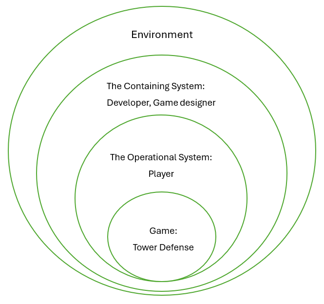
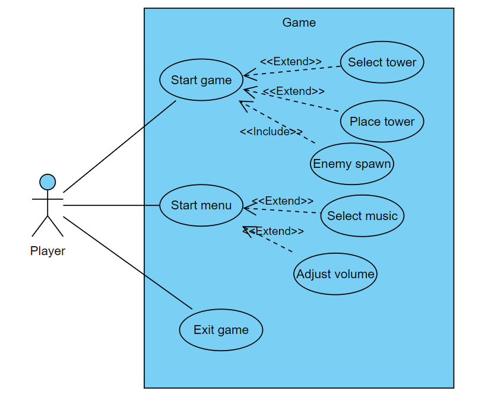
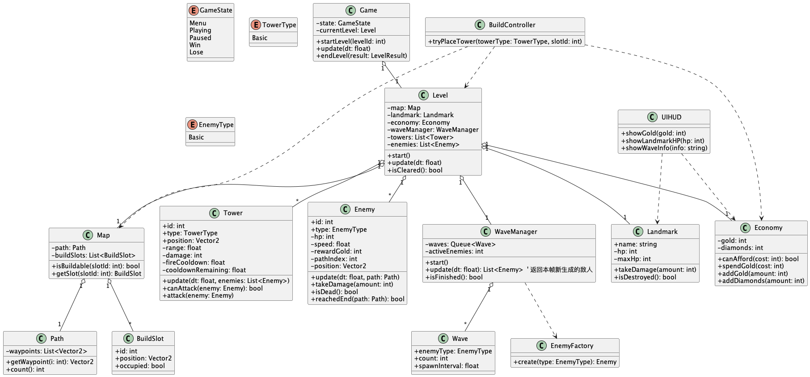
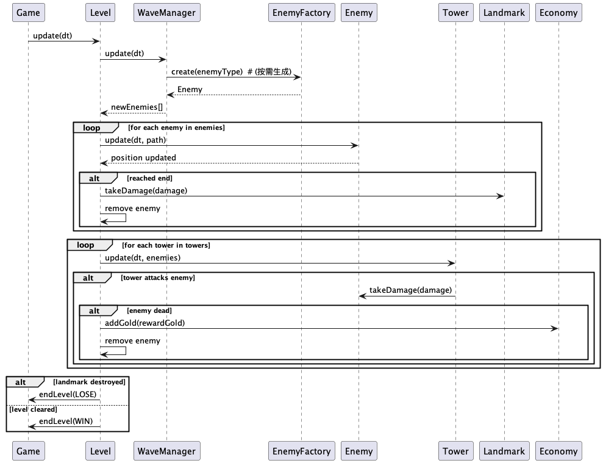
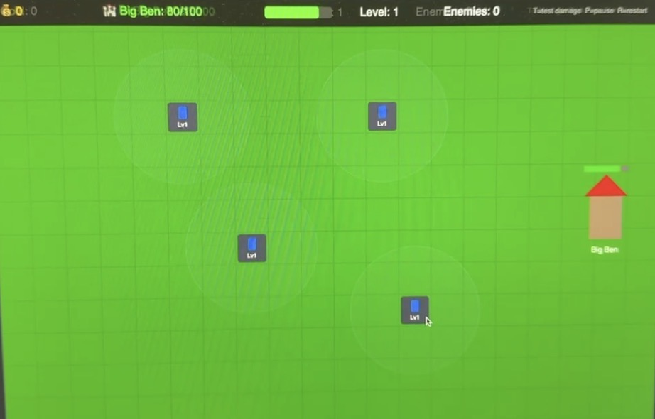
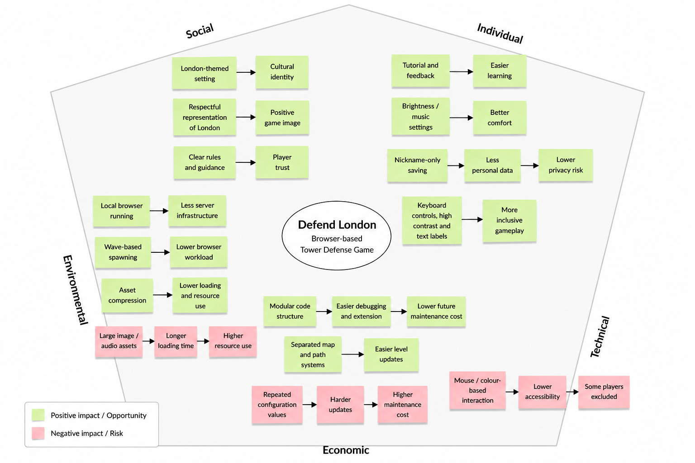

# 2026-group-14
2026 COMSM0166 group 14

# COMSM0166 Project Template
A project template for the Software Engineering Discipline and Practice module (COMSM0166).

## Info

This is the template for your group project repo/report. We'll be setting up your repo and assigning you to it after the group forming activity. You can delete this info section, but please keep the rest of the repo structure intact.

You will be developing your game using [P5.js](https://p5js.org) a javascript library that provides you will all the tools you need to make your game. However, we won't be teaching you javascript, this is a chance for you and your team to learn a (friendly) new language and framework quickly, something you will almost certainly have to do with your summer project and in future. There is a lot of documentation online, you can start with:

- [P5.js tutorials](https://p5js.org/tutorials/) 
- [Coding Train P5.js](https://thecodingtrain.com/tracks/code-programming-with-p5-js) course - go here for enthusiastic video tutorials from Dan Shiffman (recommended!)

## Your Game (change to title of your game)

STRAPLINE. Add an exciting one sentence description of your game here.

IMAGE. Add an image of your game here, keep this updated with a snapshot of your latest development.

LINK. Add a link here to your deployed game, you can also make the image above link to your game if you wish. Your game lives in the [/docs](/docs) folder, and is published using Github pages. 

VIDEO. Include a demo video of your game here (you don't have to wait until the end, you can insert a work in progress video)

## Your Group

## Team Members

| Name          | Email | GithubID | Role | Completed Work |
|---------------|-------|----------|------|----------------|
| Jiaxi You     | <fl25387@bristol.ac.uk> | TBD | Project Manager / Tester | Project management / Testing |
| Shasha Tang   | <wj25162@bristol.ac.uk> | TBD | Gameplay Developer | Requirements / Gameplay design |
| Junjie Wang   | <da25293@bristol.ac.uk> | TBD | Combat Developer | Tower system / Combat mechanics |
| Jingjing Liu  | <bd25907@bristol.ac.uk> | TBD | Level Designer | Level design / Visual assets |
| Zejun Zhang   | <tc25992@bristol.ac.uk> | TBD | UI Developer | UI / Menu interface |
| Mingshu Zhang | <so25258@bristol.ac.uk> | TBD | Systems Developer | Grid system / Gameplay systems / Integration |

## Project Report

### Introduction

Defend London is a London-themed tower defense game that challenges players to protect some of the city’s most iconic landmarks from continuous waves of invading enemies. The game is based on the core mechanics of traditional tower defense games, where players must strategically place and upgrade defensive structures to stop enemies from reaching key objectives. However, rather than using a generic fantasy or medieval setting, Defend London reimagines the genre through a stylized version of London, turning familiar routes, rivers, and landmarks into the foundation of its gameplay and identity.

The game takes inspiration from well-known tower defense design principles such as wave-based progression, resource management, and tactical placement, but introduces a distinctive twist through its setting, visual style, and enemy variety. Each level is framed around recognizable London-inspired locations, such as outer city defenses, the River Thames, and the Tower of London, allowing the environment itself to become part of the player’s experience. This gives the game a stronger sense of place than many conventional tower defense titles.

What makes Defend London novel is its combination of local cultural identity with a mixed roster of unusual enemies, ranging from fantasy-inspired creatures to other hostile forces, all threatening a modern, recognizable city. This contrast between classic tower defense mechanics and a uniquely London-centered theme creates a memorable experience that feels both familiar and original. By combining strategic gameplay, illustrated visuals, and landmark-based level design, Defend London offers a creative reinterpretation of the tower defense genre.

### Requirements 
We use a GitHub Kanban board to track our progress; you can access it via the link here.
https://github.com/orgs/UoB-COMSM0166/projects/168

- 15% ~750 words
- Early stages design. Ideation process. How did you decide as a team what to develop? Use case diagrams, user stories.
#### Early stages design & Ideation
At the early stage of game development, the team discussed a wide range of game genres in terms of playability and difficulty of implementation. Our discussion included two parts. In the first part, we clarified our expectations towards the game. After a brainstorming meeting, the team agreed on the following bullet points:
- The game genre has to be rare, one that other teams haven't tackled in the past.
- The game should give players the freedom to build their own strategy to win the game.
- The vision of the implementation should be clear and straightforward.
According to these expectations the team compared different games.

| Game  | Description | Issue | 
| :--- | :--- | :--- | 
| **Action Games** | Combat-focused gameplay requiring timed attacks, parries, and pattern recognition | The enemy's fighting techniques are difficult to develop, as they have to respond to the player's actions in a fast and logical way in terms of dodging, attacking, and counter-attacking. |
| **Puzzle Games** | A logic-based game where players interact with environmental elements or abstract mechanics to progress. | This type of game requires fully reasonable storytelling, including good hint systems that lead players to solve the mystery step by step with intensity. It is time-consuming and complicated to create an interesting story and balance the puzzles between being too difficult and too boring. |
| **Shooting Games** | Combat centered on ranged weapons, requiring spatial awareness, aiming precision, and tactical positioning.| Many teams have already implemented this game idea in the past.|

During the comparison, the team finally came to the decision to develop a tower defense game. The reasons for this decision were a mix of the pros and cons of different game genres:

- Only a few teams in the past explored this topic, making it different from other groups.
- The game is structured; the attacks and movement of enemies are predictable, making it easy to define the game rules.
- Players can win the game by developing their own defense strategy.

#### Paper prototype
During the discussion, we analyzed a range of possible gameplay ideas and considered several different types of games that could be developed for the project. This stage helped us explore different directions and think about the kind of experience we wanted to create. After comparing these ideas, we selected two prototypes to develop further and discussed them in more detail.

The first prototype was Double Steal, which focused on direct character control in a multi-level environment. In this prototype, the player would move through different floors of the map, avoid dangers, manage health, and complete objectives in various locations. The second prototype was Defend London, a tower defense game focused on defending iconic London landmarks from waves of enemies through tower placement and upgrades.

[Watch Demo - Tower Defense London](./demo/paper-prototype.MOV)

[Watch Demo - Double Steal](./demo/paper-prototype2.mp4)

After comparing the two concepts, we decided to continue with Defend London because it offered a more focused and coherent gameplay structure. It also seemed more suitable for teamwork because the mechanics could be divided more naturally into separate systems, such as map design, enemy behavior, tower logic, and interface development.

#### Identifying stakeholders
We identified stakeholders using an onion model approach

### Use Case Diagram and Use Case Specifications
In the next step, we laid the foundation for further complicated system design. Before we stepped into detailed implementation, we created a Use Case Diagram to identify system requirements from the player's perspective.

The primary actor is the player, who can start the game from the menu. The player is involved in most actions of the game. After entering the game, the player must make decisions regarding placing the right towers to defend the city. Players can also choose background music in the menu to create different atmospheres for combat.

#### Main Flow
- The player starts game
- The system starts enemy waves
- The player selects towers 
- The player strategically places towers to defend the city

#### Alternative Flow
- The player opens settings menu
- The player chooses a track

### Epics and User Stories
In order to design a clear development roadmap, we created user stories to clarify the main goals of the development.

The core stakeholders for the game are the players whom the game has to entertain; the development plan must rely on their expectations and requirements.

- As a Casual Player, I want to have an "Auto-Collect" feature for fallen resources, so that I can focus on tower placement strategy rather than clicking every dropped coin.
- As a Strategic Player, I want to see the "Attack Range" of a tower before I commit to placing it, so that I can optimize my defense layout without having to memorize the radius of every unit.
- As a Strategic Player, I want to see a "Next Wave Preview" showing which enemy types are coming, so that I don't feel cheated by a sudden influx of flying enemies I wasn't prepared for.

The success of game development depends on close collaboration between different roles in the team; therefore, we analyzed the requirements of our team members.

- As a Developer, I want to build the enemy waves system using a "Modular Script," so that the design team can add new enemy types without requiring a complete rewrite of the core code.
- As a Game Designer, I want to design the enemy wave with a combination of different enemy types, offering a satisfying variety of gameplay.

Alongside the user stories, we created our essential epics that map to the most important game features we have to implement.

#### Epic 1 - Enemy Wave System
Description: Design and implement a scalable system that handles enemy spawning, pathfinding, and progressive difficulty scaling.
- AC 1: Support for at least three enemy archetypes (Standard, Fast, Tank) with varying health and speed.
- AC 2: Enemies must successfully navigate from a designated "Start Point" to a "Base/End Point" using pathfinding.

#### Epic 2 - Tower System
Description: It allows players to build and manage defenses. This system must be modular to allow for easy addition of new tower types during development.
- AC 1: Players can select a tower from a shop and place it on valid position.
- AC 2: Towers automatically detect and fire upon enemies within their specific range.

#### Epic 3 - Game Interface
Description: It provides real-time data (resources, health) and navigate players to different game actions.#
- AC 1: IT displays real-time updates for Player Health, coins, and Current Wave Number.
- AC 2: A functional setting menu that allows players to adjust volume or change BGM.

#### Epic 4 - Game Music & Audio
Description: The auditory layer designed to enhance immersion and provide feedback.
- AC 1: Unique sound effects for core actions: Tower Placement, Enemy Death, and Base Damage.
- AC 2: Implement BGMS to create different atomosphere.

#### Epic 5 - Game Map & Environment
Description: The tactical arena where the gameplay unfolds. It defines the "Grid" for building and the "Path" for enemies
- AC 1: A grid-based map system that distinguishes between path for enemies and tower grids.
- AC 2: Visual environment assets including trees, rocks and buildings that match the game's artistic theme.

#### Reflection:
At this stage of the project, our team has been focusing on the preparation work for developing a tower defense game. Through this process, we have gained a basic understanding of Epics, User Stories, Acceptance Criteria, and their roles in the project.

At first, we regarded Epics as broad and abstract goals, and User Stories simply as a list of scattered features. Through group discussion and practice, we gradually realized that Epics represent the core value of the game, while User Stories serve as a critical bridge to translate these high-level values into user-centered and actionable tasks.

We practiced writing User Stories using the "As a user, I want to..., so that..." template, which encouraged us to focus on player experience rather than only technical implementation. Meanwhile, the "Given-When-Then" structure of Acceptance Criteria helped us define clear and testable completion conditions for each feature, ensuring that the team shares a consistent understanding of "done" before writing any code.

In this tower defense game project, these tools helped us transform the abstract idea of "developing a strategic tower defense game" into a concrete development roadmap. By breaking down core gameplay into Epics and detailed User Stories, we aligned our project vision and created a clear plan for the upcoming development phase.

This preparation work has not only improved team collaboration and consensus but also made us deeply realize that careful requirements management is the foundation of building a successful, user-centered product.

### Design

15% ~750 words 
System architecture. Class diagrams, behavioural diagrams. 

#### System architecture
The system architecture of the tower defense London is designed as a modular and scalable structure, where each subsystem is responsible for a specific aspect of the gameplay. At the core of the system, the Game Manager acts as the central controller, coordinating the overall game flow and managing the lifecycle of different components.

Once enemies are spawned, the Enemy System manages their behavior, including movement along predefined paths and handling different enemy types. In parallel, the Tower System controls the placement and attack behavior of defensive towers, continuously scanning for targets within range and initiating attacks.

The Combat System serves as the interaction layer between towers and enemies, handling hit detection and damage calculation. Based on combat outcomes, the Economy System updates in-game resources such as game coins, rewarding enemy kills and managing costs for tower construction.

Finally, the UI System reflects all changes in real time, providing visual feedback to the player, including health, economy, wave progression, and game status. Through this modular design, the system ensures clear separation of concerns, making the game easier to maintain, extend, and optimize.

#### Class Diagram

A more detailed explanation of our game design is provided by the Class Diagram, it effectively illustrates the game flow and core features of the system.

###### Game Control

The Game class is responsible for the overall flow of the program, including starting a level, updating the game during play, and ending the level with a result. The GameState enumeration supports this by defining the main states of the game, such as menu, playing, paused, win, and lose. This helps the game switch clearly between different stages.

###### Level Management

The Level class acts as the centre of the gameplay system. It contains the Map, Landmark, Economy, WaveManager, and the lists of towers and enemies. Because of this, it is responsible for updating the state of the level and checking whether the level has been completed.

##### Map and Building

The Map class stores the enemy path and the available build slots. These build slots define where towers can be placed. The BuildController handles the tower placement process by checking whether a slot is valid and whether the player has enough resources to build a tower. This separates the map layout from the player’s building actions.

##### Combat System

Combat is mainly handled through the interaction between Tower and Enemy. Towers have attributes such as range, damage, and cooldown, which allow them to attack enemies within range. Enemies move along the predefined path, take damage from towers, and can damage the Landmark if they reach the end of the route.

##### Waves and Enemy Creation

The WaveManager controls the spawning and progression of enemy waves during the level. It works together with the Wave class, which stores the number and type of enemies in each wave. The EnemyFactory is used to create enemy objects, helping separate enemy creation from wave control logic.

##### Resources and Interface

The Economy class manages resources such as gold and diamonds, including checking whether the player can afford certain actions and rewarding resources when needed. The UIHUD displays important gameplay information, such as current gold, landmark health, and wave information, helping the player understand the current state of the game.

#### Sequence Diagram

The following sequence diagram illustrates how the main subsystems of the tower defense game interact during gameplay. It shows the main gameplay update process in Defend London during each frame of the game loop. It explains how the game updates the level, spawns enemies, processes movement and attacks, and checks whether the player has won or lost.

##### Game and Level Update

The process begins when the Game class calls update(dt) on the Level class. This starts the update cycle for the current frame and allows the level to process all active gameplay elements.

##### Enemy Spawning

The Level class first updates the WaveManager. If new enemies need to be spawned, the WaveManager calls the EnemyFactory to create enemies of the required type. These newly created enemies are then added to the list of active enemies in the level.

##### Enemy Movement

After spawning, the Level updates each enemy in the active enemy list. Each enemy moves along the path by running its update(dt, path) method. If an enemy reaches the end of the path, it damages the Landmark and is removed from the level.

##### Tower Attacks

Once enemy movement has been processed, the Level updates each tower. Each tower checks the current list of enemies and attacks when a target is within range. The attack causes damage to the enemy through the takeDamage(damage) method.

##### Enemy Removal and Rewards

If a tower attack kills an enemy, the Economy system rewards the player with gold using addGold(rewardGold). After this, the defeated enemy is removed from the active enemy list. This connects combat directly with the game’s resource system.

##### End Conditions

At the end of the update cycle, the level checks whether the game should finish. If the Landmark has been destroyed, the Game ends the level with a lose result. If the level has been cleared, meaning all waves are completed and all enemies have been removed, the Game ends the level with a win result.

### Implementation

#### Implementation Journey

Development moved through four natural phases:

---

<table>
<tr>

<td align="center" width="25%" valign="top">

##### Phase 1 · Prototype

**Core game loop**

- Tile-based grid map
- Single enemy type following a fixed waypoint path
- One basic tower with projectile shooting
- Enemies spawn → move → take damage → die or reach landmark

 

*Early engine: green grid, placeholder towers, no art*

</td>

<td align="center" valign="middle" width="2%">➜</td>

<td align="center" width="25%" valign="top">

##### Phase 2 · Foundation

**Levels, economy & systems**

- Three distinct map layouts with per-level grid configs
- `WaveManager` wave-state machine (waiting → spawning → active)
- `Economy` gold system and `Landmark` HP tracking
- Win / lose conditions wired into `GameManager`
- Path edit and map paint debug tooling built

 

*Path edit mode: numbered waypoints, green/red tile overlay, live console export*

</td>

<td align="center" valign="middle" width="2%">➜</td>

<td align="center" width="25%" valign="top">

##### Phase 3 · Content & Balance

**Enemies, towers & tuning**

- 10 enemy types with distinct abilities (charge, leap, heal, taunt…)
- 6 tower types including support (Crystal) and AoE (Steam, Area)
- 3-phase final boss — Gentleman Bug
- Balance formula applied across all three levels
- Repeated playtesting cycles; stats adjusted via `TOWER_TYPES` / `ENEMY_STATS`

 

*In-game encyclopaedia: all 10 enemy types with HP, speed, reward and ability summary*

</td>

<td align="center" valign="middle" width="2%">➜</td>

<td align="center" width="25%" valign="top">

##### Phase 4 · Polish

**Feel & accessibility**

- Main menu, level-select screen, pause and settings panels
- In-game tutorial with step-by-step highlights
- Background music and per-event sound effects (`SoundManager`)
- Monster encyclopaedia with flavour text
- HUD refinements: wave bonus display, placement error feedback

 

*Level select: illustrated London map with three landmarks and star ratings*

</td>

</tr>
</table>

---

#### Technical Challenge 1: Balancing Difficulty for Engaging Combat

**Challenge.** The experience we wanted was specific: players should feel they *nearly* lost but just barely won. Early playtests revealed wild swings — some waves trivially easy, others immediately unwinnable. Worse, the team had no shared language for diagnosing why a wave felt unfair.

**Technical Difficulty.** Without a principled framework, tuning becomes guesswork. A value that feels fair in wave 1 can cascade into an unwinnable state by wave 3. We needed a diagnostic tool that could express difficulty as a comparable quantity.

**Solution.** We derived a working balance formula:

> **Player Firepower** = towers × damage × attack duration  
> **Enemy Pressure** = enemies per wave × individual HP

The target was rough parity, tilting slightly toward enemies to maintain tension. This formula gave us a common language — when someone proposed buffing an enemy, we could immediately estimate how much additional firepower players would need.

Concretely, Level 1 opens with 400 gold, enough for five or six basic towers before the first wave. The 60-gold wave bonus was calibrated so players always feel one tower short of comfortable. By wave 3, slow but durable Hedgehogs arrive, forcing players to have already scaled their defences. Each leaked enemy deals significant landmark damage — five uncontested breaches end a run — making every placement decision feel consequential.

Verification required real playtesting. When Level 2's boss wave proved consistently overwhelming, we reduced the boss count and extended the preparation window. These cycles — always returning to the formula as a diagnostic anchor — produced a difficulty curve that testers described as challenging but fair.

**Design Value.** The formula transformed subjective debates ("this feels too hard") into tractable discussions ("enemy pressure exceeds firepower by 40% — where should we adjust?").

#### Technical Challenge 2: Diverse Abilities That Reward Adaptive Strategy

**Challenge.** Tower defence risks monotony if each level simply sends more enemies. We wanted every level to introduce mechanics requiring genuinely new strategies, not just more towers.

**Technical Difficulty.** With six tower types and ten enemy types, interactions multiply rapidly. An ability balanced in isolation might break the game in combination. We needed a system where any stat could be adjusted in one place without touching unrelated logic.

**Solution.** We centralised all statistics in configuration tables, making iterative tuning fast and safe. More importantly, we designed abilities around strategic trade-offs rather than raw difficulty increases.

Level 1 introduces only basic enemies and towers, letting players master fundamentals. Level 2 unlocks the Crystal Tower — a support unit that boosts nearby towers rather than attacking directly. This forces a genuine decision: does boosting existing towers outperform simply adding more firepower? The level also introduces enemies with active abilities: Knights that charge when wounded, Archers that evade projectiles, Giants that leap past defensive lines.

Level 3 escalates further with abilities designed to counter established strategies. The Treant Mage heals nearby enemies, threatening to undo damage already dealt — forcing players to prioritise targets. The Goblin Bomber explodes on death, disabling nearby towers and punishing overly clustered defences. The final boss, Gentleman Bug, progresses through three phases: summoning minions, taunting towers to reduce their damage, and gaining resistance as it weakens.

When playtesting revealed the Treant Mage's healing outpaced realistic player damage, a single configuration change resolved the issue instantly — demonstrating how centralised tuning enabled rapid iteration.

**Design Value.** Each ability was designed as a puzzle rewarding adaptive thinking, not an arbitrary difficulty spike.

#### Technical Challenge 3: Grid Alignment and Debug Tooling

**Challenge.** Each level's invisible tile grid must align precisely with its visual background. A boundary offset by even a few pixels could block a visually open area from building, or allow towers to clip into enemy paths — both confusing to players and nearly impossible to diagnose by eye.

**Solution.** We built a debug mode that overlays the tile grid directly on screen, colour-coding buildable versus blocked cells, and printing coordinates to the console. Arrow keys adjust grid offsets in real time; a path visualisation confirms that enemy waypoints trace the intended route exactly.

This tooling transformed hours of guesswork into minutes of precise adjustment. If we were to start over, we would build it in the first week rather than the third.

#### Conclusion

Implementing *Defend Britain* taught us that building mechanics is only part of the work — making them *feel right* demands equal attention. The balance formula gave us a shared diagnostic language; centralised configuration made iteration safe; visual debug tooling made precise alignment tractable. More broadly, this project showed that "feel" is not a vague quality but something that can be diagnosed systematically. These practices — principled frameworks, single-source configuration, purpose-built tooling — will transfer directly to future projects.

### Evaluation

- 15% ~750 words

After developing a deliverable prototype of the game, it was important to evaluate its functionality and playability in order to identify potential flaws at an early stage. To assess the overall quality of the game and develop a comprehensive vision for future improvements, we used both quantitative and qualitative testing methods.

#### Qualitative evaluation
For the Qualitative evaluation, we first explored potential issues through a Think Aloud study conducted with two participants from another project group. The main objective of this method was to have the users’ first gameplay experience. Through this process, we aimed to gain a fundamental understanding of the game’s quality and identify early indicators for future improvements.

#### Think Aloud Evaluation 1: 15/03/2026
- **Positive**: The game interface is visually appealing and clean, allowing players to quickly understand how to operate the game. The rules are simple and clear, making the game easy to learn and play.
- **Negative**: Some monsters’ UI occasionally disappears, making them difficult to see.

#### Think Aloud Evaluation 2: 15/03/2026
- **Positive**: The game provides effective interactive feedback. The click sounds are clear, and there are appropriate sound effects for events such as monster deaths, tower placement, and losing HP. When a tower is placed in an invalid location, the game immediately provides a warning.
- **Negative**: The font size for monster and tower information is a bit small, which affects readability.The game lacks flexibility, as the music volume and brightness cannot be adjusted.

The feedback mainly focused on the UI design and scalability of the game. To further investigate these issues in a more systematic and detailed manner, we applied a heuristic evaluation method. This approach allows evaluators to assess the game based on established usability principles from different perspectives.

The heuristic evaluation was conducted by the team members, as this method requires a deeper understanding of the game’s design and underlying technical implementation in order to identify issues more precisely. After analysing the results from the Think Aloud evaluation and conducting additional testing, we developed the following Heuristic Evaluation Table.

#### Heuristic Evaluation
| Category | Issue | Heuristic | Frequency | Impact | Persistence | Severity |
| :--- | :--- | :--- | :--- | :--- | :--- | :--- |
| **Enemy** | diving enemies could still be targeted while they were underwater | Error prevention | 3 | 2 | 2 | 2.33 |
| **Enemy** | Missing information on monster waves | Help and documentation | 2 | 2 | 3 | 2.33 |
| **Tower** | lack of detailed stats and functional explanations for towers| Recognition rather than recall | 2 | 2 | 1 | 1.67 |
| **Game** | No options to adjust volume, brightness, or select different background music (BGM). | User control and freedom | 3 | 4 | 3 | 3.33 |
| **Settings** |The settings UI on the main menu does not scale properly to screen size  | Consistency and standards | 3 | 2 | 2 | 2.33 |
| **Settings** |The settings menu UI is inconsistent between the main menu and the in-game interface.| Consistency and standards| 1 | 2 | 3 | 2 |
| **Enemy** | Visual bug where certain monster images occasionally fail to render. | Consistency and standards | 3 | 2 | 1 | 2 |
| **Menu** | Font size is too small, making it difficult to read game information comfortably. | UAesthetic and minimalist design | 2 | 3 | 2 | 2.33 |

#### Development Focus
Based on the results, our next development focus will be concentrated on the following aspects:
- Fixing critical bugs to prevent game crashes and ensure stable gameplay
- Improving UI readability and ensuring consistent rendering across different devices
- Enhancing game flexibility by adding more background music options and a volume control system
- Providing clear and accessible information about game mechanics

#### Quantitative evaluation

For quantitative evaluation, we used the NASA-TLX method together with a structured test plan documented in a dedicated Tower Defense Game Test Document. The test document provided a systematic basis for evaluating the game’s functional behaviour and the players’ perceived workload.

The Tower Defense Game Test Document began with an overview of purpose and scope, stating that it is used to systematically test the tower defense game developed with p5.js and verify whether functions, combat logic, UI interaction, boundary performance, and compatibility meet expected design requirements.

The quantitative evaluation was executed in a controlled environment:

- Browsers: Chrome, Edge, Firefox (latest versions)
- Framework: p5.js
- Devices: PC (Windows/macOS, standard screen resolution)
- Tools: browser developer tools for checking localStorage, frame rate, and error logs

The test process included 24 specific cases across five core modules: Functional Testing, Combat & Balancing Testing, UI & UX Testing, Boundary & Robustness Testing, and Compatibility & Performance Testing.

The test module summary is shown below:

| Test Module | Number of Cases | Focus Area |
| --- | --- | --- |
| Functional Testing | 6 | Core gameplay interactions and build mechanics |
| Combat & Balancing Testing | 6 | Tower-enemy interaction, targeting logic, and balance |
| UI & UX Testing | 6 | Menu flow, settings controls, save/load, and interface feedback |
| Boundary & Robustness Testing | 4 | Stability under edge cases, click handling, and game over logic |
| Compatibility & Performance Testing | 2 | Browser compatibility and high-load frame rate behaviour |

Key quantitative methods were:

- **NASA-TLX**: players completed the NASA Task Load Index questionnaire after each play session to quantify cognitive workload, effort, frustration, and overall task difficulty.
- **Task Completion Rate**: recording whether key tasks such as tower placement, wave progression, and level completion were successful.
- **Error Rate**: logging incorrect behaviours such as invalid placement, blocked actions, save/load failures, and unintended game responses.
- **Performance Testing**: observing frame rate stability and browser compatibility during late high-pressure waves.

The NASA-TLX evaluation involved 10 players, including 5 with prior tower defense experience and 5 without. The average scores for each dimension are shown below:

| Evaluation Dimension | Overall Average Score | Load Level |
| --- | --- | --- |
| Mental Demand | 40.4 | Medium |
| Physical Demand | 22.0 | Low |
| Temporal Demand | 37.7 | Medium |
| Performance | 29.7 | Low |
| Effort | 35.5 | Medium |
| Frustration | 24.0 | Low |
| Overall Task Load | 31.6 | Low-Medium |

Key quantitative observations from the test document:

- the core interactions such as tower placement and wave progression behaved as expected in most cases
- the save system preserved progress across browser refreshes when the same nickname was used
- compatibility tests confirmed normal behaviour in Chrome, Edge, and Firefox
- performance tests showed stable frame rate and no obvious lag during later waves with many enemies and towers

These quantitative measures gave us concrete evidence that the game’s systems were functioning correctly, and NASA-TLX provided a structured way to compare player workload before and after the usability improvements.

#### Description of how code was tested

We tested the code at three levels:

- **Manual functional testing**: played the game directly to verify core interactions such as tower placement, enemy movement, wave progression, and level completion.
- **Heuristic review**: the team inspected interface flows and interaction design using usability principles, checking for consistency, error prevention, and clear feedback.
- **Technical validation**: used the in-game debug overlay and map tools to confirm that enemy pathing matched the visible map, that buildable tiles aligned correctly, and that tower targeting logic responded appropriately after tuning range and cooldown values.

Our testing approach was deliberately hands-on. By replaying the game after each fix and checking the reported issues, we confirmed that each change improved usability without introducing new regressions.

#### Summary of outcomes

##### Positive observations

- The core tower defense loop is clear: players can choose towers, place them on a grid, and see enemies move along defined London-themed paths.
- The audio and feedback system works well for basic events: tower placement, enemy death, and landmark damage are all clearly communicated.
- The balance model created for gold income and enemy pressure produced a sense of tension while still allowing players to recover through good strategy.

##### Key issues identified

1. **UI readability and information clarity**
   - Some tower and enemy statistics were too small or hard to read during active gameplay.
   - Monster icons and status labels were not always visible, especially when many enemies appeared at once.

2. **Settings and control flexibility**
   - Players could not adjust volume or brightness in-game, which reduced accessibility and personalization.
   - The settings panel appeared inconsistent between the main menu and the in-game interface.

3. **Usability gaps**
   - A lack of explicit wave-preview detail made some waves feel unexpectedly hard.
   - The menu and tutorial flow could better explain the difference between support towers and direct-damage towers.

4. **Rendering and consistency bugs**
   - Some enemy images occasionally failed to render or disappeared during fast movement.
   - Buildable grid cells and the background visuals were sometimes misaligned on edge cases, making it unclear where towers could be placed.

#### Improvements to implement

Based on evaluation, the next development cycle should focus on:

- improving HUD readability with larger text and clearer iconography
- adding music/volume controls and a consistent settings experience
- giving players better wave preview and tower information before placement
- fixing rendering glitches for enemies and ensuring grid alignment stays consistent across all levels

#### Testing notes

- The Think Aloud study highlighted user-facing problems quickly, especially around the tutorial and information density.
- Heuristic review by the team was effective for catching issues that testers did not explicitly mention, such as consistency in menu layout and error prevention during tower placement.
- The debug overlay and map grid tooling proved valuable for ensuring pathing and tower placement logic matched the player-visible environment.

### Process

#### Team collaboration

Our game development process was organised around regular team coordination, shared documentation, and a common project board.

- We used the GitHub project board as our primary task tracker. The board captured feature progress, bug fixes, and design tasks, which helped the team keep a shared sense of priority.
- Design work and decisions were documented in the `/docs` folder, including the use case model, class diagrams, and sequence diagrams.
- We held frequent group discussions to decide the game direction, with an early focus on choosing a genre that was both playable and technically achievable.

#### Role distribution and workflow

The team divided the work into major subsystems:

- **Game mechanics and balance**: wave manager, enemy statistics, tower effects, and the balance formula that guided difficulty tuning.
- **UI and interaction**: menu flow, HUD, settings, and feedback for tower placement.
- **Level design and assets**: map layouts, enemy paths, and London-themed environment details.
- **Quality and debugging**: buildable-grid alignment, rendering stability, and playable prototype testing.

Although individual roles were flexible, this structure helped each member focus on a specific area while still collaborating across the whole game.

#### Process timeline

We followed a four-phase development path:

1. **Prototype**: built the core loop with a single enemy type, one basic tower, and a playable grid map.
2. **Foundation**: added level progression, the economy system, and basic win/lose conditions.
3. **Content and balance**: introduced multiple enemy types, additional towers, and enemy abilities, while tuning difficulty across levels.
4. **Polish**: improved menus, added sound and music, implemented tutorial guidance, and refined HUD feedback.

#### Challenges and adaptation

- At first, the team needed a stronger shared language for balancing the game. We solved this by defining a simple firepower-versus-pressure formula that made tuning discussions more objective.
- Communication and task handoff were not perfect early on; some features overlapped and required repeated integration checks. Using the project board and more frequent mini-demos helped the team stay aligned.
- The map grid alignment issue was a technical bottleneck. We adapted by building a debug overlay tool, which reduced uncertainty and made level adjustments much faster.

#### Reflection

Overall, our process combined creative design with practical engineering. We learned that good collaboration requires both a clear roadmap and flexible iteration. The team improved most when we turned vague problems into concrete tasks: a UI bug became a settings refinement task, and an unfair level became a balance formula adjustment.

The process also taught us that documentation matters. Writing user stories, epics, and diagrams helped the team agree on what to build, while evaluation notes gave us a better basis for prioritising improvements.

## Sustainability, Ethics and Accessibility

### Overall Approach

In this project, we understood sustainability as the ability of the game system to retain its value, stability and adaptability throughout long-term use, maintenance and future extension. Because Defend London is a browser-based tower defense game, the most relevant sustainability issues include resource loading, local data storage, player experience, code structure and future extensibility. Based on the Sustainability Awareness Framework (SusAF), our group considered sustainability across five dimensions: social, individual, environmental, economic and technical sustainability.

| Sustainability Dimension | Relevant Topics for Defend London |
|---|---|
| Social | London-themed representation, player trust, fair gameplay |
| Individual | Player comfort, learning support, privacy, accessibility |
| Environmental | Resource loading, browser performance, energy use |
| Economic | Low-cost development, no server cost, future maintenance |
| Technical | Modular code, maintainability, extensibility |

### SusAD Diagram

We used a SusAD diagram to show both positive opportunities and negative risks across the five sustainability dimensions. The diagram helps show how small design decisions can create wider effects. For example, local browser saving can reduce server infrastructure, nickname-only saving can reduce privacy risk, and modular code can lower future maintenance cost. It also highlights possible risks, such as large image/audio assets increasing resource use, mouse or colour-based interaction reducing accessibility, and repeated configuration values increasing maintenance cost.

**Figure: SusAD diagram showing positive opportunities and negative risks across the five sustainability dimensions for Defend London.**

---

## Social

Our group designed Defend London with a clear London-themed identity, including recognisable landmarks and city-inspired levels. This gives the game a stronger identity than a generic fantasy tower defense game and adds some cultural value. However, because we use a real city as the theme, we also need to avoid careless or stereotypical representations of London, its people or its culture.

We also think social sustainability is connected to player trust. Players should be able to understand the game rules clearly, including enemy paths, tower functions and why they win or lose. In future development, we could improve tower descriptions, enemy ability explanations and level guidance so that players can understand the game more fairly.

---

## Individual

From an individual perspective, our group supports players through the tutorial, pause screen, level selection, continue option, try again button and win/lose screens. These features reduce confusion and make the game easier for first-time players to learn.

We also included music volume, music selection and brightness settings, allowing players to adjust the experience according to their comfort. However, our current accessibility is still limited because the game mainly relies on mouse input and visual judgement. This may make the game harder to use for players who have difficulty with mouse control or colour-based information. In future development, we could add keyboard controls, clearer text labels, high-contrast UI options, colour-blind friendly visual indicators and text feedback for important sound events.

Ethically, our group tried to avoid unnecessary personal data collection. Players only need to enter a nickname, with no email address, password, real name or external account required. This supports data minimisation. However, we should explain more clearly that progress is stored locally in the browser and add a “delete save data” option, so players have more control over their information.

---

## Environmental

We designed Defend London as a browser-based game that can run locally. Player progress is saved using `localStorage`, so the basic progression system does not need a remote account server or database. This reduces unnecessary infrastructure and network communication.

The game also uses wave-based enemy spawning instead of creating all enemies at once. This reduces the number of active objects the browser needs to update at the same time, which helps reduce browser workload. However, the game uses many image and audio assets, so large files may increase loading time, memory use and CPU usage. Future work should include compressing assets, removing unused files, and measuring loading time, memory use and CPU usage.

---

## Economic

Our group used accessible web technologies to develop Defend London. The project does not require paid infrastructure, a custom backend or platform-specific deployment. This makes it suitable for a student group project and avoids unnecessary cost.

The modular code structure also helps reduce future maintenance cost. Since enemies, towers, economy, waves, map data and paths are handled separately, future developers can update one part of the game without rewriting the whole system. However, repeated configuration values could make future updates harder, so they should be reduced or centralised.

---

## Technical

We divided the game into multiple modules instead of writing it as one large file. `GameManager.js` coordinates the overall game state and level flow, while other files manage enemies, towers, economy, waves, map data and paths. This makes the project easier to understand, debug and extend.

The separation between `MapData.js` and `Path.js` also improves maintainability because buildable areas and enemy movement paths can be changed independently. In future development, we could further centralise repeated configuration values, document important functions and add tests for tower placement, enemy movement and wave progression.

---

## Future Actions

| Area | Future Improvement |
|---|---|
| Privacy | Explain local saving and add a “delete save data” option |
| Accessibility | Add keyboard controls, high-contrast mode and clearer text labels |
| Environmental | Compress image/audio assets and measure performance |
| Technical | Improve documentation and reduce repeated configuration |
| Social | Make tower rules, enemy abilities and level guidance clearer |

Overall, we think Defend London already has a reasonable foundation for sustainability, ethics and accessibility, but it is not fully complete yet. The main future improvements are clearer privacy communication, better accessibility support, asset optimisation, stronger documentation and more measurable performance testing.

### Conclusion

Overall, Defend London started as a simple London-themed tower defense idea and developed into a playable browser game with multiple levels, enemy waves, towers, economy, UI, sound feedback, local saving, and a clear visual style. This project showed us that game development is not just about adding features; the harder part is making different systems work together so that the player experience feels clear, fair, and enjoyable, while creating a useful, usable, maintainable, and responsible system for real users.

One important lesson we learned was the value of iterative and agile development. Our plan changed as the game developed. Some ideas seemed straightforward at the beginning, but became more complicated during implementation, especially grid alignment, enemy pathing, wave balance, and UI readability. Instead of following one fixed plan, we improved the game through repeated testing, discussion, feedback, and small adjustments. The GitHub project board and regular team communication helped us keep track of progress and decide what needed to be improved next.

Epics and user stories were also useful because they helped us turn a broad idea into clearer development tasks. They made us think from the player’s perspective, such as whether tower placement was clear, whether waves felt fair, and whether the interface gave enough feedback. This helped the team divide the work more clearly and focus on the gameplay experience rather than only technical implementation.

The class diagram and sequence diagram helped us understand the structure and behaviour of the game before and during implementation. They made the relationships between enemies, towers, waves, the economy system, paths, map data, UI, and game state easier to discuss. In practice, this supported our modular structure and made the project easier to debug and extend.

Testing changed how we looked at the game because it showed us the difference between a game that works from a developer’s perspective and a game that feels clear and comfortable from a player’s perspective. Think Aloud testing and heuristic evaluation showed problems that we had started to ignore as developers, such as small text, unclear feedback, limited settings, and missing wave information. NASA-TLX also gave us another way to check whether the game felt too demanding or frustrating for players. These evaluations made us realise that a game can be technically working, but still need improvement in usability, accessibility, feedback, and player comfort.

We also used SusAF to reflect on sustainability, ethics, and accessibility. This helped us think beyond immediate gameplay and consider wider effects such as privacy, resource use, maintainability, and inclusiveness. Our current design has some good foundations, including local browser saving, nickname-only progress storage, modular code, and lightweight web deployment. However, there are still risks, such as large image and audio assets, mouse or colour-based interaction, and repeated configuration values.

If we continued developing the current game, we would focus on improving accessibility, polishing the interface, compressing assets, adding clearer wave previews, and explaining local saving more clearly. We would also improve documentation so that future developers could understand the code structure, configuration files, and debugging tools more easily. If we had the chance to make a sequel, we would expand the London theme with more landmarks, more enemy routes, richer enemy abilities, and a deeper progression system.

Overall, this project taught us that game development depends on much more than coding. Iteration, teamwork, requirements, design, testing, sustainability, and privacy all affected whether our final game became playable, understandable, and maintainable.

### Contribution Statement

| Contributor | Contribution |
|---|---|
| Jiaxi You | 1 |
| Shasha Tang | 1 |
| Junjie Wang | 1 |
| Jingjing Liu | 1 |
| Zejun Zhang | 1 |
| Mingshu Zhang | 1 |

### Additional Marks

You can delete this section in your own repo, it's just here for information. in addition to the marks above, we will be marking you on the following two points:

- **Quality** of report writing, presentation, use of figures and visual material (5% of report grade) 
  - Please write in a clear concise manner suitable for an interested layperson. Write as if this repo was publicly available.
- **Documentation** of code (5% of report grade)
  - Organise your code so that it could easily be picked up by another team in the future and developed further.
  - Is your repo clearly organised? Is code well commented throughout?
