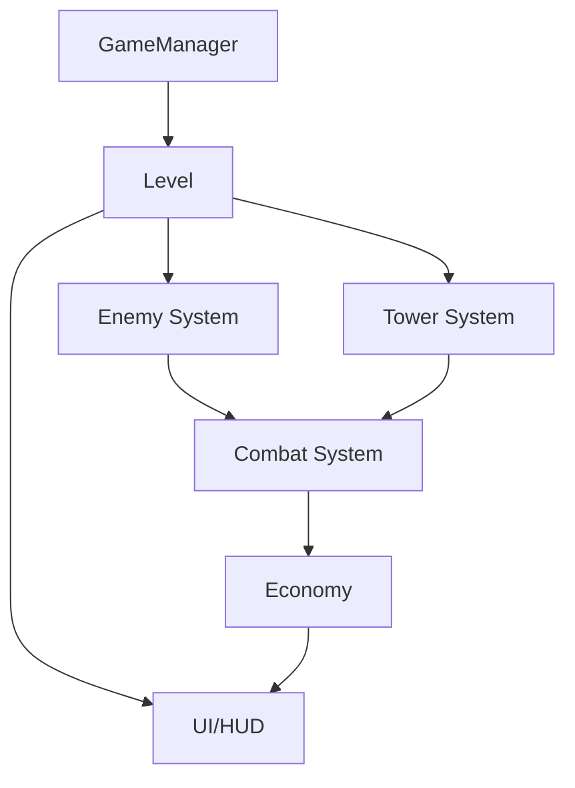

# 2026-group-14

## Defend London

> Protect the landmarks. Outsmart the invaders. Defend your city.

<table>
  <tr>
    <td align="center" width="50%">
      <a href="./index.html">
        
      </a>
      <br>
      🎮 <a href="./index.html">Play Now</a>
    </td>
    <td align="center" width="50%">
      <a href="./demo/demo.mp4">
        <video controls width="420" src="./demo/demo.mp4">
          Your browser does not support the video tag.
        </video>
      </a>
      <br>
      📺 <a href="./demo/demo.mp4">Watch Demo</a>
    </td>
  </tr>
</table>


## Your Group


## Team Members

| Name          | Email | Role | Completed Work |
|---------------|-------|------|----------------|
| Jiaxi You     | <fl25387@bristol.ac.uk> | Project Manager / Tester | Project management / Testing / Game engine setup |
| Shasha Tang   | <wj25162@bristol.ac.uk> | Gameplay Developer | Requirements / Gameplay design |
| Junjie Wang   | <da25293@bristol.ac.uk> | Combat Developer | Tower system / Combat mechanics |
| Jingjing Liu  | <bd25907@bristol.ac.uk> | Level Designer | Level design / Visual assets |
| Zejun Zhang   | <tc25992@bristol.ac.uk> | UI Developer | UI / Menu interface |
| Mingshu Zhang | <so25258@bristol.ac.uk> | Systems Developer | Grid system / Gameplay systems / Integration |


## Project Report

### Introduction

#### What is Defend London?

A tower defense game where players protect iconic London landmarks from waves of invading enemies.  
Build towers, manage resources, and survive increasingly challenging waves across three beautifully illustrated levels.

---

#### What Makes It Special ✨

| 🏛️ London Identity | 👾 Diverse Enemies | 🎓 Guided Experience |
|---|---|---|
| Levels based on real landmarks: **Big Ben**, **Tower Bridge**, and **Buckingham Palace**. | 10 unique enemy types with abilities like charging, dodging, diving, and healing. | An interactive tutorial helps new players learn core mechanics step by step. |

The sections below follow our decision flow: **ideation** (genre and prototypes), **requirements** (stakeholders through epics), then **design** (architecture, systems, and UML).

---

### Ideation

#### Genre Exploration

At the start of the project, we evaluated multiple game genres against three criteria: uniqueness compared to past student projects, strategic depth for players, and clarity of implementation scope.

| Genre | Key Challenge | Decision |
|---|---|---|
| Action | Complex real-time enemy AI | ❌ |
| Puzzle | Time-consuming narrative design | ❌ |
| Shooting | Overdone by past teams | ❌ |
| **Tower Defense** | — | ✅ |

Tower defense stood out because enemy behavior is predictable and rule-based, the modular structure maps naturally to team responsibilities, and few past teams had explored this genre.

#### Paper Prototypes

To validate our direction, we built two paper prototypes before writing any code:

<table>
<tr>
<td align="center" width="50%">

<br><b>Prototype A: Defend London</b>
<br>Tower defense · Place towers → Survive waves
</td>
<td align="center" width="50%">

<br><b>Prototype B: Double Steal</b>
<br>Action platformer · Navigate floors → Avoid hazards
</td>
</tr>
</table>

Prototype A demonstrated a tower defense loop where players place defenses and react to incoming waves. Prototype B explored action-platformer traversal with timing-sensitive hazards.

#### Why Defend London?

We selected Prototype A for three reasons:

1. **System boundaries were clear** — tower, enemy, wave, and UI components mapped naturally to individual team members.
2. **Parallel development was feasible** — each subsystem could be built and tested independently.
3. **Integration risk was lower** — the action platformer’s tightly coupled mechanics would have required more coordination.

---

### Requirements

We used a GitHub Kanban board to track requirement progress and development tasks:  
https://github.com/orgs/UoB-COMSM0166/projects/168

#### Stakeholders

We identified stakeholders using an onion model approach, organizing them by proximity to the project:


| Layer | Stakeholder | Role |
|:---:|:---|:---|
| Core | Development Team | Design, code, test, deploy |
| 2nd | Course Instructor | Evaluate outcomes, provide guidance |
| 3rd | Classmates | Playtest and offer usability feedback |
| Outer | End Players | Target audience influencing design decisions |

The development team sits at the core as direct builders. Course instructors evaluate whether the project meets learning objectives—programming skills, collaboration, and structured process. Classmates serve as early playtesters, while end players represent the ultimate audience whose needs drive feature prioritization.

#### Use Case Diagram


The player starts a session, enemy waves begin, and towers are placed to defend the landmark. An alternative flow allows access to settings for volume and music adjustment.

#### User Stories

User stories capture requirements from the player’s perspective, using the standard form: **“As a [role], I want [feature], so that [benefit].”** We defined **six** stories: **five functional** (core systems and feedback) and **one non-functional** (performance), with **role diversity**—**casual player**, **strategic player**, **new player**, and **all players**—so analysis reflects different needs, not a single “average” user. A longer backlog and alternative **Given / When / Then** criteria appear in [`docs/design/stakeholders_and_user_stories.md`](./design/stakeholders_and_user_stories.md).

| User Story | Analysis |
|------------|----------|
| “As a **casual player**, I want resources to be **auto-collected**, so that I can focus on tower placement rather than clicking every dropped coin.” | **Functional requirement:** **Economy system** — gold is added automatically when enemies are defeated (no manual coin pickup). |
| “As a **strategic player**, I want to **see tower attack range before placing**, so that I can optimize my defense layout without memorizing every radius.” | **Functional requirement:** **Tower system** — range preview / placement feedback on the build grid. |
| “As a **strategic player**, I want a **next-wave preview** showing upcoming enemy types, so that I can prepare appropriate defenses.” | **Functional requirement:** **Wave system** — HUD or panel surfaces upcoming wave composition. |
| “As a **new player**, I want an **interactive tutorial** that guides me through game mechanics, so that I can learn without frustration.” | **Functional requirement:** **UI / game flow** — stepwise tutorial (`TUTORIAL_STEPS` in `constants.js`, driven by `GameManager` + `UIHUD`) introducing landmark, path, build area, and gold. |
| “As a **player**, I want the game to **respond smoothly without lag** during intense waves, so that my strategic decisions are not hindered by performance issues.” | **Non-functional requirement:** **Performance** — stable frame rate under load; supported by a modular per-frame `update()` chain and **wave-based spawning** (not all enemies active at once). |
| “As a **player**, I want **clear visual and audio feedback** when I win or lose, so that the game outcome feels satisfying and unambiguous.” | **Functional requirement:** **UI system** — dedicated win/lose (and level-complete) screens plus sound feedback. |

Each **functional** story maps to a **subsystem** in the architecture (economy, tower placement, waves, tutorial UI, end-game UI). The **non-functional** story supported choices such as **centralized config tables** (`TOWER_TYPES`, `ENEMY_STATS`) for fast tuning without extra runtime work, and a **clear update order** in the game loop so work stays localized per frame.

Following course material on requirements, we classified every story as either a **functional requirement** (what the system must *do*) or a **non-functional requirement** (how well it must *behave*). **Functional** stories mainly drove **class boundaries and UI flows**; the **performance** story reinforced **data-driven balance** and an efficient update path instead of ad hoc calculations every frame.

#### Development Epics

| Epic | Description | Key Acceptance Criteria |
|---|---|---|
| Enemy Wave System | Spawning, pathfinding, scaling | 3+ enemy types; path from start to landmark |
| Tower System | Building, upgrading, modular types | Valid placement; auto-targeting |
| Game Interface | Real-time HUD | Live health, coins, wave display |
| Audio System | BGM and sound effects | Distinct placement/damage/death sounds |
| Map & Environment | Grid logic and visual theme | Clear path vs buildable separation |

#### Reflection

This phase clarified that **epics** are product-level outcomes, while **user stories** break those outcomes into testable, player-facing statements. The table above makes the link explicit: each story has a **requirement type** (functional vs non-functional) and a **target component**, which is how we checked coverage before implementation. **Instructor user stories** from the stakeholder model (workflow, testing, code quality) are revisited in the **Conclusion**; **acceptance criteria** on the Kanban board and in the design doc kept “done” unambiguous for both features and process.

---

### Design

#### Architecture Overview

Defend London uses a modular architecture where each subsystem handles one responsibility. `GameManager` coordinates frame updates and state transitions between menu, gameplay, and end screens.


```mermaid
flowchart TD
    GM[GameManager]
    LV[Level]
    EN[Enemy System]
    TW[Tower System]
    CB[Combat System]
    UI[UI/HUD]
    EC[Economy]
    GM --> LV
    LV --> EN
    LV --> TW
    EN --> CB
    TW --> CB
    CB --> EC
    LV --> UI
    EC --> UI
```

This separation enables parallel development and localized debugging—issues can be traced to specific modules without full-game investigation.

#### Level Design: The Maps of London

Each level is themed around an iconic London location, with increasing complexity in path design and buildable space.

<table>
<tr>
<td align="center" width="33%">

<br><b>Level 1: Big Ben</b>
<br>Single path · Generous space
<br>🟢 Introductory
</td>
<td align="center" width="33%">

<br><b>Level 2: Tower Bridge</b>
<br>Split path · Bridge chokepoints
<br>🟡 Intermediate
</td>
<td align="center" width="33%">

<br><b>Level 3: Buckingham Palace</b>
<br>Multi-lane · Tight placement
<br>🔴 Advanced
</td>
</tr>
</table>

The progression follows a deliberate learning curve: Level 1 teaches fundamentals, Level 2 introduces resource trade-offs, and Level 3 demands strategic mastery against the Gentleman Bug boss.

#### Tower System

Tower parameters are defined in centralized config tables (`TOWER_TYPES`), enabling balance adjustments without modifying core logic.

| | Tower | Cost | Damage | Special ability |
|:--:|---|--:|--:|---|
|  | Basic Tower | 60 | 15 | Balanced baseline |
|  | Slow Tower | 85 | 12 | 45% slow effect |
|  | Area Tower | 130 | 13 | Pulsing AoE damage |
|  | Crystal Tower | 120 | 15 | +25% damage to nearby towers |
|  | Steam Cannon | 180 | 55 | Piercing (up to 3 targets) |
|  | Alchemist Tower | 150 | 20 | Random potion effects |

The Crystal Tower exemplifies our trade-off philosophy: its attack is slow, but it **boosts** nearby towers (+25% damage in range), so players choose between stacking direct firepower and long-term synergy.

#### Enemy System

Enemy behavior is data-driven through `ENEMY_STATS`. Each level introduces abilities that counter common player strategies.

**Level 1: Fundamentals**

| | Enemy | HP | Speed | Ability |
|:--:|---|--:|--:|---|
|  | Guard | 100 | 2.0 | None |
|  | Pigeon | 60 | 3.0 | High speed |
|  | Hedgehog | 300 | 1.0 | High HP tank |

**Level 2: Ability pressure**

| | Enemy | HP | Speed | Ability |
|:--:|---|--:|--:|---|
|  | Knight | 180 | 1.6 | Charges when wounded |
|  | Archer | 90 | 2.2 | 25% dodge chance |
|  | Giant | 500 | 0.9 | Leaps forward |

**Level 3: Counter-strategy**

| | Enemy | HP | Speed | Ability |
|:--:|---|--:|--:|---|
|  | Goblin Bomber | 120 | 2.2 | Explodes; disables towers |
|  | Diving Lizard | 150 | 3.3 | Untargetable dive phase |
|  | Treant Mage | 200 | 1.2 | Area healing |
|  | Gentleman Bug | 2500 | 0.8 | 3-phase boss |

The Treant Mage forces target prioritization; the Goblin Bomber punishes tower clustering. These abilities turn enemies into tactical puzzles rather than stat increases alone.

#### UML diagrams

##### Class diagram


`Game` / `GameManager` orchestrates `Level`, which manages tower and enemy collections. Wave logic handles spawning; factories and presets instantiate specific types. `Tower` and `Enemy` share common update interfaces.

##### Sequence diagram


Each frame: the game calls `update()` → wave manager spawns enemies → enemies move → towers attack → combat resolves damage → UI refreshes → win/lose check.

#### Key design decisions

- **Centralized configuration.** Tower and enemy parameters live in config objects, enabling rapid balance iteration without touching core game logic.
- **Modular boundaries.** Clear interfaces between subsystems support parallel development and isolated debugging.
- **Progressive complexity.** Enemy abilities are introduced gradually across levels, building player skill before demanding mastery.

### Implementation

#### Development timeline

Our development followed a **12-week** iterative process in **four** phases.

---

##### Phase 1: Foundation (Weeks 1–3)

<table>
<tr>
<td width="40%">


</td>
<td width="60%">

**Focus:** Core architecture and basic systems

**Deliverables**
- **Game loop** and **state management** (`GameManager` + `GameState`)
- **Grid-based map** with per-cell types (`MapData.js`); **configurable** cell size via `LEVEL_GRID_CONFIG` (default **30×30 px** in `constants.js`)
- **Basic tower placement** and projectiles
- **Enemy pathfinding** along **waypoint** lists in `Path.js`

</td>
</tr>
</table>

---

##### Phase 2: Expansion (Weeks 4–6)

<table>
<tr>
<td width="40%">


</td>
<td width="60%">

**Focus:** Feature development and variety

**Deliverables**
- **Six tower types** with distinct abilities (`TOWER_TYPES` in `constants.js`)
- **Ten enemy types** with varied stats and behaviours (`ENEMY_STATS`)
- **Wave management** (`WaveManager` + `LEVEL_*_WAVE_CONFIGS`)
- **Economy**: gold, **wave clear bonus** (`WAVE_CLEAR_BONUS_GOLD`), selling and refunds

</td>
</tr>
</table>

---

##### Phase 3: Challenge (Weeks 7–9)

<table>
<tr>
<td width="40%">


</td>
<td width="60%">

**Focus:** Content expansion and balancing

**Deliverables**
- **Three London-themed levels** with hand-drawn backgrounds
- **Multi-phase boss** (Gentleman Bug) and abilities such as **charge**, **dodge**, **dive**, **heal**, **explode**
- **Balance tuning** using **spreadsheet-style reasoning** and **in-game configs** (not a single runtime formula)
- **Heuristic models** (e.g. **player firepower** vs **enemy pressure**) to compare waves before playtesting

</td>
</tr>
</table>

---

##### Phase 4: Polish (Weeks 10–12)

<table>
<tr>
<td width="40%">


</td>
<td width="60%">

**Focus:** Testing and refinement

**Deliverables**
- **Debug tools** for **grid / path alignment** (overlay, path editor, console export — see Technical challenges)
- **Settings** (volume, brightness, BGM selection) and consistent **menu vs in-game** flows where possible
- **Win / loss** screens with clear feedback
- **Bug fixes** from playtesting and heuristic review

</td>
</tr>
</table>

---

#### Technical highlight: state management

Switching between **menu**, **level select**, **playing**, **paused**, **win**, **lose**, and other modes risks **orphaned UI** or **input handlers** if every screen is bolted on ad hoc.

We centralised transitions in **`GameManager.setState`**, backed by a single **`GameState`** string enum in `constants.js` (the code does **not** use a separate class named `GameStateManager`; the **manager** role lives in **`GameManager`**).

```javascript
const GameState = {
  MENU: 'menu',
  PLAYING: 'playing',
  PAUSED: 'paused',
  WIN: 'win',
  LOSE: 'lose',
};
```

The full enum also includes **`LOGIN`**, **`LEVEL_SELECT`**, **`SETTINGS`**, **`IN_GAME_SETTINGS`**, **`MONSTER_INFO`**, and **`INSTRUCTIONS`**. Each transition runs through the same **dispatch** so **draw** and **keyboard** logic stay aligned with the **current** state.

| State (core loop) | On entry (concept) | On exit (concept) |
|-------------------|--------------------|-------------------|
| **MENU** | Show main menu; accept navigation to settings / level flow | Hand off before loading a level |
| **PLAYING** | Spawn **economy**, **waves**, **map**; run per-frame **update** | Pause or tear down level objects when leaving |
| **PAUSED** | Freeze gameplay **update**; show pause UI | Resume **PLAYING** branch |
| **WIN** / **LOSE** | Show outcome UI; record stats if needed | Return to **menu** or **retry** without leaking level state |

**Result.** Playtests and heuristic sessions did **not** surface crashes from **rapid menu ↔ play ↔ pause ↔ end-screen** navigation; state stayed **predictable** for testers.

---

#### Technical challenges

##### Challenge 1: Debug grid system

**Problem.** **Hand-drawn** backgrounds did not always match the **logical grid**: towers could look “off” the art, or **pathing** could disagree with the painted road unless **offsets** and **cell size** were tuned.

**Solution.** We added **developer overlays**: **`D`** toggles **`drawDebugGrid()`** in `GameManager.js` (green tint = **tower-buildable** in the current view, red tint = **not buildable**; cell indices drawn for alignment). **`LEVEL_GRID_CONFIG`** holds **`offsetX`**, **`offsetY`**, and **`gridSize`** per level. **`N`** toggles **path edit mode** with **waypoint** placement and **console export** for `Path.js` (see `./images/dev/grid-debug.png`).

```javascript
const LEVEL_GRID_CONFIG = {
  1: { offsetX: 0, offsetY: -15, gridSize: 30 },
  2: { offsetX: 0, offsetY: 0, gridSize: 30 },
  3: { offsetX: 0, offsetY: 0, gridSize: 30 }
};
```

| Debug overlay (D key) | Colour (approx.) | Role |
|-----------------------|------------------|------|
| **Buildable** | Green (transparent) | Cells where **towers** may be placed |
| **Non-buildable** | Red tint | **Path**, **obstacle**, HUD band, or other blocked cells |

**Result.** **Alignment** and **path export** became **fast iteration** loops instead of pixel-guessing; remaining issues were caught **before** final release builds.

##### Challenge 2: Balance formula

**Problem.** Early playtests swung between **too much gold** (trivial waves) and **over-tuned enemies** (unfair spikes). **Pure gut-feel** tuning was slow and **hard to justify** in team review.

**Solution.** We combined **(A)** **authoritative tables in code** — `TOWER_TYPES`, `ENEMY_STATS`, `LEVEL_*_WAVE_CONFIGS`, per-kill **`reward`**, and **`WAVE_CLEAR_BONUS_GOLD`** (`constants.js` / `GameManager.js`) — with **(B)** simple **design-time formulas** to reason about scaling. The expressions below are **heuristic models** used **alongside** playtesting; **tower prices** in the shipped game are **fixed per type** in `TOWER_TYPES`, not generated by the tier line at runtime.

```text
Cost ≈ BaseCost × (1 + 0.15 × TowerTier)          // design-time only
HP ≈ BaseHP × (1 + 0.2 × WaveNumber) × L_mult     // design-time only
Reward ≈ EnemyHP × 0.1 + BaseReward                 // design-time only
```

**Principle (team rule of thumb):** after clearing a wave, income from **kills + wave bonus** should usually allow **roughly a few** new **mid-tier** placements if the player defends well — tight enough to force choices, not a gold flood.

| Parameter | Level 1 | Level 2 | Level 3 | Source in code |
|-----------|--------:|--------:|--------:|----------------|
| **Starting gold** | **300** | **550** | **600** | `INITIAL_GOLD` (300) + per-level offsets in `GameManager` **level configs** (+0 / +250 / +300) |
| **Wave count** | **3** | **6** | **6** | Length of `LEVEL_1_WAVE_CONFIGS` … `LEVEL_3_WAVE_CONFIGS` in `constants.js` |

We did **not** encode a literal **`LevelMultiplier` column** (e.g. 1.0 / 1.3 / 1.6) as a single constant table; difficulty scales through **wave composition**, **HP/count** in configs, and **starting gold** above. If you reuse the **1.0 / 1.3 / 1.6** idea in coursework, treat it as a **student model** and check it against these **implemented** numbers.

**Result.** Feedback shifted from vague “**too easy / hard**” to **which wave** and **which enemy group** to change — a sign that **economy and pressure** were understandable and **tunable**.

### Evaluation

#### Evaluation design

We ran a **mixed-methods** evaluation: **qualitative** discovery (think-aloud and heuristic review), then **quantitative** comparison of perceived **workload** and **usability** under two in-game conditions.

**Quantitative user study (within-subject, *n* = 10).** Each participant played **two sessions** in **randomised order**:

| Condition | Map | Role in analysis |
|-----------|-----|------------------|
| **Simple mode** | **Level 1** (Big Ben) | Low difficulty baseline |
| **Hard mode** | **Level 3** (Buckingham Palace) | High difficulty stress test |

After **each** session, participants completed:

- **NASA-TLX** (weighted): Mental, Physical, and Temporal demand, Performance, Effort, Frustration — then **pairwise weights** per participant before computing an **overall workload** score.
- **SUS** (10 items): perceived usability on a **0–100** scale; industry **benchmark = 68**.

**Environment:** Chrome, Edge, Firefox (current versions); **p5.js** game; desktop **Windows / macOS**. We also logged **task completion**, obvious **interaction errors**, and **frame behaviour** during heavy waves (see Software testing).

**Qualitative (supporting).** Two **think-aloud** sessions (external participants) plus a **team heuristic** pass informed issue lists and UI priorities; details align with the severity table we used during iteration (see earlier report drafts in [`docs/weekly_progress/week9_evaluation_quality_and_testing/week9_evaluation_quality_and_testing.md`](./weekly_progress/week9_evaluation_quality_and_testing/week9_evaluation_quality_and_testing.md)).

**Figure set (recommended for the report).** Use **three** charts under `./images/eval/`: **(1)** NASA-TLX aggregate, **(2)** SUS aggregate (benchmark line), **(3)** SUS **per-user** (shows every participant vs **68** and makes the **paired** pattern obvious). Weight heatmaps for TLX live in [`docs/weekly_progress/week8_quantitative_evaluations/TLX_evaluations.md`](./weekly_progress/week8_quantitative_evaluations/TLX_evaluations.md) if you need supplementary material.

---

#### User testing: NASA-TLX


*Aggregate NASA-TLX (weighted) workload. Source charts: [`NASA_TLX_Final_Comparison.png`](./weekly_progress/week8_quantitative_evaluations/NASA_TLX_Final_Comparison.png).*

| Condition | Mean workload | Interpretation |
|-----------|---------------|----------------|
| **Simple (Level 1)** | **31.3** | Low–moderate cognitive load |
| **Hard (Level 3)** | **71.3** | High load — strategy and time pressure dominate |

Moving from **Simple** to **Hard** roughly **more than doubles** perceived workload (about **+128%** on the aggregate score), matching the design goal that **Level 3** should feel **taxing** rather than “more of the same UI friction.” A **Wilcoxon signed-rank** test on paired scores gave **W = 0**, **p < 0.05** (every participant ranked **Hard** heavier than **Simple**), reported in [`TLX_evaluations.md`](./weekly_progress/week8_quantitative_evaluations/TLX_evaluations.md).

---

#### User testing: SUS


*Aggregate SUS. Source: [`SUS_Final_Comparison.png`](./weekly_progress/week8_quantitative_evaluations/SUS_Final_Comparison.png).*

| Condition | Mean SUS | Adjective rating (Bangor) |
|-----------|----------|-----------------------------|
| **Simple (Level 1)** | **88.0** | Excellent (“A”) |
| **Hard (Level 3)** | **74.3** | Good (“B”) |
| **Industry benchmark** | **68** | Acceptable threshold |

Both conditions sit **above 68**, so players judged the **interface** usable even when the **game** was hard. The **~13.7** point drop from **Simple** to **Hard** reflects **challenge**, not broken menus — consistent with the narrative in [`SUS_evaluations.md`](./weekly_progress/week8_quantitative_evaluations/SUS_evaluations.md).


*Per-participant SUS: **every** user stayed **above 68** in **both** conditions, and **every** user rated **Simple** higher than **Hard** — strong evidence of **consistent** measurement rather than one outlier driving the mean.*

---

#### Key findings

| Metric | Simple (Lv1) | Hard (Lv3) | Main takeaway | Significance |
|--------|-------------|------------|---------------|--------------|
| **NASA-TLX (workload)** | 31.3 | 71.3 | Hard mode **increases** perceived cognitive/temporal pressure as intended | Wilcoxon **W = 0**, **p < 0.05** |
| **SUS (usability)** | 88.0 | 74.3 | Usability **remains high** under stress; both **beat 68** | Same paired pattern; **p < 0.05** (see week 8 write-up) |

**Takeaway:** Quantitative results support the product story: **difficulty scales through gameplay**, while **UI learnability** stays in a **good-to-excellent** band. Qualitative and heuristic work then turns those signals into **concrete** HUD, settings, and wave-info fixes.

---

#### Software testing

We did **not** rely on a large automated **unit-test** suite in this module (see `tests/`); instead we combined **black-box** case runs from our test document with **white-box–style** checks on critical paths.

##### Black-box testing

Behaviour verified **without** reading implementation line-by-line; examples:

| Test case | Input | Expected | Outcome |
|-----------|-------|----------|---------|
| Valid tower placement | Click **grass** build cell with enough gold | Tower appears; gold deducted | Pass |
| Invalid placement | Click **path** / **obstacle** | Blocked + feedback | Pass |
| Wave flow | Clear wave | Countdown / next wave or **victory** | Pass |
| Insufficient gold | Pick expensive tower | Cannot place; no charge | Pass |
| Defeat | Landmark **HP → 0** | **Lose** screen / retry path | Pass |

Full IDs (FT-001 … CP-002) are tabulated in [`week9_evaluation_quality_and_testing.md`](./weekly_progress/week9_evaluation_quality_and_testing/week9_evaluation_quality_and_testing.md).

##### White-box testing

Targeted **inspection** and **manual** execution of sensitive logic (no claimed **code-coverage %**): stepping through **`WaveManager`** state (`waiting` → `spawning` → `active`), **`Economy`** refunds and sell paths, **`Tower`** range and slow/splash branches, and **`GameManager`** win/lose gates — plus **debug-grid** verification that **logical tiles** matched **art**. This caught integration bugs that black-box runs alone often miss.

### Process

#### Development workflow

We agreed **team responsibilities** and a **Git workflow** (branch strategy, integration rules) **at the outset**, wrote them into a living document, and **revised and followed that guide** for the rest of the module so practice and documentation stayed aligned.

[**Git workflow guide (full text)**](./workflow.md)


In day-to-day work we used a **feature-branch** model: scoped work on `feature/*` and personal lines such as `*_dev`, fixes on `gamefix*`, and integration through **Pull Requests** (e.g. **#23**, **#24**) with review and CI before merge.


| Branch type | Examples | Purpose |
|-------------|----------|--------|
| `feature/*` | `feature/tower-system`, `feature/enemy-wave-system` | New functionality |
| `*_dev` | `zejun_dev`, `sound_dev` | Subsystem / personal line |
| `gamefix*`, `develop`, `design` | `gamefix`, `gamefix2`, `develop`, `design` | Fixes, integration, design experiments |

#### Task management

Work was tracked on a **GitHub Project** board; [open the project](https://github.com/orgs/UoB-COMSM0166/projects/168) for the live board.


#### Communication

Meeting outcomes and ad-hoc plans were written up in a shared log so the group had a record of decisions. [Meeting notes →](./meeting_notes/)


#### Contribution summary

**GitHub Insights → Contributors** reflects activity across the **six** team members over the module. **Roles and responsibilities** are in **Team Members** / the **Introduction**; we do not repeat per-person breakdowns here.

## Sustainability, Ethics and Accessibility

### Overall Approach

Sustainability in **Defend London** focuses on long-term maintainability, player experience, and responsible resource use. As a browser-based game, key considerations include local data storage, asset optimisation, accessibility, and code extensibility.

We applied the **Sustainability Awareness Framework (SusAF)** across five dimensions:

| Dimension | Relevant topics |
|-----------|-----------------|
| Social | London-themed representation, player trust, fair gameplay |
| Individual | Player comfort, learning support, accessibility |
| Environmental | Resource loading, browser performance, energy use |
| Economic | Low-cost development, no server dependency, maintainability |
| Technical | Modular architecture, extensibility, documentation |

### SusAD Diagram


*Figure: SusAD diagram — positive opportunities (green) and negative risks (red) across sustainability dimensions.*

The diagram maps main **opportunities** and **risks** at a glance:

| Opportunity | Risk |
|-------------|------|
| Local storage reduces server infrastructure | Large assets increase loading time and memory |
| Nickname-only saving minimises privacy risk | Mouse / colour-dependent interaction limits accessibility |
| Modular code lowers maintenance cost | Repeated config values add technical debt |

### Social Sustainability

**Defend London** uses recognisable London landmarks and city-inspired levels, giving a stronger cultural identity than a generic tower defence. Using a real city as the theme requires care to avoid stereotypes in how London, its people, or its culture are represented.

Player trust matters socially: rules for **enemy paths**, **towers**, and **win/lose** should be easy to understand. A potential improvement is clearer **tower and enemy-ability** descriptions and **level guidance** so players can judge outcomes fairly.

### Individual Sustainability

We support players with comfort and learning features:

| Feature | Purpose |
|---------|---------|
| Interactive tutorial | Reduces first-session confusion |
| Pause, level selection, continue, try again, win/lose flow | Predictable, low-friction sessions |
| Volume, music selection, brightness | Comfort and preference |

**Accessibility (current):** The build relies mainly on **mouse** input and **visual** feedback, which can exclude players with motor or severe visual impairments.

**Future work includes** keyboard-based placement, high-contrast UI, colour-blind–friendly indicators, and text alternatives for important audio cues.

### Ethics

| Practice | Implementation |
|----------|----------------|
| **Data minimisation** | **Nickname only** — no e-mail, password, real name, or external account |
| **Local storage** | Progress in browser `localStorage` — not sent to a custom backend in this project |
| **No behavioural tracking** | No analytics or profiling layer in the shipped game |

**Future improvements:** Explain **local saving** in plain language and add a **“delete save data”** control so users can reset stored progress.

### Environmental Sustainability

**Defend London** runs in the **browser** without a dedicated **game server** for single-player progress; `localStorage` removes network use for **save/load** of the core loop.

| Mitigation | Effect |
|------------|--------|
| Wave-based spawning | Fewer active entities per frame than spawning everything at once |
| Modular code / assets | Easier to load and tune subsets of content |

Larger **image and audio** files can still increase load time, memory, and **CPU** use. Future work: **compress** media, **drop unused** assets, and **measure** load, memory, and frame cost under stress.

### Economic Sustainability

The stack is **p5.js**-based, **vanilla JavaScript**, and deployable as **static** content — no paid **hosting** tier or custom **backend** is required for the current design, which fits a **student** budget.

Enemies, towers, economy, waves, maps, and paths live in **separate modules**, so a future team can **patch** one area without a full rewrite. The trade-off is that **repeated** numeric or tuning values should be **centralised** over time to keep updates cheap.

### Technical Sustainability

| Design choice | Benefit |
|---------------|---------|
| `GameManager.js` as coordinator | Clear game state and level flow |
| `MapData.js` vs `Path.js` | Buildable tiles and enemy routes editable independently |
| Spread of logic across `Tower`, `Enemy`, `WaveManager`, etc. | Easier debug and extension |

**Future work includes** tightening **shared config**, documenting key entry points, and **tests** for placement, movement, and **wave** transitions (see also **Software testing** in **Evaluation**).

### Future Actions Summary

| Area | Improvement |
|------|-------------|
| Privacy | Clearer local-save explanation; “delete save data” |
| Accessibility | Keyboard, high-contrast, clearer labels |
| Environmental | Compression; performance measurement |
| Technical | Documentation; fewer duplicated config values; more automated tests |
| Social | Clearer **tower** rules, **enemy** ability copy, and **level** hints |

**Defend London** already rests on a **credible** sustainability, ethics, and accessibility base; the largest gains ahead are in **accessibility**, **transparent privacy messaging**, and **leaner assets / measurable performance**.

### Conclusion

Overall, Defend London started as a simple London-themed tower defense idea and developed into a playable browser game with multiple levels, enemy waves, towers, economy, UI, sound feedback, local saving, and a clear visual style. This project showed us that game development is not just about adding features; the harder part is making different systems work together so that the player experience feels clear, fair, and enjoyable, while creating a useful, usable, maintainable, and responsible system for real users.

One important lesson we learned was the value of iterative and agile development. Our plan changed as the game developed. Some ideas seemed straightforward at the beginning, but became more complicated during implementation, especially grid alignment, enemy pathing, wave balance, and UI readability. Instead of following one fixed plan, we improved the game through repeated testing, discussion, feedback, and small adjustments. The GitHub project board and regular team communication helped us keep track of progress and decide what needed to be improved next.

Epics and user stories were also useful because they helped us turn a broad idea into clearer development tasks. The **end-player stories** in the Requirements section (six **As a… I want…** statements covering economy, range preview, wave preview, tutorial, performance, and win/loss feedback) framed the visible game experience and **functional vs non-functional** trade-offs, while a parallel set of **instructor (course) user stories**—for example *Follow a Defined Development Workflow* (Git, Kanban, incremental delivery) and *Conduct Testing and Iteration* (playtests, heuristic review, NASA-TLX)—gave us a checklist against software-engineering and module learning goals. The full wording of the instructor stories appears in [`docs/design/stakeholders_and_user_stories.md`](./design/stakeholders_and_user_stories.md) under *Epics for Course Instructors*. Tying the **Process** and **Evaluation** sections of this report to those stories is how we show alignment with the course, not only with what players would want in a commercial product.

The class diagram and sequence diagram helped us understand the structure and behaviour of the game before and during implementation. They made the relationships between enemies, towers, waves, the economy system, paths, map data, UI, and game state easier to discuss. In practice, this supported our modular structure and made the project easier to debug and extend.

Testing changed how we looked at the game because it showed us the difference between a game that works from a developer’s perspective and a game that feels clear and comfortable from a player’s perspective. Think Aloud testing and heuristic evaluation showed problems that we had started to ignore as developers, such as small text, unclear feedback, limited settings, and missing wave information. NASA-TLX also gave us another way to check whether the game felt too demanding or frustrating for players. These evaluations made us realise that a game can be technically working, but still need improvement in usability, accessibility, feedback, and player comfort.

We also used SusAF to reflect on sustainability, ethics, and accessibility. This helped us think beyond immediate gameplay and consider wider effects such as privacy, resource use, maintainability, and inclusiveness. Our current design has some good foundations, including local browser saving, nickname-only progress storage, modular code, and lightweight web deployment. However, there are still risks, such as large image and audio assets, mouse or colour-based interaction, and repeated configuration values.

If we continued developing the current game, we would focus on improving accessibility, polishing the interface, compressing assets, adding clearer wave previews, and explaining local saving more clearly. We would also improve documentation so that future developers could understand the code structure, configuration files, and debugging tools more easily. If we had the chance to make a sequel, we would expand the London theme with more landmarks, more enemy routes, richer enemy abilities, and a deeper progression system.

Overall, this project taught us that game development depends on much more than coding. Iteration, teamwork, requirements, design, testing, sustainability, and privacy all affected whether our final game became playable, understandable, and maintainable.

### Contribution Statement

| Contributor | Contribution |
|---|---|
| Jiaxi You | 1 |
| Shasha Tang | 1 |
| Junjie Wang | 1 |
| Jingjing Liu | 1 |
| Zejun Zhang | 1 |
| Mingshu Zhang | 1 |

### Additional Marks

You can delete this section in your own repo, it's just here for information. in addition to the marks above, we will be marking you on the following two points:

- **Quality** of report writing, presentation, use of figures and visual material (5% of report grade) 
  - Please write in a clear concise manner suitable for an interested layperson. Write as if this repo was publicly available.
- **Documentation** of code (5% of report grade)
  - Organise your code so that it could easily be picked up by another team in the future and developed further.
  - Is your repo clearly organised? Is code well commented throughout?
