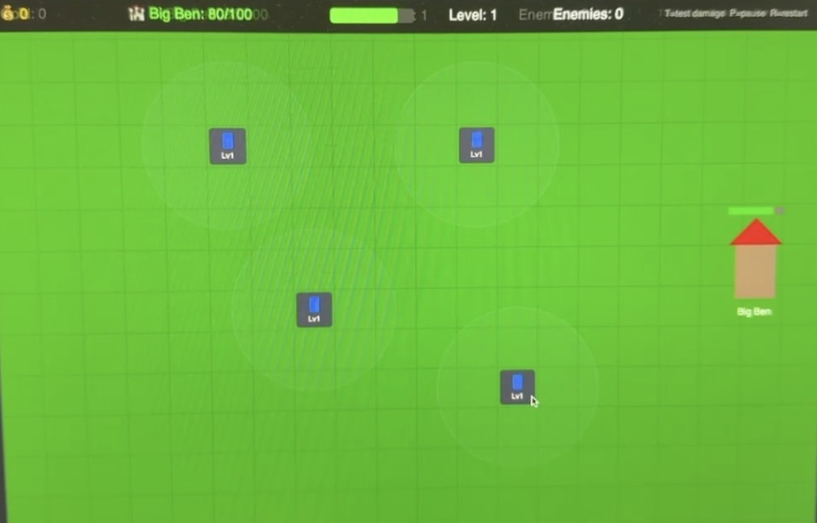
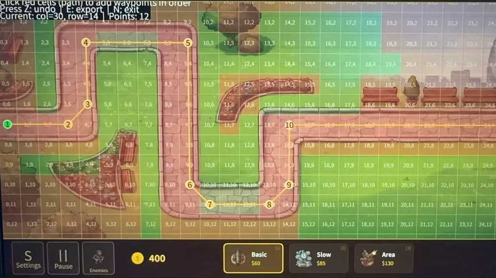
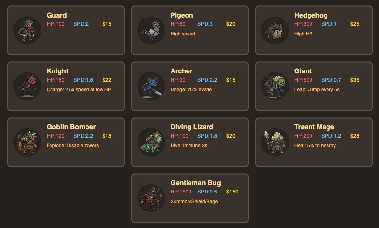
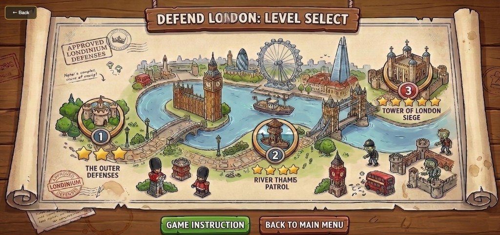

# Implementation

## Implementation Journey

Development moved through four natural phases:

---

<table>
<tr>

<td align="center" width="25%" valign="top">

### Phase 1 · Prototype

**Core game loop**

- Tile-based grid map
- Single enemy type following a fixed waypoint path
- One basic tower with projectile shooting
- Enemies spawn → move → take damage → die or reach landmark

 

*Early engine: green grid, placeholder towers, no art*

</td>

<td align="center" valign="middle" width="2%">➜</td>

<td align="center" width="25%" valign="top">

### Phase 2 · Foundation

**Levels, economy & systems**

- Three distinct map layouts with per-level grid configs
- `WaveManager` wave-state machine (waiting → spawning → active)
- `Economy` gold system and `Landmark` HP tracking
- Win / lose conditions wired into `GameManager`
- Path edit and map paint debug tooling built

 

*Path edit mode: numbered waypoints, green/red tile overlay, live console export*

</td>

<td align="center" valign="middle" width="2%">➜</td>

<td align="center" width="25%" valign="top">

### Phase 3 · Content & Balance

**Enemies, towers & tuning**

- 10 enemy types with distinct abilities (charge, leap, heal, taunt…)
- 6 tower types including support (Crystal) and AoE (Steam, Area)
- 3-phase final boss — Gentleman Bug
- Balance formula applied across all three levels
- Repeated playtesting cycles; stats adjusted via `TOWER_TYPES` / `ENEMY_STATS`

 

*In-game encyclopaedia: all 10 enemy types with HP, speed, reward and ability summary*

</td>

<td align="center" valign="middle" width="2%">➜</td>

<td align="center" width="25%" valign="top">

### Phase 4 · Polish

**Feel & accessibility**

- Main menu, level-select screen, pause and settings panels
- In-game tutorial with step-by-step highlights
- Background music and per-event sound effects (`SoundManager`)
- Monster encyclopaedia with flavour text
- HUD refinements: wave bonus display, placement error feedback

 

*Level select: illustrated London map with three landmarks and star ratings*

</td>

</tr>
</table>

---

## Technical Challenge 1: Balancing Difficulty for Engaging Combat

**Challenge.** The experience we wanted was specific: players should feel they *nearly* lost but just barely won. Early playtests revealed wild swings — some waves trivially easy, others immediately unwinnable. Worse, the team had no shared language for diagnosing why a wave felt unfair.

**Technical Difficulty.** Without a principled framework, tuning becomes guesswork. A value that feels fair in wave 1 can cascade into an unwinnable state by wave 3. We needed a diagnostic tool that could express difficulty as a comparable quantity.

**Solution.** We derived a working balance formula:

> **Player Firepower** = towers × damage × attack duration  
> **Enemy Pressure** = enemies per wave × individual HP

The target was rough parity, tilting slightly toward enemies to maintain tension. This formula gave us a common language — when someone proposed buffing an enemy, we could immediately estimate how much additional firepower players would need.

Concretely, Level 1 opens with 400 gold, enough for five or six basic towers before the first wave. The 60-gold wave bonus was calibrated so players always feel one tower short of comfortable. By wave 3, slow but durable Hedgehogs arrive, forcing players to have already scaled their defences. Each leaked enemy deals significant landmark damage — five uncontested breaches end a run — making every placement decision feel consequential.

Verification required real playtesting. When Level 2's boss wave proved consistently overwhelming, we reduced the boss count and extended the preparation window. These cycles — always returning to the formula as a diagnostic anchor — produced a difficulty curve that testers described as challenging but fair.

**Design Value.** The formula transformed subjective debates ("this feels too hard") into tractable discussions ("enemy pressure exceeds firepower by 40% — where should we adjust?").

## Technical Challenge 2: Diverse Abilities That Reward Adaptive Strategy

**Challenge.** Tower defence risks monotony if each level simply sends more enemies. We wanted every level to introduce mechanics requiring genuinely new strategies, not just more towers.

**Technical Difficulty.** With six tower types and ten enemy types, interactions multiply rapidly. An ability balanced in isolation might break the game in combination. We needed a system where any stat could be adjusted in one place without touching unrelated logic.

**Solution.** We centralised all statistics in configuration tables, making iterative tuning fast and safe. More importantly, we designed abilities around strategic trade-offs rather than raw difficulty increases.

Level 1 introduces only basic enemies and towers, letting players master fundamentals. Level 2 unlocks the Crystal Tower — a support unit that boosts nearby towers rather than attacking directly. This forces a genuine decision: does boosting existing towers outperform simply adding more firepower? The level also introduces enemies with active abilities: Knights that charge when wounded, Archers that evade projectiles, Giants that leap past defensive lines.

Level 3 escalates further with abilities designed to counter established strategies. The Treant Mage heals nearby enemies, threatening to undo damage already dealt — forcing players to prioritise targets. The Goblin Bomber explodes on death, disabling nearby towers and punishing overly clustered defences. The final boss, Gentleman Bug, progresses through three phases: summoning minions, taunting towers to reduce their damage, and gaining resistance as it weakens.

When playtesting revealed the Treant Mage's healing outpaced realistic player damage, a single configuration change resolved the issue instantly — demonstrating how centralised tuning enabled rapid iteration.

**Design Value.** Each ability was designed as a puzzle rewarding adaptive thinking, not an arbitrary difficulty spike.

## Technical Challenge 3: Grid Alignment and Debug Tooling

**Challenge.** Each level's invisible tile grid must align precisely with its visual background. A boundary offset by even a few pixels could block a visually open area from building, or allow towers to clip into enemy paths — both confusing to players and nearly impossible to diagnose by eye.

**Solution.** We built a debug mode that overlays the tile grid directly on screen, colour-coding buildable versus blocked cells, and printing coordinates to the console. Arrow keys adjust grid offsets in real time; a path visualisation confirms that enemy waypoints trace the intended route exactly.

This tooling transformed hours of guesswork into minutes of precise adjustment. If we were to start over, we would build it in the first week rather than the third.

## Conclusion

Implementing *Defend Britain* taught us that building mechanics is only part of the work — making them *feel right* demands equal attention. The balance formula gave us a shared diagnostic language; centralised configuration made iteration safe; visual debug tooling made precise alignment tractable. More broadly, this project showed that "feel" is not a vague quality but something that can be diagnosed systematically. These practices — principled frameworks, single-source configuration, purpose-built tooling — will transfer directly to future projects.