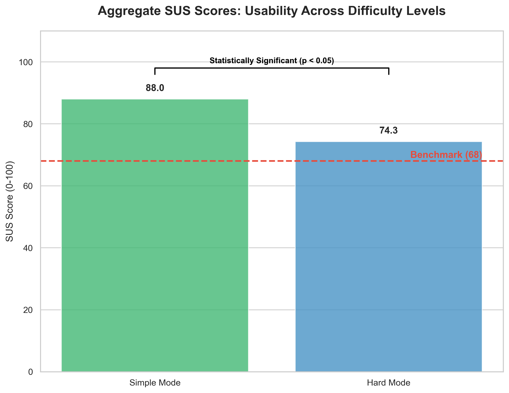

# 1. Level Selection for SUS Testing
For the quantitative usability evaluation, two distinct difficulty conditions were required. Since the game features three progressive levels, we selected Level 1 as the representative **Simple Mode** (low difficulty) and Level 3 as the representative **Hard Mode** (high difficulty). This pairing allowed us to compare usability and user experience across the extreme ends of the difficulty spectrum.

# 2. Overview of Methodology
To evaluate the core usability of our Tower Defense game, we conducted a within-subject study involving **10 participants**. Each participant completed the same set of tasks in both Simple Mode and Hard Mode. After each session, they completed the standard 10-item SUS questionnaire. The final scores were calculated using the industry-standard SUS methodology, resulting in a scale of 0 to 100.

# 3. Aggregate Performance vs. Industry Benchmark
As illustrated in the **Aggregate SUS Scores** chart, both game modes significantly outperformed the industry-standard benchmark.

- Simple Mode achieved an exceptional mean score of **88.0**, which translates to a **Grade A ("Best Imaginable" or "Excellent")** on the usability scale.
- Hard Mode yielded a mean score of **74.3**, which remains firmly within the **Grade B ("Good")** range.

Critically, both modes scored well above the **industry average of 68**. This demonstrates that while the game increases in challenge, the underlying user interface and interaction logic remain highly intuitive and robust. The high score in Hard Mode proves that the difficulty stems from strategic gameplay rather than a failure in usability or UI clarity.

  
   
  <em>Figure 1: Aggregate SUS Scores across two difficulty levels</em>

# 4. Individual Consistency and Statistical Significance
The **SUS User Comparison** chart provides a granular view of participant feedback. We observed a perfectly consistent trend across all 10 users: every single participant rated the Simple Mode higher than the Hard Mode.

This consistency was verified using the **Wilcoxon Signed-Rank Test**. Because the Simple Mode was rated superior in every instance, the resulting W-statistic was 0. With n=10 and α=0.05, the result is **statistically significant (p < 0.05)**.

This statistical proof indicates that the decrease in perceived usability in Hard Mode is not due to random chance but is a direct result of the increased cognitive load and temporal demand inherent in the harder difficulty setting.

  
   
  <em>Figure 2: Individual SUS score comparison between Simple Mode and Hard Mode for all 10 participants. Every participant rated Simple Mode higher than Hard Mode, and all scores remained above the industry benchmark of 68. The difference was statistically significant (Wilcoxon Signed-Rank Test, W=0, p < 0.05).</em>

# 5. Conclusion
The quantitative data confirms a highly successful usability design. The game provides a seamless experience for beginners (**88.0**) while maintaining a high standard of functional clarity (**74.3**) for players seeking a more intense strategic challenge. We have effectively decoupled "Game Difficulty" from "Interface Difficulty," ensuring that players struggle against the enemies, not the controls.
