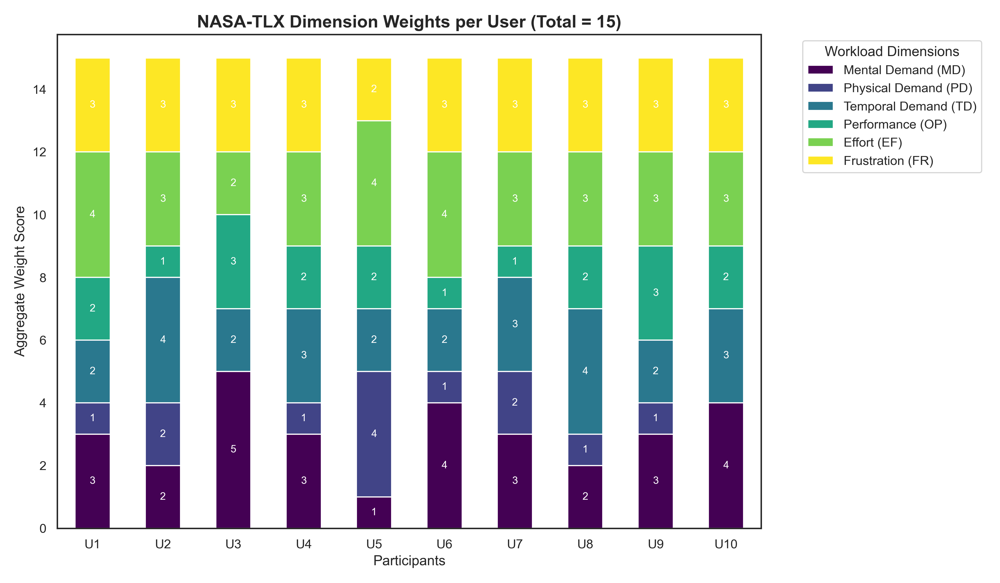
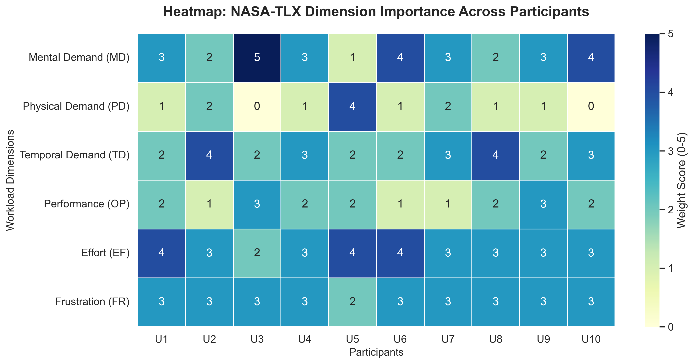
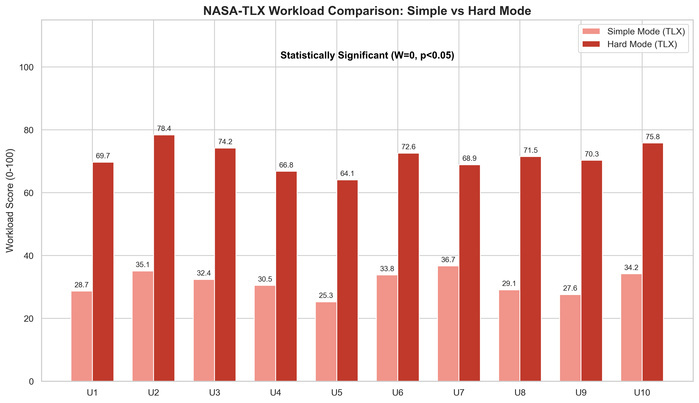

# 1. Level Selection for TLX Testing
For the quantitative usability evaluation, two distinct difficulty conditions were required. Since the game features three progressive levels, we selected Level 1 as the representative Simple Mode (low difficulty) and Level 3 as the representative Hard Mode (high difficulty). This pairing allowed us to compare usability and user experience across the extreme ends of the difficulty spectrum.

# 2. Methodology and Weight Determination
To accurately capture the subjective workload of our participants, we utilized the full weighted version of the NASA-TLX. This process involves two distinct steps: a Weight Determination phase (Pairwise Comparisons) and a Rating phase across six dimensions: Mental Demand (MD), Physical Demand (PD), Temporal Demand (TD), Performance (OP), Effort (EF), and Frustration (FR).

<table style="width:100%; border:none;">
  <tr>
    <td style="width:50%; border:none; text-align:center;">
      
       
      <em>Figure 1: NASA-TLX dimension importance stacked bar</em>
    </td>
    <td style="width:50%; border:none; text-align:center;">
      
       
      <em>Figure 2: NASA-TLX dimension importance heatmap</em>
    </td>
  </tr>
</table>

As shown in the Stacked Bar Chart and Dimension Importance Heatmap, the weight distribution reveals a clear strategic profile for our game. All participants completed 15 pairwise comparisons, resulting in a total weight of 15 per user.

- **Core Workload Drivers**: The Heatmap indicates that Mental Demand (MD) and Effort (EF) were consistently assigned the highest weights (darker cells). This confirms that players perceive the Tower Defense gameplay as a cognitive challenge requiring significant strategic planning and sustained attention.
- **Physical Demand (PD)**: Conversely, PD received the lowest weights (lighter cells, often 0 or 1), which is typical for strategy games where interaction is limited to deliberate mouse clicks rather than rapid physical movements.
- **Individual Profiles**: The Stacked Bar Chart illustrates the diversity in user perception; while the total weight is constant, some users (like U2 and U8) were more sensitive to Temporal Demand (TD), while others prioritized Mental Demand.

# 3. Aggregate Workload Analysis
The Aggregate NASA-TLX Scores chart highlights a dramatic and statistically significant shift in perceived workload between the two difficulty settings.

- **Simple Mode**: Users reported a relatively low workload with a mean score of 31.3. This indicates a relaxed experience where players could easily manage enemy waves without feeling overwhelmed.
- **Hard Mode**: The mean workload surged to 71.3. This represents a 128% increase in total workload. In this mode, the combined pressure of increased enemy speed and limited resources forced users into a state of high cognitive load.

  
   
  <em>Figure 3: Figure 1: Aggregate NASA-TLX workload scores</em>

# 4. Individual Workload Trends and Significance
The NASA-TLX User Comparison chart visualizes the workload for each of the 10 participants. There is a universal trend: 100% of the participants experienced a substantial increase in workload when transitioning from Simple to Hard Mode.

We applied a Wilcoxon Signed-Rank Test to confirm the validity of these results. With every user showing a consistent increase, the W-statistic was 0, confirming that the difference in workload is statistically significant (p < 0.05). This proves that our difficulty design successfully scales the challenge in a way that is palpable to every type of player.

  
   
  <em>Figure 4: Individual NASA-TLX workload scores</em>

# 5. Conclusion
The NASA-TLX data provides strong evidence that our game successfully creates a "challenging" environment in Hard Mode. By significantly increasing the Temporal and Mental demands while maintaining the high usability scores (as seen in our SUS data), we have achieved a balanced difficulty curve. Players are cognitively taxed by the strategy required in Hard Mode, which is the intended design goal for a Tower Defense title.
